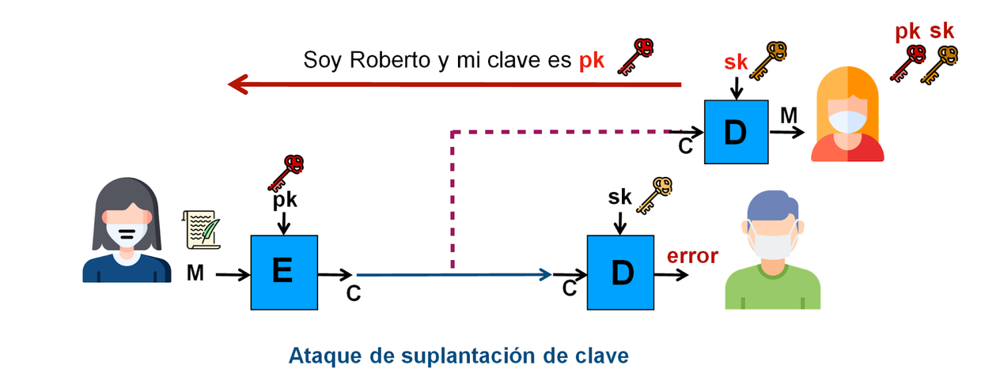
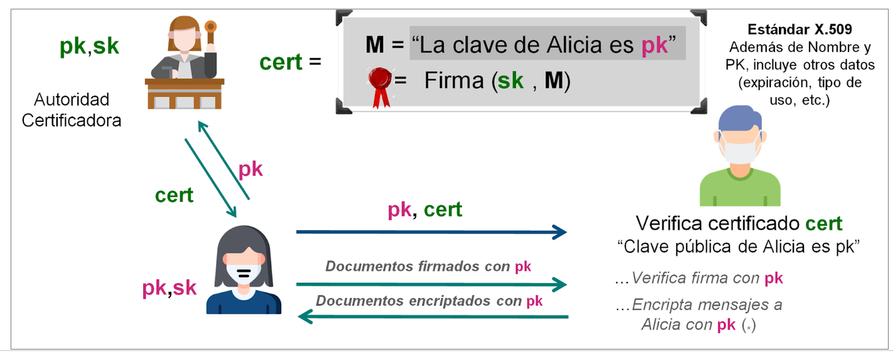
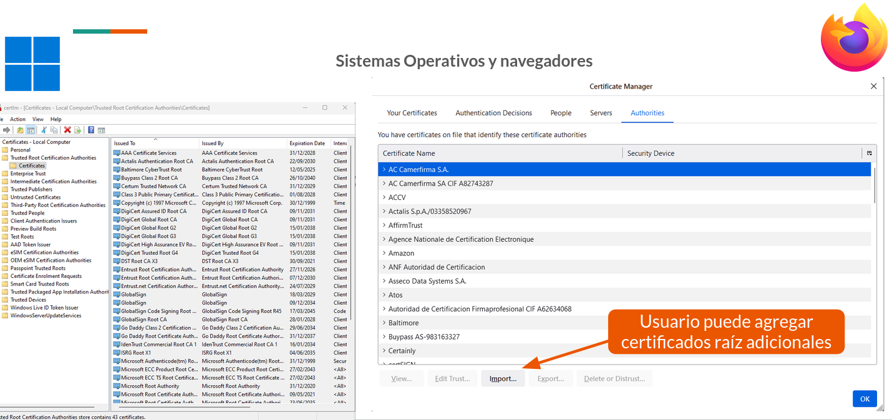
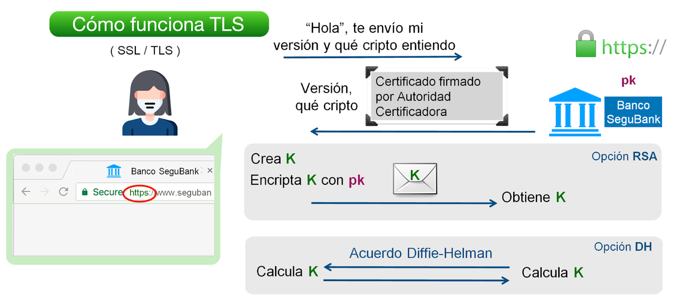
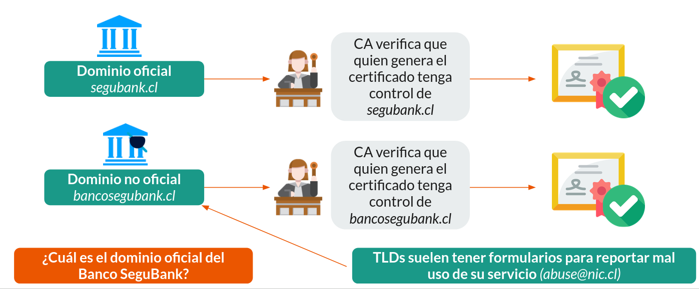
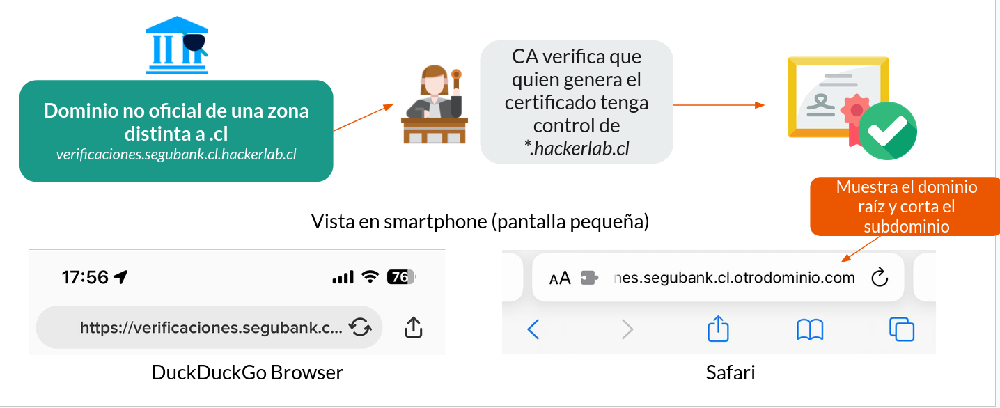
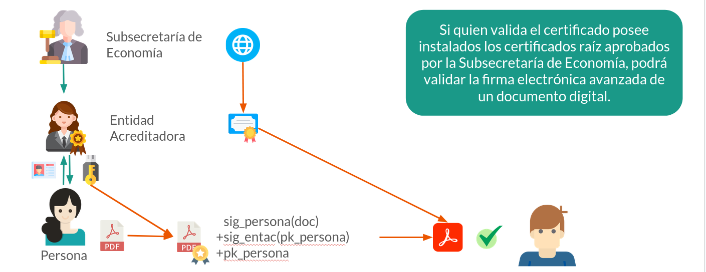
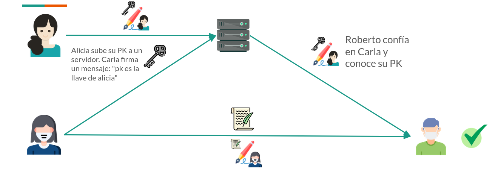



# PKI y Web of Trust

Retomando la pregunta de Criptografía Asimétrica, ¿Cómo podemos hacer para que Eva no se haga pasar por Roberto en el proceso de recolección de llaves?

En el ejemplo de arriba notamos que necesitamos un mecanismo para determinar de fomra segura que una llave pública es de alguien en específico. Para esto, en el curso veremos dos soluciones:

* **Infraestructura de Llave Pública (PKI)**: Una o más fuentes confiables que entregan certificados (mensajes firmados con sus llaves privadas) en los que confirman que cierta llave pública es de quien dice ser
* **Web of trust (WoT)**: La confianza se determina a partir de confirmaciones de entidades previamente confiables, sin necesitarse una autoridad centralizada, pero volviendo la confiabilidad de una llave pública específica en algo subjetivo (dependerá solo de las confirmaciones emitidas por quiénes confío).

## Infraestructura de Llave Pública

En este caso, se definen una o más _Autoridades Certificadoras_ (ACs), sobre las cuales un grupo de personas asume buen comportamiento, además de un conjunto de algoritmos necesarios para firmar y "certificados", que actúan como declaraciones de pertenencia firmadas por la llave privada de la Autoridad Certificadora.

Las llaves públicas de las autoridades certificadores son conocidas por Alicia y por Roberto

> [!COMMENT]
> Simplemente pateamos el problema. ¿Ahora cómo Roberto u Alicia conocen la llave pública de la autoridad certificadora? 

Se supone que para Roberto es más fácil conocer y guardar una o pocas llaves de autoridades certificadoras (algo que le tocará hacer muy pocas veces en la vida) que guardar las llaves de Alicia y otras personas que conozca en el tiempo (solo lo debería hacer cada vez que conoce a alguien nuevo).

El proceso es así:

1. Alicia muestra su llave pública $pk$ a la AC y valida su identidad con ella. Si todo valida, la Autoridad Certificadora genera un certificado sobre un mensaje $M$, el cual dice "Confirmo que la clave de Alicia es esta: <contenido de $pk$>" y se lo envía a Alicia para presentarlo. Esta firma es validable con la llave pública de la AC.
2. Cuando Roberto deba verificar un documento firmado por Alicia, Alicia le enviará el documento, la firma sobre el documento, su llave pública y el certificado. A Roberto le bastará con ejecutar los siguientes pasos para confirmar que la firma es correcta:
  1. Que el mensaje del certificado es sobre exactamente la $pk$ entregada por Alicia y sobre Alicia específicamente (por ejemplo, citando el RUN de Alicia).
  2. Que el certificado valida sobre la llave pública de la AC ya conocida por Roberto
  3. Que la firma sobre el documento valide con los parámetros documento, llave pública de Alicia.
3. Cuando Roberto quiera enviar un mensaje cifrado a Alicia, deberá hacer lo siguiente:
  1. Pedirle a Alicia primero su llave pública y el certificado. 
  2. Luego de recibirlo y validarlos (como en el punto 1 y 2 del caso anterior), Roberto podrá cifrar su mensaje con la llave pública recibida y enviarlo cifrado a Alicia sin miedo a que pueda ser leído.
  3. Alicia deberá usar la llave privada correspondiente a esa llave pública para leer el mensaje.

### TLS y Certificados en Web

La seguridad del canal de comunicación en el protocolo HTTP la entrega una infraestructura de llave pública estandarizada:

- Las identidades están asociadas a los nombres de dominio (DNS) de los sitios.
- Las autoridades certificadoras confiables están instaladas en los equipos de los usuarios o en los navegadores por defecto. Todas ellas poseen procesos de verificación previos al otorgamiento de un certificado. Por ejemplo, [Let's Encrypt](https://letsencrypt.org/) utiliza el [protocolo ACME (RFC8555)](https://datatracker.ietf.org/doc/html/rfc8555) para demostrar que quien pide un certificado para un dominio específico tenga control sobre ese dominio o la infraestructura a la que apunta.
- Al visitar un sitio, el navegador automáticamente valida:
 - Que el certificado presentado por el sitio refiere al dominio visitado (o a un dominio _wildcard_ compatible).
 - Que el certificado fue firmado por alguna AC confiable para el navegador o el equipo.

Esta imagen muestra la visualización para agregar y quitar certificados de Windows y Firefox:

> [!TIP]
> ¿Es suficiente con que mi OS o navegador confíen? ¿Qué podría salir mal a pesar de la confianza?

Una vez tenemos solucionada la cadena de confianza desde el dominio hasta el certificado, podemos ejecutar un acuerdo de llaves con criptografía asimétrica, como se ve en la imagen:

* **Si se usa Diffie-Hellman**: Se llega a un secreto compartido.
* **Si se usa RSA o Curva Elíptica**: Usuario envía secreto a sitio web cifrado con su llave pública.

> [!TIP]
> También existe un protocolo llamado MTLS ([Mutual TLS](https://www.cloudflare.com/es-es/learning/access-management/what-is-mutual-tls/)), en el que el usuario también debe presentar un certificado válido en la cadena de confianza del servidor. Esta medida adicional de seguridad ayuda a mitigar ataques de suplantación y entrega autenticación de usuario al canal TLS.

### Problemas con PKI Web

* **La infraestructura de las CA ha sido vulnerada en el pasado**: [El 2022 pasó con una autoridad llamada Billbug](https://arstechnica.com/information-technology/2022/11/state-sponsored-hackers-in-china-compromise-certificate-authority/).
* **Hay CAs que se han portado mal y han tenido que ser revocadas por navegadores y sistemas operativos**: [Pasó con Synmatec el 2018](https://groups.google.com/a/chromium.org/g/blink-dev/c/eUAKwjihhBs/m/El1mH8S6AwAJ?pli=1).
* **Dominios no oficiales**: Lo vimos en DNS. **Un certificado no nos indica que el sitio sea real, solo que no está siendo intervenido. Supongamos que existe un banco llamado segubank, cuyo dominio oficial es `segubank.cl`. Lamentablemente, nada evita que cualquier persona compre y use (aunque sea por un tiempo) `bancosegubank.cl`, e incluso consiga un certificado TLS para ese dominio.

    

    A veces incluso ni si quiera se necesita un dominio oficial y basta con un subdominio.

    

    > [!COMMENT]
    > En algún momento se intentó evitar lo anterior a través de los certificados [EV](https://www.digicert.com/es/faq/public-trust-and-certificates/what-is-an-extended-validation-ev-ssl-certificate) (_extended validation_), los que son mucho más caros que los normales pero también más difíciles de conseguir porque requieren una mayor cantidad de medidas de seguridad implementadas. Algunos navegadores mostraron estos certificados como más seguros en las barras de navegación, pero eso dejó de usarse hace varios años, por lo que no hay diferencia práctica entre usar un certificado caro, uno pagado pero barato o uno gratis gracias a [ZeroSSL](https://zerossl.com/) o [Let's Encrypt](https://letsencrypt.org/).
* **Dominios con homoglifos**: Como lo que vimos en DNS. Uso de caracteres no estandar para fraude.

### Firma Electrónica Avanzada

La Firma Electrónica Avanzada en Chile se basa también en una PKI, administrada por la Subsecretaría de Economía a través del listado de [Entidades Acreditadoras](https://www.entidadacreditadora.gob.cl/entidades/).

En este modelo, la Subsecretaría valida que las empresas autorizadas a emitir certificados para personas (en formato token USB de firma electrónica) cuenten con los requisitos necesarios de solvencia y seguridad para poder ejecutar esta acción. En caso de mal comportamiento, la Subsecretaría puede revocar esta autorización.

En este caso, los certificados raíz no están instalados en los equipos, por lo que para validar automáticamente algo firmado por Firma Electrónica Avanzada en Chile, hay que instalar los certificados raíz de todos los posibles proveedores.

Los pasos para validarse y firmar se ven en la siguiente imagen, y los enumeraremos:

1. Daniela quiere conseguir un token USB para poder firmar y cifrar documentos con un par de llaves generado por ella. Para hacer esto, debe contactarse con una de todas las entidades acreditadoras disponibles y demostrar que ellas es Daniela.
2. Una vez que la Entidad Acreditadora ha demostrado la identidad, Daniela le pasa su llave pública y la Entidfad emite un certificado que indica que la llave pública que Daniela facilitó es de ella.
3. Ahora, cuando Daniela quiera firmar algo para Sebastián, basta con que use un programa compatible con su token USB y se lo envíe. En el caso de los PDF, el mismo documento almacena su contenido, la firma de la persona al documento, la firma de la entidad acreditadora a la llave pública de la persona y la llave pública correspondiente.
4. El documento llega a manos de sebastián y, si tiene instalada la llave raíz en su equipo, la aplicación de PDF podrá mostrar su propia validación.

> [!TIP]
> ¿Han habido Entidades Acreditadoras en Chile a las que se les haya quitado su permiso para operar?
> 
> ¿Si los certificados raíz de las Entidades Acreditadoras estuvieran firmados por una llave raíz de la Subsecretaría de Economía, ¿qué pasaría si esa llave se filtrara? ¿Y si se venciera?

## Web of Trust

En vez de confiar en una única autoridad al momento de determinar si una llave es o no de una persona, podemos usar la vieja práctica de _la amiga de mi amigo es mi amiga_, pero cambiando amistad por confianza.

A esto se le denomina _Web of Trust_ y funciona así:

* Alicia quiere escribirle una carta cifrada a Carla, pero no conoce su llave pública
* Alicia pregunta a su amigo Roberto, en quien confía, si conoce la llave de Carla. Roberto puede enviarle la llave que conoce de Carla, firmada por la llave privada de Roberto (que Alicia ya conoce).
    * O para mayor comodidad, podría existir un boletín de anuncios público en el que todas las personas pueden publicar estos _votos de confianza_. y subir sus llaves públicas. La llave pública de Carla podría estar ahí, acompañada de 7 votos de confianza (mensajes firmados por otra persona). Si Alicia confía en 3 de esos 7 votos de confianza (los otros 4 no los conoce, así que no confía ni desconfía), probablemente esté más segura de que esa específicamente sea la llave pública real de Carla.
* Una vez que Alicia recibe un número de confirmaciones razonable para ella, puede elegir confiar en la llave de Carla (e incluso dejar un voto de confianza adicional).
* Diego no conoce ni a Roberto ni a Alicia, pero igual quiere escribirle a Carla. Revisa el boletín de anuncios público y ve 4 confirmaciones de personas en las que él confía, así que también puede quedar conforme, incluso si esas 4 personas no son las mismas que las 3 de Alicia.
* Emilio no conoce a ningún amigo de Carla de los que firmaron las confirmaciones en el boletín público, por lo que no tiene forma de confiar que la llave allá es de Carla.

> [!TIP]
> ¿Qué evita que un atacante no genere muchos "votos de confianza" falsos para una llave privada? ¿Qué medidas se pueden tomar en WoT para mitigar ese efecto?

### Protocolo PGP

En el protocolo PGP (lo veremos en más profundidad en el futuro), existen _key servers_, que son servicios públicos en Internet donde uno puede subir su llave pública y toda firma de aprobación que haya recibido de otras personas, ayudando a quienes no nos conocen todavía a poder comunicarse con nosotros (asumiendo que hay gente que haya firmado y en la que confiemos por transitividad).

El 2019, [unos atacantes empezaron a llenar de credenciales falsas los servidores de llave PGP más populares](https://access.redhat.com/articles/4264021). Como el sistema de los _key server_ es por diseño de solo escritura, si se reciben muchos datos y el sistema no puede rechazarlos o borrarlos, es posible que se ponga muy lento para todos los usuarios, causando una degradación o denegación de servicio.