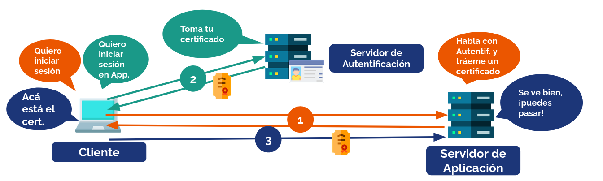
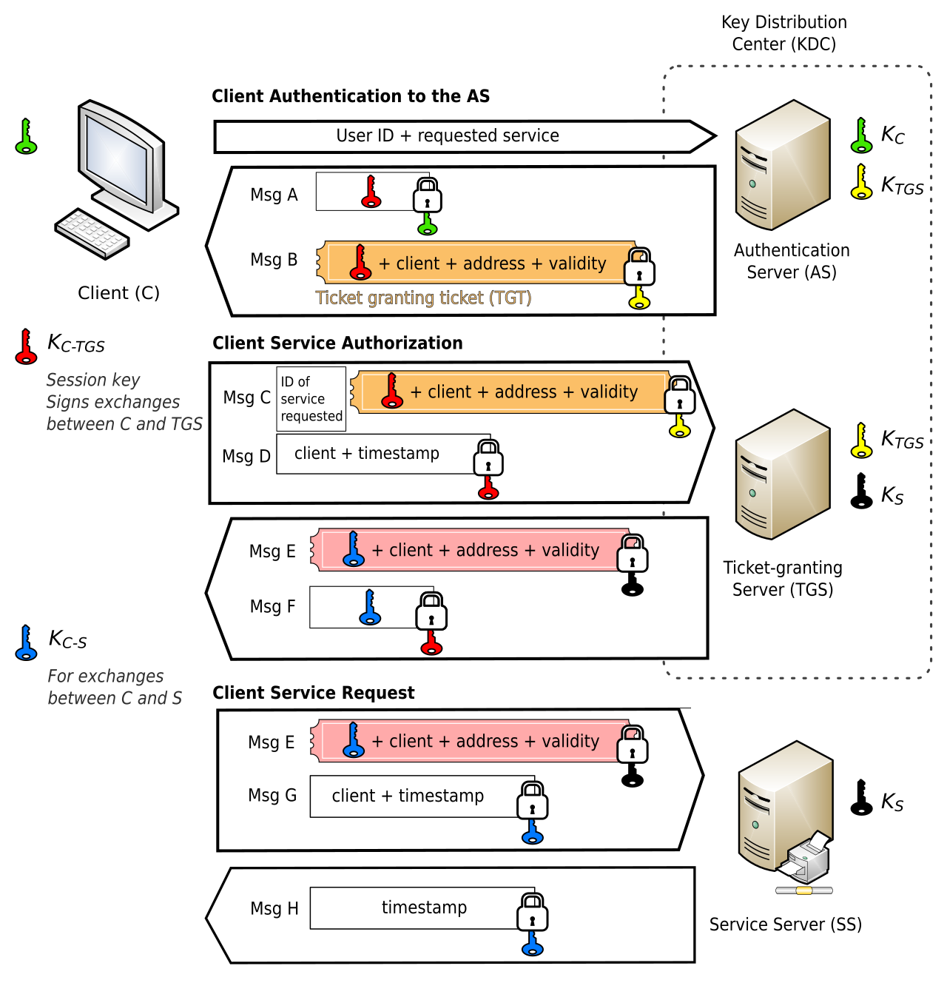
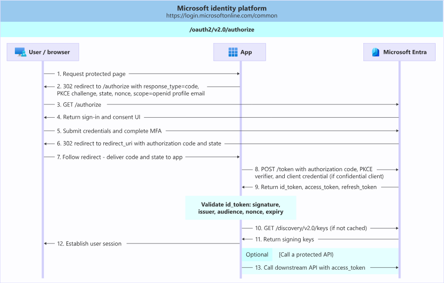
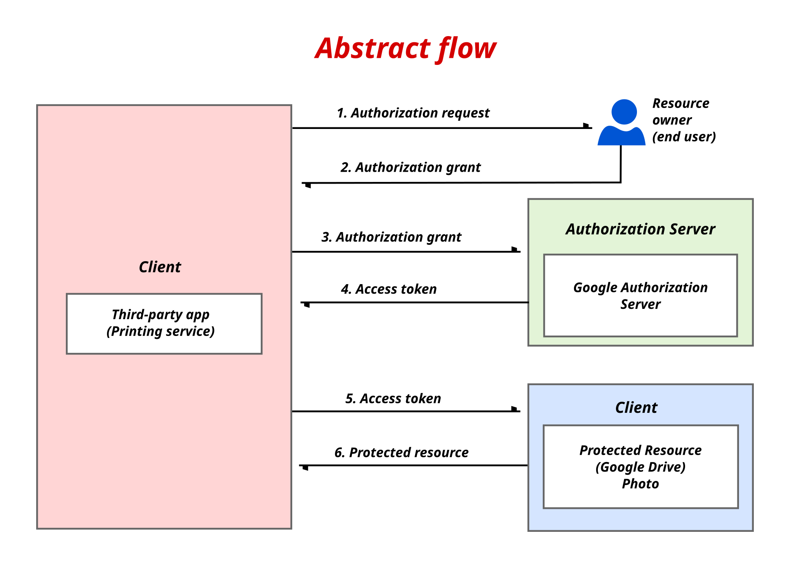



# Autenticación Federada

La autenticación es muy difícil, ¿por qué no se la delegamos a alguien que sepa mejor cómo hacerlo?

Esta idea se suele llamar autenticación federada o inicio de sesión único (Single Sign On en inglés).

El esquema generalmente es algo como esto:

1. El **💻 Cliente** se conecta a un **🖥️ Servidor de Aplicación** y solicita iniciar sesión de forma federada. El **🖥️ Servidor de Aplicación** lo redirige a un **🪪 Servidor de Autentificación**.
2. El **🪪 Servidor de Autentificación** le pide iniciar sesión y aceptar la transmisión de algunos datos de cuenta al **🖥️ Servidor de Aplicación**. Si el **💻 Cliente** acepta, se le entrega un **🎟️ Certificado**.
3. El **💻 Cliente** envía el certificado al **🖥️ Servidor de Aplicación**, el cual lo valida de forma independiente (usando criptografía asimétrica) o consultando directamente al **🪪 Servidor de Autentificación** (el caso directo no se ve en esta imagen).

Existen protocolos tradicionales que permiten contar con un sistema centralizado de inicio de sesión:

## Kerberos

Protocolo de autentificación que funcione en base a **Tickets**, los que son comunicables a través de una red insegura, que permiten demostrar identidad (autenticar) entre ellos de forma segura. La siguiente imagen del usuario [Jeran Renz](https://commons.wikimedia.org/wiki/User:Jeran_Renz) de Wikipedia muestra cómo funciona el protocolo

> [!COMMENT]
>  tal vez es mejor volver a ver esta sección cuando hayas leído la unidad de **Criptografía**

> [!IMPORTANT]
> 👷 **Pendiente**: Explicar paso a paso Kerberos.

## NTLM (New Technology Lan Manager)

> [!IMPORTANT]
> 👷 **Pendiente**: Explicar paso a paso NTLM.

## OpenID Connect

[OpenID Connect](https://openid.net/developers/how-connect-works/) es un protocolo de autenticación construido sobre el marco de autorización OAuth 2.0 (definido más abajo).

En OpenIDConnect existen los siguientes actores:

* **User Agent** o agente de usuario: El navegador o dispositivo que actúa _en nombre del usuario_.
* **Usuario**: La persona que quiere iniciar sesión
* **Proveedor OpenID** (también conocido como Identity Provider o IDP): Entidad que provee el servicio de identidad. Algunos ejemplos: Google (cuando usas el botón "iniciar sesión con Google"), GitHub, ClaveÚnica, MiUChile.
* **Relying Party** Aplicación que externaliza el inicio de sesión a un IDP.

El método de funcionamiento es el siguiente, en términos generales:

1. Un usuario navega a una aplicación web con su navegador
2. El usuario hace click en iniciar sesión o crear cuenta con un proveedor externo (compatible con OpenID Connect). La aplicación actual redirige al proveedor de identidad con parámetros especiales que le ayudarán a hacer seguimiento a la consulta al terminar de iniciar sesión, y que definen los valores del perfil que la aplicación web necesita para iniciar sesión y/o crear una cuenta.
3. El proveedor de identidad muestra un formulario de inicio de sesión y contraseña. El usuario ingresa los datos solicitados. Es posible que se pidan otras validaciones posteriormente (como MFA del proveedor de identidad).
4. Si el inicio de sesión es exitoso, generalmente se muestra un cuadro de consentimiento, explicitando qué datos serán compartidos con la aplicación web inicial.
5. Si lo anterior se acepta, se devuelve el User Agent al sitio de la aplicación web inicial con parámetros (entre ellos, uno llamado `token`) que le permitirán validar si el inicio de sesión fue exitoso. Específicamente, el Relying Party llama a un endpoint del IDP que le devuelve un `access_token`, un `refresh_token` y un `id_token`, el que puede ser validado para confirmar que la respuesta viene de la fuente autoritativa correspondiente.

El siguiente diagrama del IDP de Microsoft ([obtenido de este enlace](https://learn.microsoft.com/en-us/entra/identity-platform/v2-protocols-oidc#send-the-sign-in-request)) muestra el paso a paso de un inicio de sesión OpenID Connect. En el diagrama, App es la aplicación que desea externalizar el inicio de sesión y Microsoft Entra es el IDP.

> [!TIP]
> Inicia sesión en U-Cursos con la _consola de desarrollador_ abierta y la opción _persist logs_ (persistir registros) activada. Monitorea en la pestaña _network_ qué URLs se visitan desde que abres U-Cursos sin haber iniciado sesión hasta que logras iniciarla.

## Otros protocolos

A continuación mencionamos otros protocolos y equemas que cumplen el objetivo de autenticación (o autorización) delegada.

* **SASL**: Esquema que permite conectar aplicaciones compatibles con mecanismos de autenticación compatibles. Entre las aplicaciones más conocidas se encuentran IMAP, LDAP, POP, SMTP, XMPP y entre los mecanismos de autenticación y autorización se encuentran Usuario/Contraseña, OpenID y OAuth 2.0.
* **RADIUS**: Protocolo de autenticación y autorización usado en aplicaciones de red (como por ejemplo, redes cableadas e inalámbricas empresariales). El [RFC 2865](https://datatracker.ietf.org/doc/html/rfc2865) lo define.

> [!COMMENT]
> La conexión WiFi de la Escuela (la que usa la cuenta CEC) probablemente usa un servidor RADIUS para inicio de sesión (el que muy probablemente está sincronizado con el directorio de usuarios del CEC).

* **OAuth 2.0**: Protocolo de autorización (no autenticación) definido en los RFC [6749](https://datatracker.ietf.org/doc/html/rfc6749) y [6750](https://datatracker.ietf.org/doc/html/rfc6750) y que sirve como base del protocolo de autenticación OpenID Connect. Sirve para autorizar el intercambio de información acotada entre aplicaciones por un tiempo determinado. En algunos casos, se usa (incorrectamente) como mecanismo de autenticación, asumiendo que si el usuario tiene la posibilidad de conseguir un token de autorización, también tiene acceso a la cuenta. Esto no siempre será verdad.

El flujo OAuth 2.0 común se describe en esta ilustración obtenida de Wikipedia, diseñada por [Takahashi Shuuji](https://commons.wikimedia.org/wiki/User:TAKAHASHI_Shuuji).

* **OpenID 2.0 (a secas)**: No confundir con OpenID Connect (protocolo descrito en la sección anterior). Protocolo creado en 2007 con un objetivo similar al protocolo OpenID Connect ya descrito. En algún momento de la década de los 2010, muchas redes sociales lo implementaron, pero hoy quedó en desuso debido al desarrollo y la masificación de OpenID Connect. Existe incluso una guía para [migrar desde OpenID 2.0 a OpenID Connect](https://openid.net/specs/openid-connect-migration-1_0-06_orig.html).

* **[SAML](https://docs.oasis-open.org/security/saml/v2.0/saml-core-2.0-os.pdf)**: Protocolo usado para intercambiar datos de autenticación y autorización entre sistemas. Los datos se estructuran en formato XML y se usan servicios SOAP para intercambiar información. Si bien OIDC y OAuth 2.0 cumplen en gran parte el mismo objetivo que SAML, este protocolo se sigue usando en integraciones casi siempre orientadas a empresas.

## Plataformas abiertas que actuan como proveedoras de identidad

Algunas plataformas abiertas que pueden usarse para implementar IDPs. Todas ellas soportan OIDC, SAML y OAuth 2.0, permiten configurar MFA en sus cuentas y pueden federarse nuevamente con otras cuentas, por lo que son una buena opción para implementar en instituciones que cuentan con muchas aplicaciones y que necesitan contar con MFA en todas ellas:

* **[Keycloak](https://www.keycloak.org/)**: Implementación abierta en Java de un proveedor de identidad. Hoy lo mantiene Red Hat.
* **[Zitadel](https://zitadel.com/)**: Implementación abierta en Go de un proveedor de identidad. Fácil de usar y mantener.
* **[Authentik](https://goauthentik.io/)**: Implementación abierta en Go de un proveedor de identidad. Muy personalizable, pero más complejo.

> [!TIP]
> 🧪 Posiblemente en el laboratorio 1 vamos a integrarnos con alguno de estos sistemas.

## Ventajas y desventajas de a autentificación federada

Desde el punto de vista de ciberseguridad, la autentificación federada tiene algunas ventajas:

* **Disminuye la cantidad de credenciales necesarias para cada persona**: En entornos empresariales, esto es súper útil para centralizar la creación y eliminación de cuentas en un solo lugar.
* **Permite contar con MFA en cualquier aplicación que soporte autenticación federada**: No es necesario desarrollar, para cada aplicación, módulos de MFA y autenticación con contraseña.

Sin embargo, también hay algunas desventajas:

* **Mayor riesgo de ataques en IDP**: Si el IDP es muy usado en muchos tipos de cuentas, el impacto de filtración de una contraseña, de indisponibilidad o del descubrimiento de una vulnerabilidad en sus sistemas es mucho mayor. Un ejemplo concreto de esto en nuestro país es ClaveÚnica, que permite inicio de sesión en más de 400 sistemas distintos, [según su sitio web](https://portaldatos.digital.gob.cl/dashboards/dash_cu). 
* **Hay decisiones de diseño importantes que tomar al administrarlo**: Una vulnerabilidad típica de sistemas IDP mal configurados es la maleabilidad del ID de usuario. Si el IDP permite cambio de IDs de usuario (correos electrónicos o nombres de usuario personalizados) y ese valor es enviado en las integraciones a las aplicaciones web que lo usan como sistema de SSO, es posible que un usuario, cambiando su identificador por el de otro usuario que lo haya cambiado hace poco o haya eliminado su cuenta, **pueda entrar a una cuenta externa que no le corresponde**.
* **Se requiere confiar mucho en el IDP**: La institución que administra el IDP **posee la capacidad técnica de poder iniciar sesión en cualquiera de las cuentas de sus usuarios** (y las cuentas en las que estos usan el IDP para autenticarse), incluso sin conocer las contraseñas. También, **el IDP se entera de todos los sitios que usan sus usuarios, cuándo inician sesión y cuando la cierran**, lo que puede ser un riesgo de privacidad.
* ****

> [!TIP]
> Elabora una lista de casos en los cuales crees que es conveniente contar con un IDP y en qué casos no lo es, justificando cada decisión.