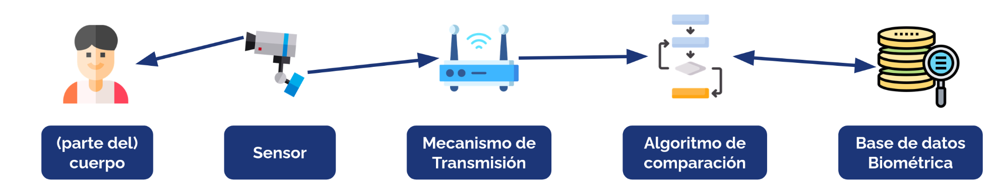
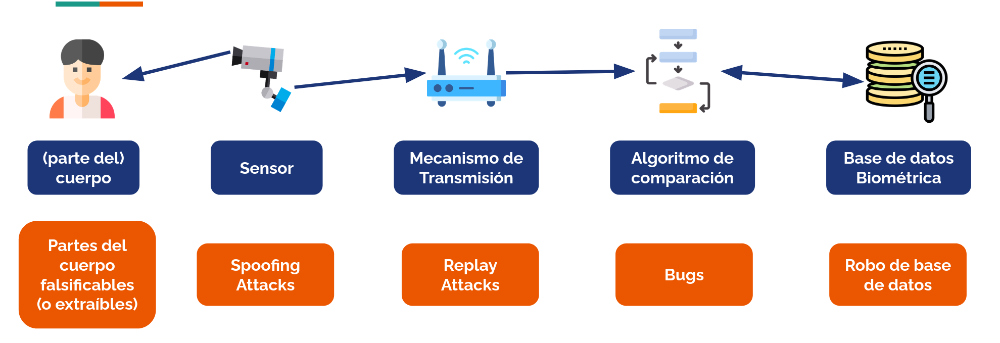



# Lo que soy

La **Autenticación Biométrica** es la transformación de características físicas de un individuo en un vector representativo de ellas, y la **comparación** de este vector con un dato de referencia.

Algunos ejemplos de autenticación biométrica:

* 🧑 **Reconocimiento facial** (características del rostro de una persona)
* 🎤 **Reconocimiento de voz** (características del timbre y la entonación de la voz de una persona)
* 👁️ **Reconocimiento de iris** (características del patrón del iris del ojo de una persona)
* 🫆 **Reconocimiento de huella dactilar** (características del patrón de las huellas dactilares de una persona)

## La validación biométrica

Para todos estos ejemplos, existen los siguientes componentes que pueden afectar en el resultado final de una validación biométrica.

* **Parte del cuerpo** que debe ser reconocida.
* **Sensor** que toma una muestra de la parte del cuerpo (video, foto, LIDAR, cámara térmica, etc.).
* **Mecanismo de transmisión**, usado para trasladar los datos tomados por el sensor al mecanismo que los compara con una referencia. Si la validación es remota, el mecanismo de transmisión podría ser una red interna. Si la validación es local, es el bus que conecta el sensor con el sistema que procesa y compara los datos.
* **Base de datos biométrica**: Repositorio que almacena la información de referencia de todos los usuarios del sistema. Esta información corresponde a una representación matemática de la parte del cuerpo comparada.
* **Algoritmo de comparación**: Algoritmo que recibe como entradas la información de referencia y la información detectada por el sensor, entregando un dato continuo que representa la probabilidad de que lo detectado por el sensor sea lo mismo que lo obtenido para crear la referencia. En el caso de validación biométrical local, el algoritmo suele vivir en un chip seguro del dispositivo, para dificultar su extracción.

## Problemas

Una validación biométrica puede realizarse de **forma local** (todos los pasos anteriores en un mismo dispositivo) o de **forma parcialmente remota** (algunos pasos en dispositivos cercanos a la persona validando y otros no). En el caso parcialmente remoto, **dependemos de confiar en dispositivos que muy probablemente no están en nuestro control, como se ve en la imagen siguiente:

* **Problemas en el lector o la parte del cuerpo escaneada**: Sensores de huella digital ([Samsung Galaxy S10](https://www.digitaltrends.com/phones/samsung-galaxy-s10-ultrasonic-fingerprint-scanner-fooled-by-screen-protector/)) y de reconocimiento facial ([iPhone X](https://www.cnet.com/news/privacy/kid-unlock-iphone-x-face-id/)) pueden ser burlados con condiciones de modificación (voluntaria o intencional) del lector o lectura de partes del cuerpo parecidas entre familiares, [fabricadas](https://blog.talosintelligence.com/fingerprint-research/) o generadas con Inteligencia Artificial. Como medida de mitigación, algunos sensores intentan tomar señales adicionales que muestren que la señal recibida viene de alguien vivo, o viene de una fuente en vivo.
* **Retransmisión de valores previamente detectados**: Si el canal de transmisión entre el sensor y el sistema que valida la señal no es seguro, un atacante podría interceptar señales o reenviarlas a conveniencia. Para evitar esto, se recomienda usar canales de comunicación cifrados y que cuenten con mecanismos de autentificación seguros.
* **Errores en el algoritmo de comparación**: Un algoritmo de comparación puede tener vulnerabilidades que hagan que se rechacen o acepten más o menos casos de los que se debería, [muchas veces perjudicando particularmente a minorías](https://www.nature.com/articles/d41586-022-03050-7). Generalmente, esto es calibrable a través de parámetros que ajustan el nivel de similitud del dato leído con el dato modelo. En otros casos (como el reconocimiento facial), el modelo es actualizado continuamente para detectar cambios en el tiempo (como aparición de barba, crecimiento de pelo o uso de lentes). La recomendación principal para evitar este problema es contar con un sistema robusto y ampliamente probado, que cuente con datos de alta calidad para comparar.
* **Robo en la base de datos**: Un robo de una base de datos biométrica expone a todas las personas cuyos datos están almacenados en ella, ya que el atacante o cualquier persona que reciba estos datos podrá usarlos para identificar individuos registrados sin su autorización y ellas y ellos no tendrán forma de "cambiar sus datos biométricos". Este riesgo es más claro cuando la base de datos de información biométrica es centralizada, ya que existiría una motivación mucho mayor para un atacante en intentar acceder a ella. [Esto ocurrió en marzo de 2026 en NYC Health + Hospitals.](https://www.nychealthandhospitals.org/pressrelease/notice-of-data-breach/), y [se estima que afectó a 1,8 millones de personas](https://cybernews.com/security/nyc-health-hospitals-fingerprints-medical-records-breach/).

## Casos interesantes

Los siguientes son casos interesantes de autentificación biométrica que se han vuelto de uso masivo o que han hecho noticia en los últimos años.

* **Worldcoin**: La empresa **[World](https://world.org/es-la)** (de Sam Altman, también fundador de OpenAI) inició entre 2022 y 2023 [una campaña en países no desarrollados](https://www.buzzfeednews.com/article/richardnieva/worldcoin-crypto-eyeball-scanning-orb-problems) (entre ellos, Chile) para recopilar datos de iris de personas en espacios públicos y pagar por ello (ya sea en criptomoneda o en dinero real). El objetivo de este proyecto es crear un sistema de validación humana mundial de alta confiabilidad (para estar inscrito, tuviste que haber escaneado tu iris previamente), que pueda ser usado posteriormente como una "prueba de humanidad en aplicaciones digitales. En 2024, Wall Street Journal [publicó un artículo](https://www.wsj.com/tech/sam-altman-openai-humanness-iris-scanning-4d0e1dab?eafs_enabled=false). No queda claro qué pasará con la información que Worldcoin recopila si la empresa desaparece o si sufren un ciberataque, lo que en conjunto con haber iniciado su estrategia en países con poca regulación sobre datos sensibles, la ha vuelto objetivo de muchas críticas.

> [!COMMENT]
> Curioso que la misma persona que fue parte del origen de la inundación de bots de los últimos años sea la que vende una solución a empresas y gobiernos para demostrar humanidad 🙄

* **Reconocimiento Facial para obtener ClaveÚnica en Pandemia**: En marzo de 2020, semanas después del inicio de la cuarentena por la pandemia de COVID-19, el desarrollador José Ureña [publicó en Twitter](https://www.cooperativa.cl/noticias/pais/servicios-publicos/registro-civil/suspenden-app-de-clave-unica-tras-falla-revelada-en-redes-sociales/2020-03-29/180758.html) que pudo lograr activar la ClaveÚnica del periodista Daniel Matamala usando solamente su RUT y una foto de él. Una posible razón por la que este problema pudo haber ocurrido es que **el parámetro de tolerancia en detección haya sido configurado para disminuir la cantidad de usuarios legítimos reclamando por no ser reconocidos** (falsos negativos), **pero sin validar que la tasa de usuarios fraudulentos intentando enrolar cuentas de otras personas** (falsos positivos) **no aumentara**.

## Recomendaciones de implementación

* **Considerar esquemas completamente locales y aislados de otros componentes**: En el caso de dispositivos móviles, existen chips dedicados en ellos que se encargan de actuar de sensor, procesar el dato observado y compararlo con un dato modelo almacenado localmente. El riesgo de exfiltración de los datos biométricos disminuye tremendamente al compararse con un caso en el que el dato se almacena de forma remota. Todavía es posible enfrentarse a problemas de spoofing debido a vulnerabilidades o limitaciones en partes del sistema.
* **Parametrizar bien según el modelo de amenaza**: Tener en consideración que la modificación de los umbrales de rechazo o aceptación de estos sistemas afectarán directamente a la cantidad de falsos positivos y falsos negativos (ambos con impacto en la seguridad o usabilidad del sistema).
* **Utilizar más de un factor para validar**: Mismo consejo que en las otras categorías de factores, mientras más de ellos se utilicen, menos probable es que ocurra un acceso no autorizado.
