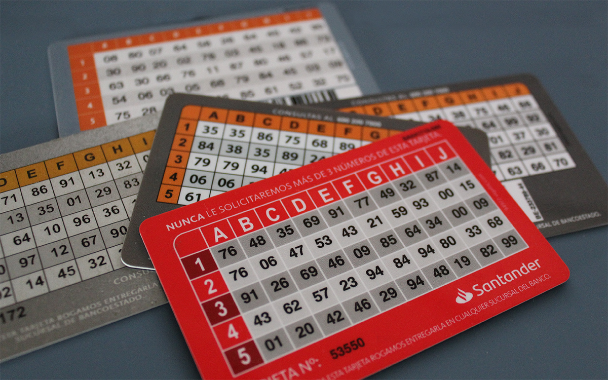
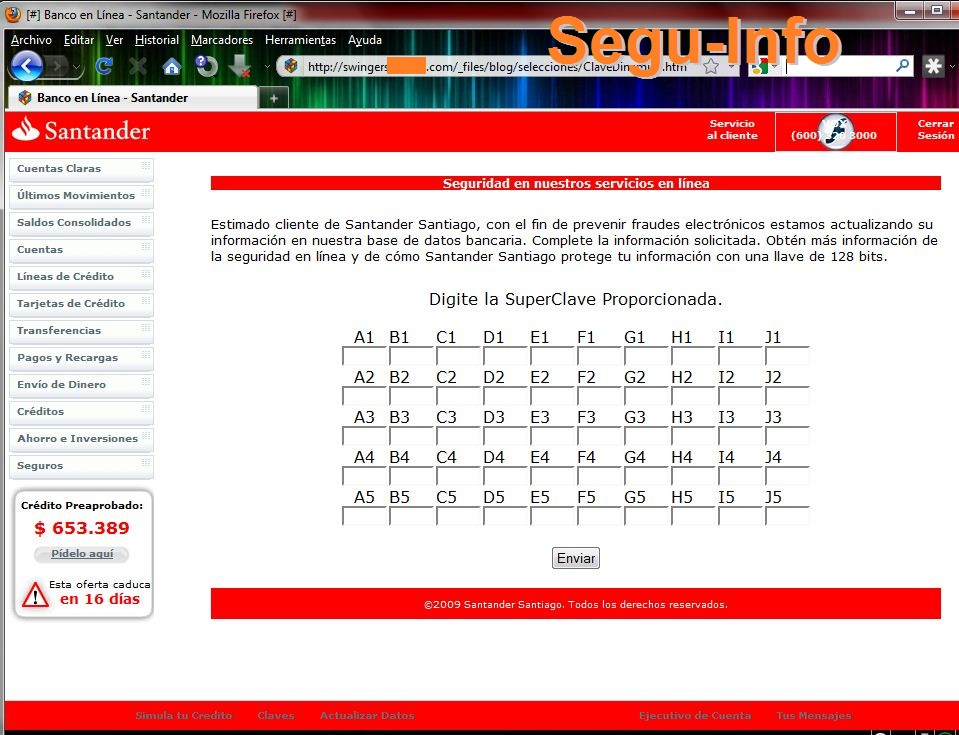
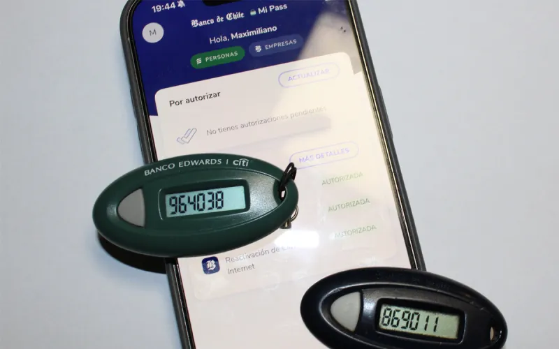
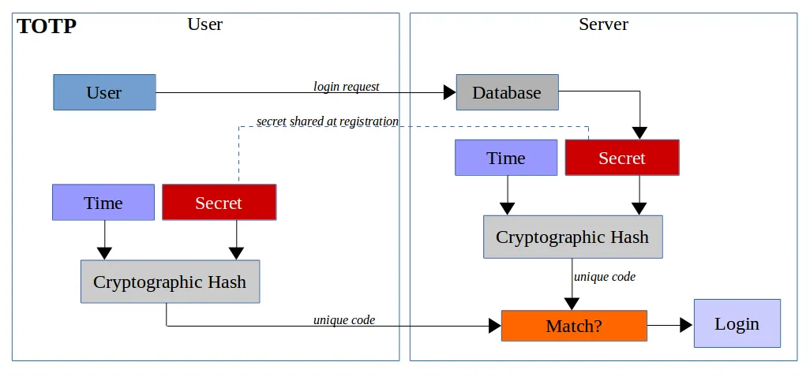
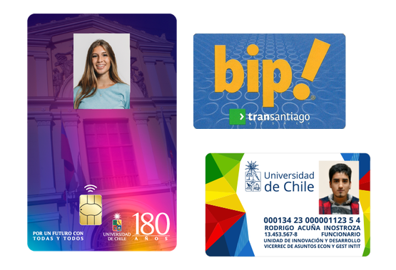
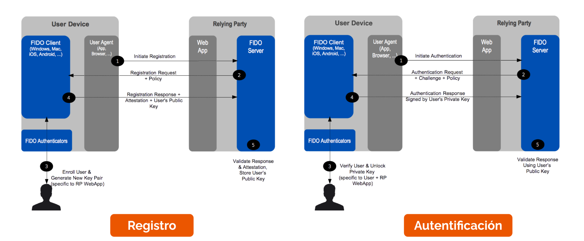
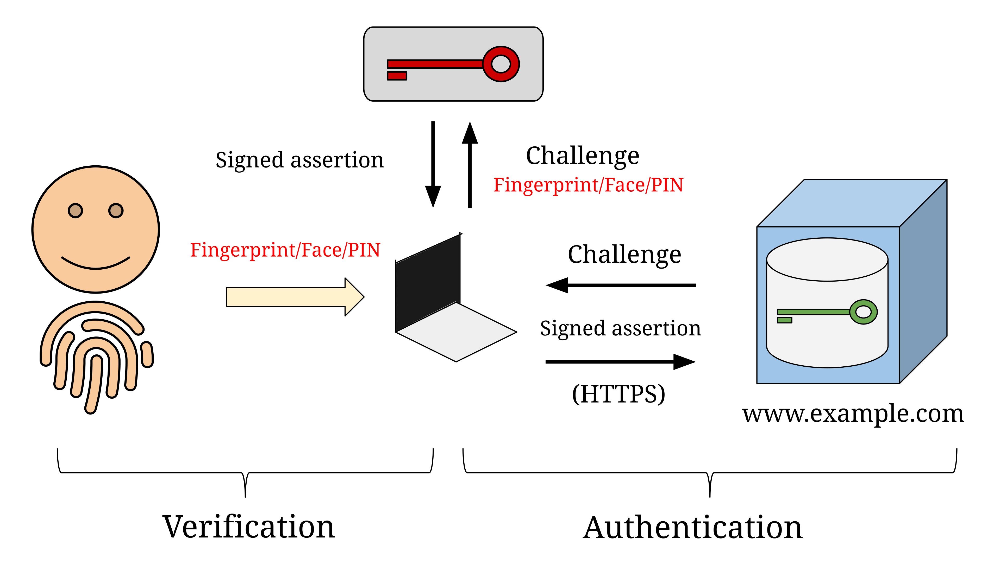



# Lo que tengo

Este tipo de mecanismos de autenticación incluye cosas que **solo la persona que tiene derecho a autenticarse con una cuenta** debería tener en su poder. 

## 💳 Tarjetas de Coordenadas

Las tarjetas de coordenadas son tarjetas de plástico con una grilla de números aleatorios, distribuidos en bloques por coordenadas.

Cuando una persona quiere demostrar que es quien dice ser en un sistema remoto, el sistema le pide ingresar un número acotado de valores en coordenadas específicas. 

> [!TIP]
> Si los valores en cada coordenada van de 00 a 99, **¿cuál es la probabilidad de que un atacante los adivine sin conocerlos?**
>
> **¿Por qué se piden solo algunas coordenadas y no sería más seguro pedir todos los valores de la tarjeta?** (Pista, piensa en los modelos de amenaza que pudieron haber sido considerados para este dispositivo)



Uno de los problemas más grandes de las tarjetas de coordenadas es que **son muy fáciles de copiar**. Basta con una foto o con una página de phishing que pida todas las coordenadas (según los atacantes, _para prevenir fraudes electrónicos_, como se muestra en este artículo del blog argentino [Segu-Info](https://blog.segu-info.com.ar/2010/12/phishing-banco-santander-chile.html)) para que deje de servir a su objetivo original.



> [!TIP]
> El 1 de agosto de 2026 la Comisión para el Mercado Financiero (Organismo de Estado que regula a los bancos) [prohibió el uso de tarjetas de coordenadas](https://www.adnradio.cl/2026/07/31/tarjetas-de-coordenadas-dejaran-de-funcionar-desde-este-sabado-estos-clientes-podran-mantenerlas/?outputType=amp) de forma general, permitiéndolo solo a personas con discapacidad o problemas de salud, adultos mayores y quienes no dispongan de dispositivos compatibles con los nuevos métodos de autenticación. **¿Qué opinas de esta medida?**

> [!COMMENT]
> ¿Esto pasaba el 2010 y recién el 2026 se prohibieron las tarjetas de coordenadas? 🫠


## Llaveros de seguridad



También conocidos como _Digipass_ o _tokens físicos_, son dispositivos con forma de llavero, un botón y una pantalla que muestran 6 dígitos aparentemente aleatorios, los que cambian cada vez que el botón se presiona o cada vez que pasa una cantidad de tiempo determinada.

¿Cómo funcionan? Los dispositivos generan números pseudo-aleatorios (en la unidad de criptografía explicaremos exactamente qué significa esto) a partir de un valor _semilla_, el cual es conocido por el banco y es grabado en el dispositivo al fabricarlo. Al momento de enrolar un _digipass_, el banco asocia el dispositivo (del cual conoce la semilla) a la cuenta del cliente, lo que le permite validar en todo momento que el código ingresado corresponda al mostrado en el dispositivo.

Algo muy positivo de estos dispositivos es que **su superficie de exposición es muy limitada**. Como no se conectan a Internet ni son conectables al computador, clonarlos es muy difícil. Sin embargo, han habido ocasiones en los que se ha roto la seguridad de los mismos, como por ejemplo [cuando el 2011 un atacante especializado y dirigido se robó la base de datos de semillas de un proveedor de tokens](https://archive.nytimes.com/bits.blogs.nytimes.com/2011/04/02/the-rsa-hack-how-they-did-it/).

> [!COMMENT]
> Y si eran tan buenos, ¿por qué se murieron? 😵 (podrían ser la alternativa a las tarjetas de coordenadas eliminadas).

Al menos, [el 2025 algunos bancos los entregaron como alternativa a la eliminación de tarjetas de coordenadas](https://chocale.cl/2025/08/banco-de-chile-se-adapta-a-la-eliminacion-de-las-coordenadas-con-aplicacion-y-token-fisico/). Sin embargo, hasta la fecha (2026), entregar estos dispositivos no es obligación en nuestro país.

## OTPs

Los códigos de un solo uso (_One Time Password_ por sus siglas en inglés) son la versión en _software_ de los llaveros de seguridad, lo que los vuelve más baratos.

En algunos casos, el código es enviado por SMS o email a las casillas o números previamente registrados. Sin embargo, esto no es recomendado porque ambos canales no son considerados seguros y [hay casos registrados](https://www.theverge.com/2017/9/18/16328172/sms-two-factor-authentication-hack-password-bitcoin) de interceptación de correos o mensajes SMS.

En el caso de códigos generados por aplicación se usan generalmente los algoritmos HOTP o TOTP (que son casi lo mismo, solo que uno usa un reloj interno para generar el código). 

```
HOTP(C) = HMAC(K,C)[:6] (C es el número de ejecución y K es una llave secreta)
TOTP(T) = HOTP(I); con I =  T / 30 (T en Unix time) 
```

(HMAC es una función de MAC que veremos con más detalles en Criptografía. Por ahora asuman que es una función de _hash_ que recibe dos valores como entrada).

En [este sitio](https://blog.trezor.io/why-you-should-never-use-google-authenticator-again-e166d09d4324) hay una imagen que explica muy bien cómo funciona TOTP. HOTP es casi lo mismo, pero usa un contador que incrementa cada vez que se revisa un código, en vez de un valor basado en el tiempo.




La seguridad de este sistema depende de que **el proceso de enrolamiento no sea interceptado por un atacante**, y que **no exista forma de volver a ver el código de enrolamiento después de enrolar un dispositivo** (ni en el dispositivo enrolado ni en la plataforma que requiere autenticación). En caso contrario, **un atacante podría conseguir acceso una vez a cualquiera de los dos dispositivos y copiar ese valor**.

Algunas aplicaciones móviles que generan estos códigos:

* **[Bitwarden Authenticator](https://bitwarden.com/products/authenticator/)** (App Store, Play Store)
* **[Google Authenticator](https://support.google.com/accounts/answer/1066447?hl=es&co=GENIE.Platform%3DAndroid)** (También implenenta las notificaciones de aplicación que se definen a continuación)
* **[Microsoft Authenticator](https://support.microsoft.com/es-ES/authenticator/download-microsoft-authenticator)** (También implenenta las notificaciones de aplicación que se definen a continuación)
* **[Authy](https://www.authy.com/)** (También ofrece respaldos en la nube de los códigos)

> [!TIP]
> ¿Qué efectos en la seguridad de los TOTP (positivos y negativos) tiene contar con respaldos en la nube de estos códigos? Describe el modelo de amenaza que estás usando para hacer la evaluación.

## Aplicaciones móviles y notificaciones push

Cuando los servicios cuentan con una aplicación móvil para sus usuarios, algunos sistemas de autenticación usan las notificaciones _push_ de la aplicación para notificar, aceptar o rechazar inicios de sesión (Se supone que el usuario previamente inició sesión en la aplicación, enrolándola). En algunos casos la aceptación de la notificación requiere una clave fija, en otros un número aleatorio mostrado en el dispositivo que pidió realizar la autenticación.

El supuesto es que **Solo alguien que tiene acceso al dispositivo seguro puede aceptar la notificación**.

Este mecanismo puede tener algunos problemas de seguridad, relacionados con usabilidad e implementación:

* **Fatiga de notificación de autenticación** (también le dicen _MFA Fatigue_ o _Push Bombing_): Cuando un atacante ya tiene acceso a un factor de autenticación de una cuenta, puede forzar el envío masivo de notificaciones de autenticación, esperando que por error el usuario acepte una de ellas y le deje ingresar a la cuenta. Es por esto que algunos servicios (como _Microsoft Authenticator_ y el Sistema Operativo Android) entregan un código obligatorio y aleatorio en el navegador, el que debe ser ingresado en la aplicación para aceptar la confirmación de acceso (y que un usuario que no ha pedido la notificación no tendrá como conocer).

  [Según el sitio Dark Reading](https://www.darkreading.com/cyberattacks-data-breaches/uber-breach-external-contractor-mfa-bombing-attack), lo anterior le pasó a Uber el 2022 cuando fueron atacados por el _actor de amenaza_ `Lapsus$`.

* **Aumento de superficie de exposición**: Vulnerabilidades en las aplicaciones de autenticación (por no cumplir el **principio de Economía de Mecanismos**) podrían facilitar a atacantes aprobar autenticaciones sin contar con el dispositivo (o saltárselo definitivamente). [En el CLCERT encontramos algo así hace unos años en un banco](https://www.cooperativa.cl/noticias/tecnologia/internet/seguridad/investigador-denuncio-grave-vulnerabilidad-en-banco-chileno/2018-04-27/184252.html).


## Tokens y tarjetas inteligentes 

Las tarjetas inteligentes son tarjetas con un mini computador dentro de ellas. A veces tienen un chip a la vista (como las tarjetas bancarias y las credenciales universitarias). También pueden comunicarse inalámbricamente, a través de protocolos como RFID, [NFC](https://nfc-forum.org/learn/nfc-technology/), [MIFARE Classic](https://www.nxp.com/products/rfid-nfc/mifare-hf/mifare-classic:MC_41863), [MIFARE DESFire](https://www.nxp.com/products/rfid-nfc/mifare-hf/mifare-desfire:MC_53450), o [FeliCa](https://www.sony.co.jp/en/Products/felica/). En el mundo, suelen ser usadas para identificación en campuses u oficinas, pagos financieros o de transporte público, apertura de puertas de hotel o de estacionamiento, entre otros usos.



El computador en la tarjeta no tiene batería, pero se energiza cuando se acerca a un lector compatible.

También existen los **token físicos**, dispositivos que se pueden conectar por _USB_ o _NFC_ a un computador de escritorio o dispositivo móvil para realizar operaciones criptográficas en entornos seguros

Dependiendo de la tecnología de la tarjeta o token, suelen usarse dos tipos de autenticación con ellas:

* **Presentación de un ID interno**: Algunas tarjetas, como las RFID o MIFARE Classic (la tecnología de la Tarjeta Bip! por casi 20 años, a pesar de que cuando se empezó a usar el 2007 ya tenía 12 años de vida y era considerada insegura), poseen guardado un identificador númerico de solo lectura en sus primeros 4 bytes de almacenamiento. Este ID es leído por los lectores de tarjetas para identificar a un usuario y autenticarlo.

En teoría, una tarjeta MIFARE Classic que cumpla con el estándar no debería dejar escribir en la sección del ID. Sin embargo, desde hace mucho tiempo se encuentran a la venta tarjetas especiales (les dicen _tarjetas mágicas_) que sí permiten esta modificación, lo que facilita la copia de tarjetas con lectores USB o dispositivos como el [Flipper Zero](https://docs.flipper.net/zero/nfc/mfkey32).

* **Operaciones criptográficas**: Algunas tarjetas más modernas (MIFARE DESFire) o tokens como el **[Yubikey](https://www.yubico.com/)** y **[Google Titan](https://store.google.com/es/product/titan_security_key?hl=es&pli=1&selections=eyJwcm9kdWN0RmFtaWx5IjoiWkdWMmFXTmxYMlpoYldsc2VWOWZkR2wwWVc1ZmMyVmpkWEpwZEhsZmEyVjUifQ%3D%3D)** poseen controles basados en criptografía para dificultar la clonación de los mismos. En varios casos, los dispositivos guardan llaves privadas internamente, pero entregan una API a aplicaciones y el sistema operativo para ejecutar operaciones criptográficas como almacenamiento de llaves, cifrado y descifrado.

En el caso de los tokens físicos, existen protocolos como [FIDO](https://fidoalliance.org/specifications/) y [FIDO2](https://fidoalliance.org/fido2/) que permiten inicio de sesión estandarizado en aplicaciones que los implementan.



Los problemas más comunes en este tipo de dispositivos son las **fallas en el hardware o software**, que generalmente no son corregibles dado que los dispositivos no son actualizables por seguridad. En estos casos, la mitigación es comprar un dispositivo nuevo y parchado, [como pasó con unas Yubikey hace unos años](https://www.theregister.co.uk/2018/06/18/yubico_webusb_google_bounty/).

Otro problema difícil de mitigar sin enrolar dispositivos o mecanismos de autenticación adicionales distintos es el impacto de la pérdida o robo del dispositivo.

## Passkeys

Las [_Passkeys_](https://fidoalliance.org/passkeys/) o _llaves de acceso_ son casos particulares del estándar FIDO que permiten a una persona iniciar sesión en una aplicación o sitio web usando los mecanismos de seguridad de sus dispositivos. Son parte del estándar de autenticación web [_WebAuthn_](https://www.w3.org/TR/webauthn/).

El objetivo de las _passkeys_ es desincentivar el uso de contraseñas escritas (y evitar todos los problemas relacionados con ellas) para iniciar sesión en plataformas. Muchas plataformas conocidas (entre ellas Google, X y Meta) las soportan como medio alternativo de autenticación a las contraseñas.

Su funcionamiento lo veremos con más detalle en la sección de _Criptografía_ y está basado en el uso de claves asimétricas, pero describiremos acá algunas de sus ventajas:

* Son resistentes a algunos ataques de tipo _sitio fraudulento_. En estas situaciones, un atacante crea una página muy parecida a una real y logra que una víctima ingrese a ella (ya sea a través de _phishing_ o de _malvertising_). La _passkey_ no se puede utilizar por diseño en un dominio distinto al usado para registrarla, lo que hará que el sistema operativo no la ofrezca.
* Eliminan el problema de memorización, predictibilidad y repetición que tienen las contraseñas. Una _passkey_ es válida solo en un sitio a la vez. 
* No requieren el almacenamiento de un valor privado de parte del proveedor del servicio, basta con guardar la llave pública generada.

Esta imagen del usuario [Trscavo](https://en.wikipedia.org/wiki/User:Trscavo) en Wikipedia muestra el flujo común de uso de _passkeys_ (se puede ver el uso de un factor adicional en el dispositivo que almacena la passkey para autorizar la generación de la _afirmación firmada_)



* El usuario pide iniciar sesión en `www.example.com` (sitio en el que ya inició sesión previamente).
* El sitio `www.example.com` envía un _desafío_ (challenge) dependiente de la llave pública y resolvible solo contando con la llave privada correspondiente (_passkey_). El desafío es recibido por el dispositivo que almacena la _passkey_  para resolver.  
* El dispositivo pide una confirmación adicional (lo que sé: PIN, lo que soy: Huella/Cara) para autorizar la resolución del desafío. El usuario entrega la confirmación correspondiente.
* El dispositivo genera la _afirmación firmada_ (_signed assertion_) y la entrega al sitio `www.example.com` por **HTTPS**, el cual la valida. Si la afirmación es correcta, la sesión se inicia.

También tienen algunas desventajas, fundamentalmente de usabilidad:

* En algunos casos, debes registrar una _passkey_ por dispositivo desde el que quieres iniciar sesión. En algunas implementaciones de sistemas operativos, se permite delegar la autenticación a un dispositivo cercano al que está iniciando sesión, pero requiere el uso de sistemas propietarios (Windows, Mac) con teléfonos compatibles (Android con Servicios de Google o iOS).
* En otros casos, la _passkey_ se puede guardar en una aplicación con datos portables como un _gestor de claves_. Sin embargo, ahora la seguridad de la passkey dependerá de la seguridad de la contraseña primaria del usuario, aumentando la posibilidad de que sea usada en otros dispositivos no reconocidos en caso de exfiltración de la contraseña.
* Como en el caso de todo método de autenticación, se han descubierto algunos ataques en los últimos años:
  * [SquareX en DEFCON 2025](https://www.youtube.com/watch?v=LCGm5-ZjKK0): Relacionado con el uso de extensiones maliciosas
  * [PaloAlto en Agosto 2026 (!)](https://unit42.paloaltonetworks.com/passwordless-authentication-security-risks/): Relacionado con el uso de sistemas de respaldo de las Passkey en la nube.

## Conclusiones

Ya contar con dos dispositivos de autenticación (uno del grupo "lo que sé" y otro del grupo "lo que tengo") estamos dificultando la mayor parte de los accesos no autorizados a cuentas más exitosos hoy.

