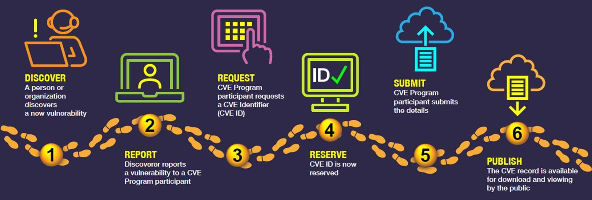
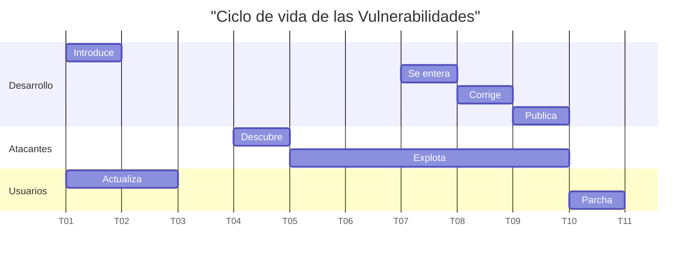
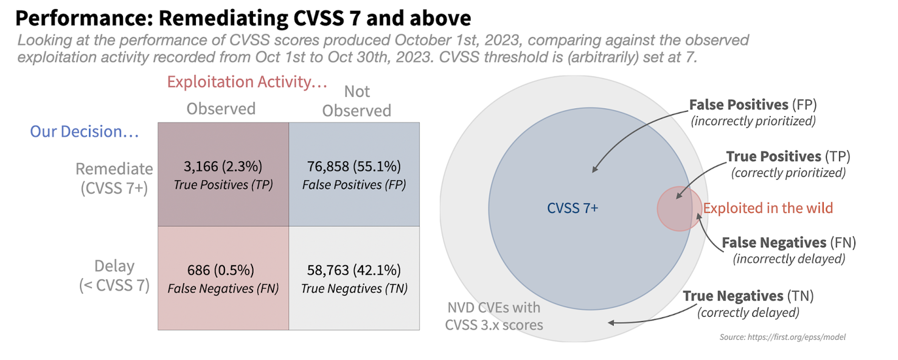
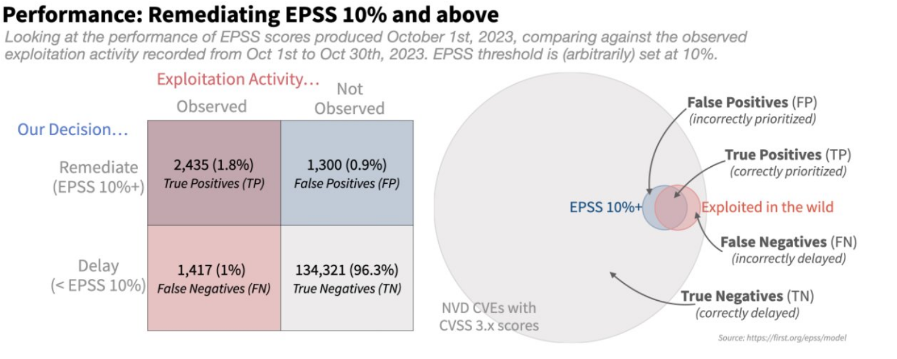


# Debilidades y Vulnerabilidades

> [!TIP]
> Supongamos que estás subscrito a una aplicación web para almacenar fotos en la nube que nadie más usa (fotos.hackerlab.cl), y cuando empiezas a usarla, notas que no tiene una opción para compartir tus fotos con otras personas que no tienen cuenta (cuando les mandas el link, les aparece un error `HTTP 403`). **¿Considerarías eso una debilidad o vulnerabilidad? ¿Por qué?**
>
> Y si, al contrario, notas que la URL a tus fotos tiene una estructura similar a esta: `https://fotos.hackerlab.cl/foto/1824918745`, y decides cambiar el ID para ver que pasa. El sistema te muestra una foto que (estas seguro/a) no es tuya. **¿Considerarías eso una vulnerabilidad o debilidad? ¿Por qué?**
>
> Si alguno de los casos anteriores era una vulnerabilidad o debilidad, **¿cómo crees que pudo haber aparecido?**

Hay muchas formas de vulnerar los _requisitos_ de ciberseguridad en un sistema informático. Algunas no dependen necesariamente un diseño o una implementación rota (como la ingeniería social), pero las más reconocidas e interesantes (para el perfil de Ing. Civil en Computación y a veces para los medios) son las que dependen de _exploits_ sobre _vulnerabilidades_ asociadas a _debilidades_.

El software pasa por varias etapas de planificación, diseño y desarrollo, que pueden ser vistas con mayor formalidad en un curso de Ingeniería de Software. Para efectos de este curso, simplificaremos y reconoceremos las siguientes:

* **Comprender los problemas a solucionar y su contexto**: El software nace para resolver uno o más problemas en un _contexto_ determinado. Un problema no necesariamente es algo comprendido o bien definido por quienes son afectados por él. El primer paso de un proceso de ingeniería de software debería ser la comprensión del problema a resolver y en qué contexto se desenvuelve. Es recomendable escribir esta comprensión en algún lado, para dejar claros los alcances de la solución y sus limitaciones.

* **Definir los requisitos**: Los _requisitos_ son los problemas que el software debe resolver y las restricciones específicas de la solución (tiempo, dinero, tecnologías, usos futuros) que no siempre dependen de quienes implementan.

    Recordemos que, como dijimos al inicio del curso, los _requisitos_ deben quedar súper claros tanto en lo que se **debe poder hacer** como en lo que **no se debe poder hacer**.

* **Diseñar un modelo del sistema**: Considerando tanto los problemas como los _requisitos_, se debe proponer un _modelo_ que pueda hacerse cargo de ellos. El _modelo_ debería quedar especificado en algún lado, y su rol es dejar por escrito la intención del equipo de desarrollo al diseñar e implementar aquello que resuelve el problema.

El _modelo_ no solo debe considerar los _requisitos_, sino también la experiencia de quienes lo diseñan e implementarán para cumplir con ellos de forma **simple**, **segura** y **eficiente** (o al menos ese es el perfil que se busca en los y las tituladas en Ingeniería Civil en Computación de nuestra universidad 😊).

* **Implementar el modelo**: Siguiendo el _modelo_ diseñado, es necesario desarrollar código que, en su conjunto, cumpla con todos los _requisitos_ definidos. Actualmente, ese código puede ser escrito a mano o con ayuda de herramientas automáticas. Sin embargo, si queremos desarrollar de forma segura desde el inicio, **la responsabilidad de su implementación siempre debe recaer en algún humano**, que debe disponer de herramientas y procesos para validar que la implementación cumple con lo requerido (_tests_, revisión manual de código, QA, entre otros mecanismos que veremos más adelante).

Recordemos que hoy en día el proceso de arriba es iterativo. Pocas veces nos toca desarrollar software desde sus inicios, y la mayoría del tiempo lo dedicamos a mejorar o añadir funcionalidades a software existente. También es importante recordar que, así como estas etapas están presentes en software desarrollado por nosotros y nosotras, también deberían presentes en las **dependencias** que usamos.

Las debilidades y vulnerabilidades aparecen cuando alguna de las etapas anteriores no se hace de forma correcta, y se consideran como algo casi asumido dentro del ciclo de vida del software. **La tolerancia a ellas y a su gravedad debe depender directamente de la criticidad del software diseñado y del _contexto_ del problema que debe ser resuelto**.

## Debilidades

Las **debilidades** son condiciones de software, hardware o firmware que, bajo ciertas circunstancias, pueden contribuir a la aparición de **vulnerabilidades**.

En algunos casos, las debilidades pueden originarse por implementaciones incorrectas (_bugs_), pero también pueden deberse a _modelos_ que no representan con la precisión suficiente la realidad del problema que intentan solucionar o _requisitos_ no transparentados adecuadamente.

Los desarrolladores y desarrolladoras de software llevan tanto tiempo desarrollando software, que ya cuentan con una lista exhaustiva de formas de cometer errores en su desarrollo. Esta lista se llama [_Common Weakness Enumeration_ (CWE)](https://cwe.mitre.org/) y es mantenida por una corporación estadounidense enfocada en problemas de defensa, inteligencia, seguridad pública, salud y ciberseguridad que nombraremos habitualmente en el curso, llamada [MITRE](https://www.mitre.org/).

> [!COMMENT]
> No será la primera vez que veremos el mundo de la ciberseguridad relacionado tan directamente con el mundo militar...

El CWE estructura las debilidades en grafos dirigidos que agupan las debilidades en varias categorías. Cada nodo del árbol tiene un tipo y un código. Uno de los grafos más comunes es [CWE-1000: Research Concepts](https://cwe.mitre.org/data/definitions/1000.html) , que clasifica las debilidades en 10 categorías generales:

* Control deficiente de acceso
* Interacción deficiente entre muchas entidades bien comportadas
* Control deficiente de un recurso durante su ciclo de vida
* Cálculo incorrecto
* Gestión del flujo de control insuficiente
* Fallo en un mecanismo de protección
* Comparación incorrecta
* Revision o manejo incorrecto de condiciones excepcionales
* Neutralización incorrecta
* Adhesión incorrecta a estándares de código

[Hay otros grafos y vistas](https://cwe.mitre.org/data/index.html), asociadas a otros modelos estándares para clasificar debilidades. Algunos ejemplos son:

* [Weaknesses in the 2025 CWE Top 25 Most Dangerous Software Weaknesses](https://cwe.mitre.org/data/definitions/1435.html)
* [Desarrollo de Software](https://cwe.mitre.org/data/definitions/699.html)
* [Diseño de Hardware](https://cwe.mitre.org/data/definitions/1194.html)

Los nodos del grafo pueden tener varios, varios tipos, y las aristas definen distintos tipos de pertenencia. No cualquier nodo puede ser asociado a una vulnerabilidad, ya que algunos nodos sirven como agrupación o categoría y no son lo suficientemente específicos para ello (en la página del nodo se explicita si es mapeable o no con vulnerabilidades).

Algunos tipos de nodos:

* **Grafo o vista**: Distintas jerarquías (algunas de tipo árbol, pero no necesariamente), que organizan taxonómicamente las debilidades.
* **Pilar**: Grupo abstracto de debilidades que no es mapeable con vulnerabilidades.
* **Clase**: Grupo de debilidades más concreto que Pilar, pero menos que base, que es mapeable con vulnerabilidades con consideraciones especiales
* **Categoría**: Grupo que se relaciona con otros nodos que tienen características similares, definiendo en el esa característica en común.
* **Base**: Debilidad generalmente independiente de un recurso o tecnología, pero con detalles suficientes como para entregar recomendaciones de detección o prevención. Son mapeables con vulnerabilidades.
* **Variante**: Especificación de una debilidad relacionada con un lenguaje de programación o contexto específico.

> [!TIP]
> Menciona ejemplos hipotéticos de diseño y desarrollo de software en los que podrían aplicar las siguientes debilidades, según sus definiciones en la página web:
* [Missing Authorization](https://cwe.mitre.org/data/definitions/862.html)
* [Exposure of Sensitive Information to an Unauthorized Author](https://cwe.mitre.org/data/definitions/200.html)
* [Command Injection](https://cwe.mitre.org/data/definitions/77.html)

## Vulnerabilidades

Las vulnerabilidades son **instancias concretamente explotables** de una o más debilidades en software, hardware o firmware, que al ser aprovechadas impactan negativamente los **requisitos de ciberseguridad** de un sistema.

Así como con las debilidades, existe un registro centralizado y estandarizado de facto de vulnerabilidades, a cargo de **MITRE Corporation**. El registro se llama [CVE (Common Vulnerabilities and Exposures)](https://www.cve.org/). Este registro numera las vulnerabilidades conocidas, las describe, les asigna un puntaje (más info de esto en breve), las documenta con recursos externos y describe sus mitigaciones (si existen).

En este registro, quedan anotadas (casi) todas las vulnerabilidades en **software o hardware distribuible o comercial**, es decir, del que pueden existir múltiples versiones en funcionamiento, en distinta infraestructura, administradas por distintas personas. Algunos ejemplos de este tipo de _productos_:

 * Sistemas operativos
 * Aplicaciones móviles o de escritorio
 * Software libre autohospedable
 * Software comercial instalable _on premise_
 * Plugins, librerías y complementos
 * Desarrollos parcialmentre a medida, pero desplegados por más de un equipo.

Todos estos productos reciben un [CPE o Common Platform Enumeration](https://cpe.mitre.org/) (sí, también de MITRE), que permite asociar automáticamente vulnerabilidades a versiones específicas de un software/hardware/firmware.

En resumen, una _vulnerabilidad_ del catálogo **CVE** está asociada a uno o más **CPEs** (versiones de productos afectados) y relacionada con una o más _debilidades_.

## CVE

En el ecosistema de CVE existen los siguientes roles:

* **CNA o Autoridad de numeración CVE**: Entidad autorizada por MITRE, con un alcance y responsabilidad específicos, que asigna regularmente CVE IDs y publica los registros CVE correspondientes.
* **CNA-LR o CNA de último recurso**:  **CNA** autorizada por una raíz para asignar IDs de CVE y publicar registros CVE dentro del alcance de la raíz correspondiene, por vulerabilidades no cubiertas por otro CNA o su alcance 
* **Root o Raíz**: Organización autorizada en el programa CVE que es responsable en un alcance específico, del reclutamiento, entrenamiento y gobernanza de una o más entidades CNA, CNA-LR u otras raíces.
* **Top-Level Root**: Raíz de mayor nivel, responsable de la gobernanza y la administración de una jerarquía específica, incluyendo otras **Raíces** o **CNAs** en esa jerarquía.

También existen los siguientes tipos de organizaciones:

* **Fabricante**: Organización que vende productos o servicios a los que se les puede asignar un CVE.
* **Organización Investigadora**: Organización cuyo objetivo es investigación en ciberseguridad, y cuyos resultados suelen ser la identificación de vulnerabilidades a las que se les puede asignar un CVE.
* **Código abierto**: Organizaciones que producen, administran o mantienen productos o servicios, disponibilizando libremente su código abierto para su posterior redistribución o modificación.
* **CERT/CSIRT**: Equipos de respuesta a incidentes de ciberseguridad. Veremos esto más adelante.
* **Servicio hospedado**: Servicio basado en la nube, plataforma como servicio, infraestructura como servicio o software como servicio.
* **Proveedor de servicios de Bug Bounty**: Plataformas de bug bounty, es decir, que administran procesos de reporte coordinado de vulnerabilidades. Veremos esto en la sección correspondiente del curso.
* **Consorcio**: Conjunto de entidades que se unen por conveniencia para trabajar en un proyecto en particular.

Puedes ver una descripción más detallada y una lista de asociados en [el sitio oficial](https://www.cve.org/PartnerInformation/ListofPartners).

### Ciclo de vida de un registro CVE

¿Cómo una vulnerabilidad pasa de una idea explotable a un número centralizado? Generalmente, siguiendo estos pasos:

1. **Alguien** (investigador, fabricante, agencia ciber, ciudadano) descubre la vulnerabilidad
2. Ese alguien la reporta a un **participante del programa CVE** (_Program Partner_), organismo autorizado por MITRE para recibir vulnerabilidades de un tipo de producto o en una región específica.
3. El **participante** solicita un **CVE ID** y lo reserva para asignarlo a la vulnerabilidad.
4. El CVE es aprobado y reservado.
5. El **participante** sube los detalles del CVE
6. El CVE se encuentra disponible públicamente.

## Ciclo de vida de las vulnerabilidades

Las vulnerabilidades tienen un ciclo de vida que puede variar caso a caso, pero generalmente existen estas etapas:

* **T01**: Vulnerabilidad es introducida en el software por fabricante, generalmente por accidente y éste es distribuido. Usuarios instalan versión vulnerable. Nadie sabe que existe la vulnerabilidad
* **T04**: Vulnerabilidad es descubierta por un atacante. Atacante encuentra una forma de sacarle provecho (vendiéndola, usándola para sus objetivos, etc)
* **T05**: Vulnerabilidad es explotada por uno o más atacantes.
* **T07**: Vulnerabilidad es conocida por fabricante (es afectado, recibe reportes de clientes, de investigadores o de agencias de ciberseguridad) y es diagnosticada. Si la vulnerabilidad es lo suficientemente crítica y hay acciones que mitigan la vulnerabilidad que no requieren actualizar (deshabilitar funcionalidades), son recomendadas a los clientes. Si el software afectado es distribuible (instalable localmente, dependencia de otro software u _on premise_), se le asigna un **CVE**.
* **T08**: Equipo de desarrollo trabaja en un parche de la vulnerabilidad.
* **T09**: Parche es distribuido a los clientes, quienes parchan (algunos antes, otros después).
* **T10**: Clientes parchan. Idealmente, los clientes que parcharon ya no están afectados por la vulnerabilidad.

### Vulnerabilidades de día zero (0-Day Vulnerabilities)

Entre **T04** y **T07** se considera que una vulnerabilidad **es de día cero**, esto quiere decir que la vulnerabilidad no es conocida por el fabricante (ni por gran parte de la comunidad de ciberseguridad) hasta el momento. Este tipo de vulnerabilidades son más valiosas porque, al no tener medidas de mitigación, son más efectivas. Una vez que una vulnerabilidad es de conocimiento público, deja de ser día cero (en el gráfico, eso sería en **T07**).

## Exploits

Son las formas de aprovecharse de las vulnerabilidades. Pueden ser a través de código, siguiendo pasos manuales en el uso de un sistema informático, o combinando ambas formas.

A veces, la publicación de vulnerabilidades viene acompañado de un código fuente que facilita su validación a través de una explotación muy controlada de la vulnerabilidad (evitando generar impacto en los **requisitos de ciberseguridad** de la aplicación). Estos códigos se conocen como **pruebas de concepto** (o _PoC_ por sus siglas en inglés).

> [!COMMENT]
> Algunas personas consideran que si se demuestra que existe una posibilidad teórica de explotar una debilidad, ya debería existir una vulnerabilidad. Otras personas dicen que una vulnerabilidad no existe si no entregas una forma real de explotar la debilidad relacionada. En el segundo grupo están quienes mantenían la publicación [PoC||GTFO](https://www.alchemistowl.org/pocorgtfo/) (traducido muy amablemente, significa "muestra la prueba de concepto o lárgate").
>
> El argumento también ha servido para desacreditar a "_hackers éticos_" que encuentran vulnerabilidades y están seguros/as de que pueden explotarse, pero deciden no probarlas para no exponerse a infringir la ley; lo que hace que quienes reciben los reportes no las tomen mucho en cuenta. Una forma de evitar este riesgo la veremos en la unidad de _Reporte Coordinado de Vulnerabilidades_.

Puedes encontrar una base de datos de exploits conocidos en [ExploitDB](https://www.exploit-db.com/) o buscando en GitHub por su CVE

> [!DANGER]
> **Nunca pruebes exploits en sistemas en los que no tengas permiso.** Puedes afectar los requisitos de ciberseguridad y cometer un delito de paso. En la unidad de Reporte Coordinado de Vulnerabilidades explicaremos cómo hacerlo bien.

> [!DANGER]
> **Nunca uses exploits públicos que no hayas visto previamente como funcionan, incluso si son en sistemas en los que estás autorizado.** Muchos atacantes crean repositorios falsos con supuestas PoC de exploits conocidos que contienen infostealers u otro tipo de malware.

##  ¿Cómo priorizar Vulnerabilidades?

Todos los días se encuentran nuevas vulnerabilidades, y cada vez son muchas más las que se encuentran ya que las herramientas para buscarlas se vuelven más accesibles y usables por cualquier persona, en especial desde que se masificó el uso de modelos de IA generativa para automatizar intentos de ataque.

La recomendación actual de las agencias de ciberseguridad del mundo es [**priorizar la aplicación de parches de ciberseguridad**](https://www.cisa.gov/news-events/directives/bod-26-04-prioritizing-security-updates-based-risk), según el **riesgo** asociado a que sean explotadas. Esto es porque, en general, el tiempo de parchado es escaso, y mejor que parchar todo en orden de llegada para evitar ciberataques es parchar lo que sabemos que es más probable que los actores de amenaza de mis sistemas van a usar para explotarlos. Esa probabilidad dependerá, entre otros factores, del tipo de actor de amenaza, de la facilidad de explotar vulnerabilidades y del impacto que tiene esa explotación en los objetivos de ellos.

Como vimos en la sección de modelamiento de amenazas, el **riesgo** se puede definir de manera cualitativa y cuantitativa. A continuación, veremos algunos modelos de cálculo de riesgo de vulnerabilidades que pueden ser útiles para ponderar vulnerabilidades cuantitativamente, priorizando su parchado para ser más efectivo en la prevención de incidentes de ciberseguridad o ciberataques.

### CVSS

También conocido como [Common Vulnerability Scoring System](https://www.first.org/cvss/v4.0/) y mantenido por el [Foro Internacional de Equipos de Respuesta a Incidentes y Ciberseguridad FIRST](https://www.first.org/), es un mecanismo matemático para calcular la criticidad de una vulnerabilidad, asignando un puntaje entre 0.0 y 10.0, y considerando varios factores, entre los que se encuentran:

* Tipo de vector de ataque
* Complejidad de los ataques
* Requisitos de los ataques
* Privilegios requeridos para atacar
* Interacción de usuario
* Afectación a Confidencialidad, Integridad, Disponibilidad del sistema vulnerable y de potenciales escalamientos (_movimiento lateral_)

También se incluyen métricas suplementarias que permiten ajustar el puntaje a una realidad de despliegue específico.

> [!TIP]
> Puedes usar la [Calculadora de CVSS oficial](https://www.first.org/cvss/calculator/4.0) para experimentar el impacto de cada factor en el puntaje final.

Dependiendo del puntaje, una vulnerabilidad puede ser clasificada en **None** (0.0), **Low** (0.1, 3.9), **Medium** (4.0 - 6.9), **High** (7.0 - 8.9) y **Critical** (9.0 - 10.0). Algunas personas usan estos clasificadores para definir qué tan urgente es parchar la vulnerabilidad (y generalmente tienen sentido).

> [!COMMENT]
> ¿Pero quién define el puntaje objetivo y oficial de una vulnerabilidad?

Las CNA que reciben las vulnerabilidades están encargadas de puntuarlas. Una vulnerabilidad puede tener más de un puntaje asociado, y el puntaje puede ir variando dependiendo de reconsideraciones que se hagan sobre el impacto de la vulnerabilidad y su facilidad de explotación.

> [!COMMENT]
> ¿Qué pasa si una vulnerabilidad no es correctamente parchada o el parche genera otras vulnerabilidades?

Es algo que pasa de vez en cuando, y es una de las razones por las que el impacto de una vulnerabilidad puede ir mutando. En algunos casos, se asigna más de un CVE a un conjunto de vulnerabilidades muy relacionadas, o a una vulnerabilidad que dejó de existir por un tiempo, pero que luego por un error de desarrollo volvió a aparecer.

---

Una de las desventajas de CVSS es que muchas veces el impacto real dependerá un montón del despliegue específico del software. Una vulnerabilidad con puntaje CVSS 10.0 tal vez no es tan importante de parchar si el sistema afectado está desconectado completamente de Internet y en una habitación con control de acceso muy restringido. 

A veces, el fabricante del software no está muy de acuerdo con el veredicto de la CNA correspondiente. Daniel Stenberg, mantenedor y creador de la librería `curl`, publica en su blog sobre [un caso desagradable de un bug de su software que fue interpretado como vulnerabilidad crítica](https://daniel.haxx.se/blog/2023/09/05/bogus-cve-follow-ups/), y su largo viaje intentando cambiar esta situación.

### EPSS

Sabemos entonces que el puntaje **CVSS** no es suficiente para establecer categóricamente que una vulnerabilidad debe ser parchada. Sería ideal contar con un oráculo que nos dijera qué tan probable es que algo pase en el futuro. ¿Será posible contar con algo así?

FIRST lo está intentando hace unos años, a través del puntaje [**EPSS** (_Exploit Prediction Scoring System_)](https://www.first.org/epss/). El puntaje corresponde a la probabilidad de que una vulnerabilidad específica sea explotada en los próximos 30 días, a partir de datos históricos y uso de aprendizaje automático.

El EPSS es un puntaje dinámico, varía todos los días para todas las vulnerabilidades. [Según la descripción oficial](https://www.first.org/epss/how-it-works.html), se consideran al menos las siguientes fuentes:

* Que exista o no código disponible para explotar la vulnerabilidad
* Qué tanto se menciona en canales especializados
* Características específicas declaradas en el CVSS correspondiente
* Si las menciones son o no recientes, y qué tanto tiempo lleva existiendo la vulnerabilidad
* Información de explotación activa de fuentes como telemetría de malware, honeypots, IDS/IPS y feeds de Inteligencia de Amenazas.

Una explicación didáctica de por qué EPSS es mejor para priorizar vulnerabilidades que considerar solo CVSS estaba publicada en el sitio oficial de FIRST, pero por algún motivo ya no la encuentro, así que la replicaremos en el apunte.

El año 2023 FIRST hizo el siguiente experimento: Dimensionó la cantidad de vulnerabilidades con EPSS 7 o mayor y la comparó con la cantidad de vulnerabilidades totales, para determinar qué vulnerabilidades parchar inmediatamente y qué vulnerabilidades postergar.

Al mismo tiempo, en ese mismo periodo, determinó las vulnerabilidades que fueron detectadas como explotadas. Si bien muchas de las vulnerabilidades explotadas están en el grupo CVSS 7 o más, este segundo grupo es tan grande que el esfuerzo en parcharlas todas no parece ser tan efectivo. Solo el 2,3% de vulnerabilidades priorizadas fueron realmente explotadas. Si solo alcanzáramos a parchar un 4% del total de vulnerabilidades con CVSS 7 o superior, decidir cuáles parchar y cuáles no solo con esa información es una tarea con resultados bastante azarosos. Es como tener un edificio con al menos 1.000 puertas abiertas, pero contar solo con tiempo para cerrar 40 antes de que 20 personas intenten ingresar por cualquiera de las entradas.

En la imagen siguiente se ven los números concretos de este experimento: el 55% de las vulnerabilidades totales fue parchada pero no fue explotada, y el 2,3% de las vulnerabilidades totales fue parchada y sí fue explotada; mientras que el 0.5% de las vulnerabilidades no fue parchada y fue explotada, y el 42% de las vulnerabilidades no fue parchada ni explotada.

En cambio, si nos enfocamos solamente en las vulnerabilidades que tienen probabilidad de explotación de 10% o superior en los próximos 30 días, nos encontraremos en una situación mucho más favorable. Si bien no vamos a parchar el 100% de las vulnerabilidades explotadas, el nivel de esfuerzo es mucho menor y el éxito mucho mayor que en el caso anterior. 

La tabla muestra que casi 2 de cada 3 vulnerabilidades parchadas fue explotada, y si bien quedaron más falsos negativos afuera, esto se puede ajustar aumentando el umbral de parchado.

> [!TIP]
> Puedes revisar las variaciones de EPSS de hoy en [el sitio oficial](https://www.first.org/epss/data_stats). Cambian (casi?) todos los días.

### KEV

Este no es un puntaje, sino más bien una característica particular que, si bien no entrega un número rankeable, puede servir un montón para ponderar el riesgo real de explotación de una vulnerabilidad.

[KEV](https://www.cisa.gov/known-exploited-vulnerabilities-catalog) es una clasificación binaria administrada oficialmente por [CISA](https://www.cisa.gov/) (la Agencia de Ciberseguridad e Infraestructura de Estados Unidos). El registro simplemente marca todas las vulnerabilidades que se han visto explotadas por atacantes _in the wild_. Si una vulnerabilidad se ha visto explotada, es probable que se siga usando, por lo que este factor debería impactar de manera importante en la decisión de si parchar o no parchar.

KEV ya está considerado en el puntaje EPSS, pero de todos modos vale la pena ver la lista de vez en cuando.