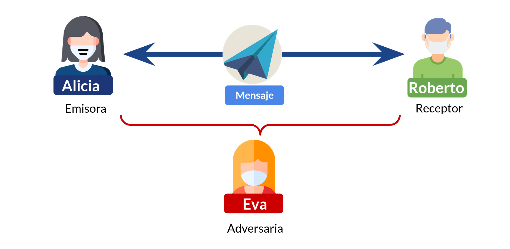
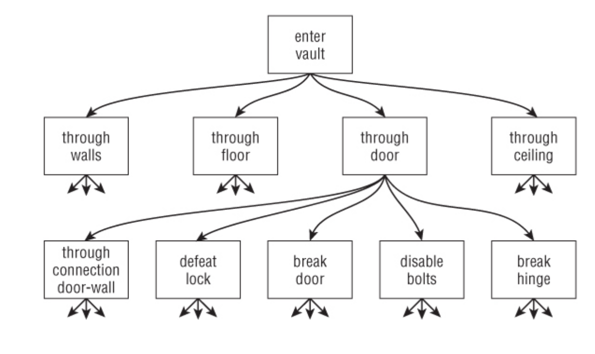

# Modelamiento de amenazas

Para saber cómo defendernos, tenemos que saber qué cosas de valor tenemos y a quiénes les podrían interesar.

## ¿Cómo comunico mensajes?

Hay un caso muy repetido de modelamiento de amenazas en protocolos de comunicación criptográficos.

Llamaremos la Emisora del mensaje (la que se comunica primero) `Alicia`, a quien lo recibe `Roberto`, y `Eva` a quien quiere romper alguna propiedad de ciberseguridad esperada por `Alicia` y `Roberto`.

Hablemos de `Alicia` y `Roberto`: No sabemos qué quieren proteger al comunicarse. ¿Quieren estar seguros de que el mensaje llega tal cual como la otra persona lo mandó, o de que nadie pudo haberlo leído durante su transporte?.

Hablemos ahora un poco de `Eva`. Si no sabemos qué sabe, qué no sabe, qué podría llegar a saber o qué controla, no vamos a poder crear una estrategia que permita a `Alicia` y `Roberto` "comunicarse de forma segura", según lo que definimos en el párrafo anterior.

## ¿Qué es un modelo de amenazas?

El **modelo de amenaza define los recursos que queremos defender y de qué adversario queremos defenderlos**.

* Un **recurso** es la **Confidencialidad**, **Integridad**, **Disponibilidad**, **Autenticidad** o el **No repudio** de un sistema, componente o dato.
* Un **adversario** es alguien con intereses opuestos a la protección de los recursos de quien evalúa el modelo de amenazas.
* El **límite de confianza** es el perímetro que engloba recursos con el mismo nivel de confianza. **Todo lo que venga de afuera podría ser un ataque**.
* La **superficie de ataque** es todo punto en el límite de confianza que recibe información desde fuera de él.

### Tipos de adversario

¿De quién me estoy defendiendo? Puedo clasificar a mi adversario en varias dimensiones:

* **Según su tamaño**, no es lo mismo defenderse de una persona, de un grupo de personas, de una empresa completa o de un país enemigo.
* **Según sus recursos**. ¿Con cuánto tiempo, dinero, conocimiento y acceso cuenta el adversario? 
* **Según sus intenciones**. Mi adversario puede ser curioso, buscar fama al lograr atacar mis sistemas, buscar dinero o simplemente "derrotarme" (si es un país enemigo o una empresa competidora)

Dependiendo de mi nivel de exposición y de lo que podría ganar el adversario al atacarme, voy a tener que prepararme más o menos.

### El modelo de amenazas puede cambiar en el tiempo

Esto puede ocurrir porque no fue bien definido (quien lo define no conoce completamente el dominio) o porque las amenazas van evolucionando en el tiempo.

Un ejemplo son las medidas de seguridad en sitios de internet. Varios de estos conceptos los veremos en clases y en las secciones correspondientes del apunte, por eso no se explican tanto y se cuentan como una conversación más que como materia.

 
> A mediados de los años 90, en internet no pasaban cosas muy entretenidas. Sí existían los foros, pero no podías comprar algo en una tienda de China y te llegaba a la semana siguiente (en realidad, no podías comprar algo en casi ningún lado). Si la información disponibilizada no tenía mucho valor económico, ¿quién iba a querer robarla?. Confiar en las mejores intenciones de otros internautas no era una idea disparatada.
>
> Pero pasó el tiempo y empezamos a hacer cosas importantes. Trámites gubernamentales, compras y transacciones bancarias, resultados de exámenes, correspondencia privada y mensajería instantánea. Ahora sí había valor en lo que uno veía, conversaba, compraba o descargaba. Con el tránsito de cosas de valor, empezó a haber interés de otros de acceder a lo que no era de ellos.
> 
> Por un lado, el aumento de amenazas requirió el aumento de medidas de seguridad para proteger el contenido de los mensajes. Lo que en un principio se transmitía en _texto plano_ entre el servidor en EE.UU. y un computador en Chile, permitiendo a cualquiera en el camino leer el contenido en tiempo real, empezó a transmitirse de manera _cifrada_ gracias al desarrollo de la criptografía asimétrica y su estandarización como capa que cubre el contenido de otros protocolos. Ahora los intermediarios verían valores aleatorios, y solo emisor y receptor conocerían el contenido.
> 
> Así como mejoró la tecnología para transmitir datos de forma privada, la necesidad de algunas entidades de dificultar el abuso de recursos también aumentó la cantidad de información que fue necesaria entregar y el número de validaciones requeridas para crear cuentas o ejecutar acciones críticas. Mecanismos como la validación de identidad gubernamental, los factores múltiples de autenticación (MFA) y el seguimiento del comportamiento en línea por empresas de publicidad y su impacto en la resolución de captchas se fueron haciendo cada vez más comunes, aceptados sicológicamente y normalizados. El modelo de amenazas sobre servicios en Internet se fue modificando a medida que fueron cambiando las cosas que hacemos en el ciberespacio y los comportamientos de los adversarios, y es muy probable que en el futuro se siga haciendo cada vez más restrictivo.
>
> Es por esto que, al contrario de lo que ocurría en el año 1993, hoy ser un perro es algo que sí pueden saber otros en Internet, aunque uno no quiera revelarlo voluntariamente:
>
> 

### Evaluación de riesgos y qué hacer frente a ellos

Si bien esto es una disciplina más grande que solo los riesgos técnicos o de ciberseguridad, es útil saber cómo funciona para entender mejor el objetivo del modelamiento de amenazas.

A continuación enumeramos algunos pasos necesarios para realizar una evaluación de riesgos:

* **Entender requerimientos del sistema**: Qué debe hacer y qué no debe hacer.
* **Identificar recursos y adversarios**: Qué quiero proteger y de quién quiero protegerlo.
* **Establecer requisitos de seguridad**: De lo que no debe hacer, qué tiene un impacto directo en los recursos.
* **Evaluar diseño del sistema**: Una vez definido, comprobar si en los casos borde se siguen cumpliendo los requisitos de seguridad.
* **Identificar amenazas y clasificar riesgos**: Teniendo claras las capacidades del adversario y del sistema, identificar posibles puntos de fallo
* **Hacerse cargo de los riesgos**: Para cada riesgo identificado, tomar una de las siguientes posturas:
  * **Mitigar**: Hacer más difícil el aprovecharse de un problema mediante la implementación de una medida de seguridad, la que debería costar menos que el costo de que el riesgo se materialice.
  * **Eliminar**: A través de la eliminación de características del sistema (menos funcionalidades)
    * **El único sistema seguro en todo momento es el que no hace nada**.
  * **Transferir**: Encargar a otra parte del sistema que se haga parte del riesgo (otro tipo de control o contratar un seguro).
  * **Aceptar**: Ninguna de las anteriores. Estar dispuesto a pagar el costo de materialización del riesgo.

### ¿Cómo ponderar el riesgo?

Se puede hacer de forma cualitativa o cuantitativa:

* **Cualitativa**: A partir de categorías: _Bajo, medio, alto, muy alto_.
* **Cuantitativa**: Con una fórmula matemática.

Algunas referencias conocidas sobre gestión de riesgos y evaluación de riesgos:

* [NIST SP 800-30](https://csrc.nist.gov/pubs/sp/800/30/r1/final) es una guía que enseña a ejecutar evaluaciones de riesgo en sistemas de información.
* [NIST SP 800-37](https://csrc.nist.gov/pubs/sp/800/37/r2/final) es un marco de gestión de riesgos para organizaciones y sistemas de información.

### Herramientas para modelar riesgos

Dos ejemplos:

* **[Modelo STRIDE](https://learn.microsoft.com/en-us/azure/security/develop/threat-modeling-tool-threats)** (del libro "Threat Modeling" de A. Shostack): Pensar en seis dimensiones
    * **Spoofing**: ¿Cómo podría pretender ser alguien que no soy en el sistema?
    * **Tampering**: ¿Cómo puedo modificar información sin autorización y sin que se note?
    * **Repudiation**: ¿Cómo puedo hacer que no haya evidencia en el sistema de que hice algo que sí hice?
    * **Information Disclosure**: ¿Cómo puedo ver información que no debería ver?
    * **Denial of Service**: ¿Cómo puedo evitar que otros accedan al servicio cuando deberían poder acceder?
    * **Elevation of privilege**: ¿Cómo puedo hacer cosas que no debería poder hacer, o para las que el programa no estaba diseñado?

* **[Árbol de ataques](https://www.schneier.com/academic/archives/1999/12/attack_trees.html)**: Partir con un objetivo final como raíz del árbol. Luego buscar formas de acercarme a ese objetivo, dibujando para cada forma encontrada un hijo al nodo anterior.

### Otras ideas para discutir

Ideas de las que hablaremos en clases, pero que no tienen un lugar definido (todavía) en el apunte.

* Considerar o no que un comportamiento es una vulnerabilidad dependerá de qué tan bien definido está el sistema. Si el sistema está bien definido, **esto debería ser claro para quienes conocen la definición.**
> [!NOTE]
> **Discusión**: ¿Es una vulnerabilidad que cualquiera pueda conocer mi nombre sabiendo solo mi RUT?
* El esfuerzo dedicado a evitar la ocurrencia de vulnerabilidades es inversamente proporcional a la confianza que se tiene en quienes lo usan, y directamente proporcional a la capacidad de los adversarios.
> [!NOTE]
> **Discusión**: ¿Qué medidas de seguridad valdría la pena aplicar en un sistema de finanzas familiares no expuesto a Internet? ¿O en un curso dictado completamente a través de Discord?
> * Define recursos a proteger y adversarios
> * Define límites de confianza y superficies de ataque
> * Define reisgos existentes, pondéralos cualitativamente y trata de hacerte cargo de ellos.
> * Usa técnicas como árboles de decisión o modelo STRIDE, si lo necesitas.