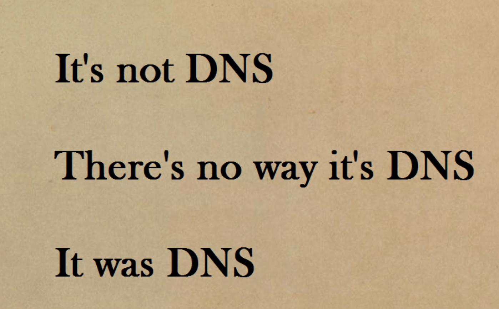
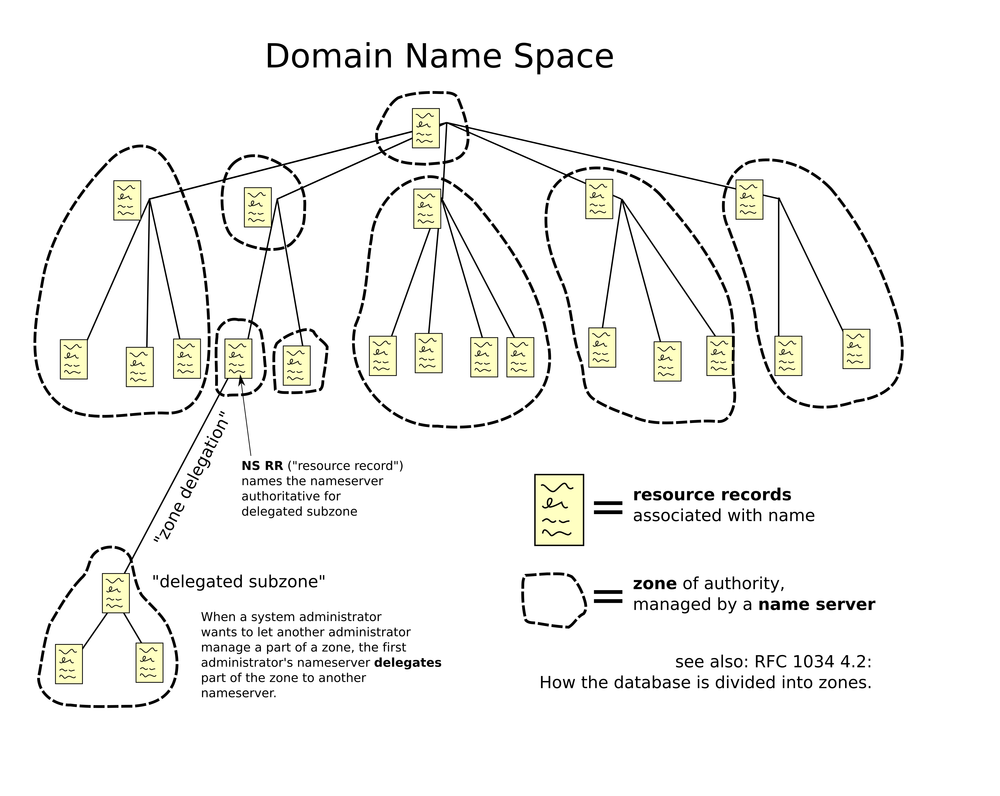
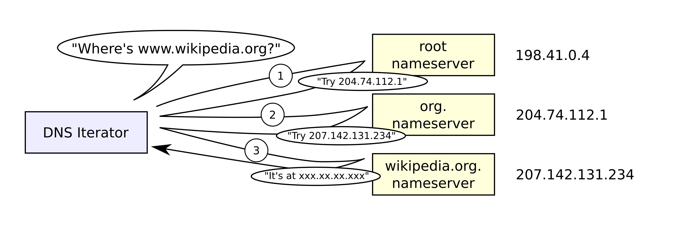
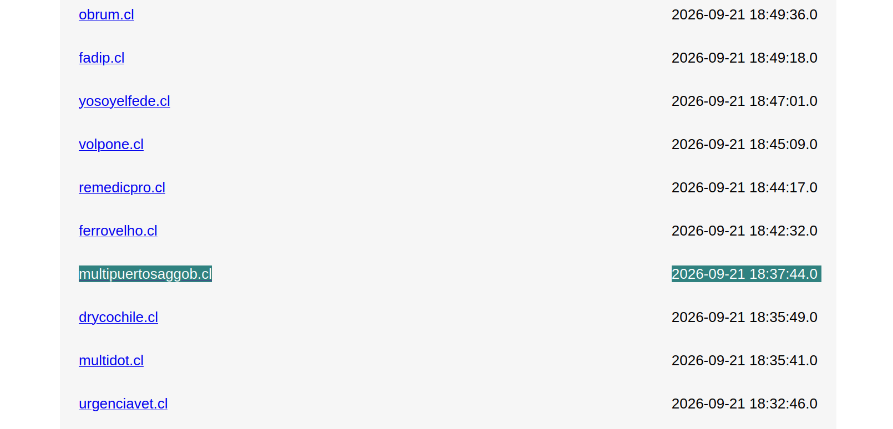
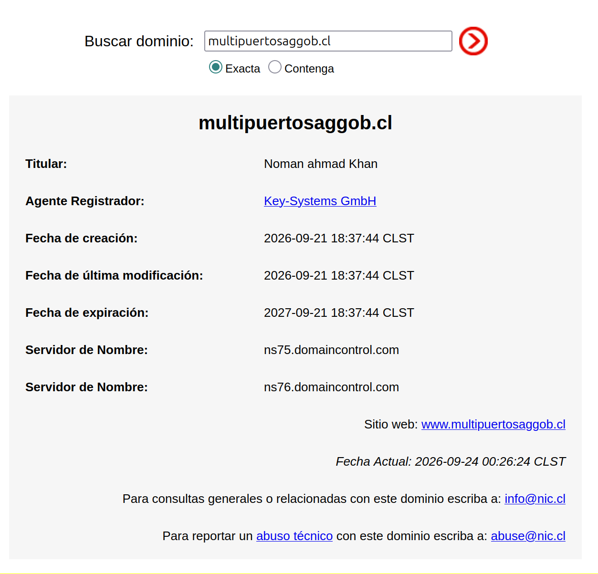

# Sistema de Nombres de Dominio

En esta sección veremos los conceptos esenciales relacionados con nombres de dominio y los servidores que soportan el sistema que nos permiten hablar de las vulnerabilidades más comunes que se aprovechan de malas configuraciones o debilidades del protocolo.

> [!COMMENT]
> Cuando hay problemas de red, casi siempre es DNS:
>
> 

DNS es un sistema jerárquico, como un árbol.Cada nodo es considerado una **zona de autoridad** para él y sus nodos hoja. La siguiente imagen muestracómo las zonas se relacionan entre sí, y cómo ocurre la _delegación de zonas_

* La zona raíz (.) es manejada por [IANA](https://www.iana.org/domains/root/servers).  Está compuesta de 13 servidores, nombrados por las letras A a la M. Sus IP están hardcodeadas en los _resolver recursivos_ (servicio web que contesta consultas DNS). Estos servidores tienen, asímismo, configuradas las IP autoritativas de cada dominio existente.
* Cada dominio (TLD) posee sus propios servidores, y así mismo, sus propias reglas para delegar dominios de nivel secundario (_SLDs_).
    * En algunas zonas (_.cl_) es posible registrar dominios en el SLD. En otras (_.name hasta 2026, _.ar_ hace unos años) solo en un tercer nivel.

Delegar una subzona significa que todo dominio dentro de ella es definido autoritativamente por otro servidor DNS. Esto ocurre naturalmente con los TLD: Se delega la zona del dominio comprado a las IP que define quien lo compra.

## Tipos de Nombres de Dominio

La cantidad de nombres de dominio de primer nivel (_TLDs_) es muy grande, pero finita. Puedes encontrar todos los nombres de dominio en DNS [acá](https://www.iana.org/domains/root/db).

Hay 3 tipos de nombres de dominio

* **gTLDs**: TLD de tipo genérico, no asociados a países, creados primero junto con los _ccTLDs_. Considera _.com_, _.net_, _.org_, _.biz_, _.info_, _.name_ y _.pro_. A veces incluye también a los _new gTLDs_.
* **New gTLDs**: Dominios creados desde el 2012
* **sTLD**: TLD auspiciados. Representan un tipo de comunidad, la que puede acceder al dominio. Ejemplos: _.aero_ (transporte aereo), _.asia_ (asia), _.coop_ (cooperativas), _.edu_ (instituciones educacionales estadounidenses), _.gov_ (gobierno estadounidense), _.int_ (organizaciones basadas en tratados internacionales), _.jobs_ (trabajo y recursos humanos), _.mil_ (ejército estadounidense), _,post_ (servicios postales), _.cat_ (comunidad cultural catalana), _.mobi_ (productos móviles), _.museum_ (museos), _.tel_ (datos de contacto), _.travel_ (viajes), _.xxx_ (sitios pornográficos).
* **ccTLDs**: 255 dominios de dos letras basados en los códigos ISO-3166-1 alpha-2 para los países. Ejemplos: _.cl_ (Chile), _.us_ (EEUU), _.co_ (Colombia), _.ai_ (Anguila), _.tv_ (Tuvalu), _.to_ (Tonga), _.io_ (Territorio Británico del Océano Índico).
* **Internationalized ccTLDs**: Dominios que usan sus caracteres originales (no ASCII). Ejemplos: _.الجزائر_ (Algeria), _.ευ_ (Grecia), _.中國_ (China).
* **Testing TLD**: Dominios reservados. Está garantizado que nunca se agregarán como dominios reales, por lo que se pueden usar en entornos de prueba o internos. _.test_, _.example_, _.invalid_, _.localhost_, y 11 dominios internacionalizados.

## ¿Qué vive en un dominio?

En un dominio uno puede guardar información de muchos tipos. Cada tipo se conoce como _Resource Record_ o **RR**.

Algunos tipos de RR:
* `A`: o IPv4 asociadas a un FQDN.
* `AAAA`: o IPv6 asociadas a un FQDN.
* `MX`: o dominio o IP usadas en un FQDN para servicios de correo electrónico. Aparte del valor, contiene un 
* `CNAME`: o dominio original al que debe apuntar el FQDN que contiene este **RR**.
* `TXT`: o datos de texto asociados al FQDN. Se usa para otros subprotocolos, como los que veremos en _e-mail_.

## Resolución de nombres de dominio

Esta imagen muestra cómo funciona la resolución de nombres de dominio.

Cuando queremos saber a qué IP apunta `www.wikipedia.org` (es decir, consultamos por los **RR** de tipo `A` asociados al dominio `www.wikipedia.org`), la consulta recursiva sigue este orden:
 - Se consulta a zona raíz una de las IP que está a cargo de `.org` -> La IP `204.74.112.1` en este ejemplo.
 - Se consulta a algún servidor a cargo de `.org` quién está a cargo de `wikipedia.org` -> La IP `207.142.131.234` en este ejemplo.
 - Se consulta a algún servidor a cargo de `wikipedia.org` la IP asociada al dominio `www.wikipedia.org`.

En la práctica, si el dominio ya había sido resuelto hace poco (un tiempo menor al **TTL** (_Time to Live_) del **RR**), se devuelve directamente el último valor consultado.

> [!TIP]
> ¿Qué evita que un resolver DNS conteste haciéndose pasar por una zona autoritativa? ¿O que conteste una IP distinta a la IP que realmente está a cargo de una parte del _FQDN_ (Fully Qualified Domain Name)?

## Vulnerabilidades y debilidades comunes

Mencionaremos algunos problemas de seguridad relacionados con los nombres de dominio.

### En su uso

#### _Cybersquatting_, homoglifos y dominios fraudulentos

NIC Chile (Centro de nuestra Universidad que administra la zona `.cl`) publica automáticamente y casi en tiempo real [una lista de los dominios nuevos inscritos](https://nic.cl/registry/Ultimos.do?t=1m).

Algo curioso que ocurre cada cierto tiempo es que personas compran dominios como `multipuertosaggob.cl` o `slepchiloegob.cl`, que se parecen mucho a sitios con login que sí existen, como https://multipuerto.sag.gob.cl y https://slepchiloe.gob.cl .

Generalmente los compran personas con nombres extraños, desde _agentes registradores_ fuera de Chile:

El caso de `multipuertosaggob.cl` es interesante, porque tiene un formulario de login. Perfectamente podría ser usado por un actor de amenaza para una futura campaña de phishing. A esto se le denomina _Cybersquatting_ y hay de muchos tipos:
- **con caracteres homoglifos**: En los TLD que aceptan caracteres internacionalizados, a veces se pueden crear dominios que visualmente se ven muy parecidos a los reales. En `.cl`, esto se podría hacer solo con vocales con tilde, eñe o combinaciones de letras visualmente parecidas (`1` vs `l` vs `I`, `rn` vs `m` por ejemplo). `uchiIe.cl` podría confundirse, con la tipografía adecuada. [Acá hay un generador de homoglifos](https://www.irongeek.com/homoglyph-attack-generator.php).
- **cambiando o agregando letras**: no se nota a simple vista que `uchlie.cl` no es `uchile.cl`. Esto puede ser usado por actores de amenaza para compra
- **usando subdominios**: `uchile.cl.login.malicioso.cl` es un subdominio válido y creable por la persona que administra la zona `malicioso.cl`.
- **usando cualquier dominio**: `https://malicioso.cl/uchile.cl/login` igual podría engañar a algunas personas.

> [!COMMENT]
> También hay personas que compran dominios parecidos no para ejecutar fraude directamente, sino que para venderlos en el futuro a un precio mayor 😠.

> [!TIP]
> ¿Cómo sé cuál es el dominio real de...
> - ... un supermercado?
> - ... un Organismo de Administración del Estado?
> - ... un banco?

### En su configuración

Las siguientes son problemáticas asociadas a la configuración de los dominios:

### Dominios a IPs olvidadas y dominios olvidadoes

Para poder usar un dominio, necesitas un servidor DNS autoritativo que lo maneje, y apuntar a las IP de ese servidor en la configuración del Agente Registrador donde se compró el dominio. Esto permite delegar la zona completa.

Sin embargo, ¿qué pasa si alguien apunta un (generalmente sub) dominio de una zona con alta reputación en buscadores a una IP que ya no se usa y un atacante se da cuenta? Puede intentar crear un servidor con el proveedor de hosting que maneja esa IP y conseguir su asignación, lo que le permitirá contar con un sitio difícilmente bloqueable.

Lo anterior es un riesgo para dominios de instituciones confiables (bancos, servicios gubernamentales, universidades), que hace necesario una revisión periódica de los subdominios en una zona, limpiando aquellos que ya no se usan.

> [!TIP]
> ¿Qué puede pasar si olvido renovar mi dominio? ¿Cuál es el mayor impacto que eso puede generar?

> [!TIP]
> ¿Y qué puede pasar si enlazo al dominio de otra persona en mi sitio, pero esa otra persona lo olvida?

### **Dominios wildcard**

Uno puede configurar el subdominio `*.malicioso.cl` para que apunte (vía **RR** de tipo `A`) a una IP específica (`1.2.3.4`).

Esto significa que todo posible subdominio de `malicioso.cl` apuntará a esa IP. Por ejemplo: `hola.malicioso.cl`, `estedominiotambienexiste.malicioso.cl`, `nosoy.malicioso.cl`.

Si bien hay casos de uso que justifican delegaciones de tipo _wildcard_, se recomienda evitarla para dificultar a los atacantes la creación de subdominios aleatorios en caso de afectación del servidor a la que su IP apuntan todos los dominios.

### En la infraestructura

DNS es un protocolo en texto plano, no autenticado ni cifrado. Esto genera algunos problemas en su uso:

* **Información en texto plano**: Las preguntas y respuestas a resolvers DNS tradicionales llegan y vuelven en texto plano. Un atacante con control de la red siempre podrá verlas
* **Información no siempre autenticable**: ¿Cómo sé que la respuseta que me llegó del resolver es real? Con la versión básica de DNS es imposible.
* **Atacante con control de red puede hacer muchas cosas**: Un atacante con el control de la red o del servidor DNS de una víctima podría hacer muchas cosas. Algunos ejemplos:
    * **Cache Poisoning**: DNS funciona por UDP, lo que significa que no lleva persistencia de conexiones. La primera respuesta con la IP de origen correcta y otros parámetros bien configurados será la que el resolver asuma como real, guardándola en cache. Si un atacante logra enviar a un resolver una respuesta haciéndose pasar por el autoritativo al que consultó y ésta llega antes que la real, el valor ingresado por el atacante puede quedar en caché por mucho tiempo.
    * **_Person in the Middle_**: Quien tenga control del canal de comunicación podrá ver todas las consultas DNS realizadas. De hecho, algunos Firewall usan DNS para monitorear la seguridad de los sitios visitados. Asímismo, podrá evitar que ciertas consultas lleguen a destino, o podrá responder ciertas consultas con otras IP arbitrarias.

> [!TIP]
> ¿Qué más podría hacer un atacante con control completo de la red sobre el dominio de una víctima?

## Mitigaciones

Las siguientes son algunas mitigaciones no tan masivamente adoptadas que ayudan a mitigar muchos de los problemas de DNS ya mencionados

* **DNSSEC**: Definido de forma agrupada en el [RFC9364](https://www.rfc-editor.org/info/rfc9364/), es un conjunto de extensiones a DNS (con RRs especiales y nuevos) que permite establecer una _cadena de confianza_ en las respuestas recibidas. Esto se logra _hardcodeando_ las llaves de las zonas raíz y validando, paso a paso, la delegación declarada a partir de firmas desde la zona raíz hasta el dominio consultado. Algunos bancos e instituciones críticas lo usan, pero su aplicación no está masificada. **DNSSEC no entrega confidencialidad**
* **DNS over HTTPS**: Corresponde a la resolución DNS a partir de una api web vía HTTPS. Esto entrega confidencialidad en la respuesta (solo emisor y receptor saben qué dominio se resolvió). Por eso, algunos firewall intentan bloquear los resolver DNS over HTTPS más conocidos.

> [!TIP]
> Según lo explicado, ¿DNS over HTTPS puede preservar integridad de la respuesta? ¿y de la cadena de confianza?
