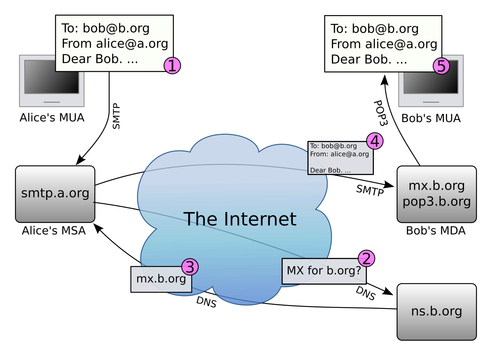
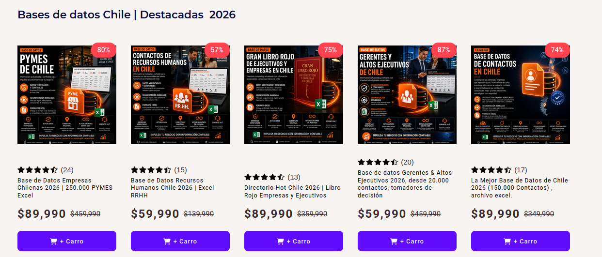

# Correo Electrónico


El correo electrónico o _e-mail_, por muy antiguo y asíncrono que pueda parecer frente a la rapidez de la mensajería instantánea, sigue siendo un componente fundamental y oficial de comunicación, al menos en entornos universitarios y laborales (en especial al relacionarse con otras instituciones).

> [!COMMENT]
> También se usa un montón como canal alternativo para el envío de desafíos de seguridad, e incluso como canal de publicidad incómoda y nod deseada a las personas solo porque compraron una vez en una tienda algo muy particular 🫠

Gran parte de lo visto acá viene del [RFC 5322](https://www.rfc-editor.org/info/rfc5322/).

## Estructura de una dirección de correo electrónico

Una dirección de correo electrónico tiene el formato `nombrecasilla@proveedor.tld`, donde `nombrecasilla` es un nombre único dentro de un proveedor específico y `proveedor.tld` es el dominio que posee los RRs de infraestructura necesaria para el servicio de correo electrónico.

Para que un dominio pueda recibir correos electrónicos, es necesario configurar RRs de tipo `MX` (_Mail eXchange_). Estos RR poseen los siguientes campos:
 - **TTL o _Time to Live_**: Tiempo que el RR puede pasar en la caché de un resolver
 - **Dominio**: Dominio que al resolverse se obtiene la IP del servidor de correo
 - **Prioridad**: Mientras más bajo, más prioritario. Permite definir orden de prueba cuando se configuran servidores de _fallback_, en caso de que los de prioridad más alta no funcionen.

 La recomendación es tener siempre al menos dos RRs de tipo `MX`.

> [!COMMENT]
> Si no se configuran estos RR, el mail server intentará enviar el correo al RR a de la dirección respectiva.

## Estructura de un correo electrónico

El mensaje que contiene un correo electrónico enviado a un servidor de intercambio de correos tiene una estructura similar al mensaje HTTP que vimos en web.


```http
Delivered-To: ekrell@usach.cl
Received: from mailserver.usach.cl ([1.2.3.4])
Received: from dichato.dcc.uchile.cl (4.3.2.1)
	by anakena.dcc.uchile.cl with ESMTPS id 46aa879b907df2fe;
	Sun, 27 Sep 1985 14:17:54 +0000
X-Spam-Score: -4.55
Authentication-Results: mail.dcc.uchile.cl;
	dkim=pass header.d=uchile.cl ...
	dkim=pass header.d=dcc.uchile.cl ...
	spf=pass...
	dmarc=pass...
DKIM-Signature: v=1; a=rsa-sha256; q=dns/txt; c=relaxed/simple;
	s=3orsn2wzjgkygdmtoocu6a37adhg4g66; d=uchile.cl; t=1790518672;
	h=List-Unsubscribe:List-Unsubscribe-Post:From:To:Reply-To:Subject:Message-ID:Content-Transfer-Encoding:Date:MIME-Version:Content-Type;
	bh=...
DKIM-Signature: v=1; a=rsa-sha256; q=dns/txt; c=relaxed/simple;
	s=224i4yxa5dv7c2xz3womw6peuasteono; d=dcc.uchile.cl; t=1790518672;
	h=List-Unsubscribe:List-Unsubscribe-Post:From:To:Reply-To:Subject:Message-ID:Content-Transfer-Encoding:Date:MIME-Version:Content-Type:Feedback-ID;
	bh=...
From: José Miguel Piquer <jopiquer@dcc.uchile.cl>
To: Edgardo Krell <ekrell@uchile.cl>
Subject: Hola mundo
Message-ID: <010001a0e33abd23-c3349ca6-f55d-4a23-b74a-9d7df795e258-000000@email.dcc.uchile.cl>
Date: Sun, 27 Sep 1985 14:17:52 +0000
MIME-Version: 1.0
Content-Type: text/html; charset=utf-8

Si este mail te llega, abramos una botella de champana.

```

* **Cabeceras comunes**: Parten el mensaje. Contienen campos como `From`, `To`, `Subject`, `Date`, `Content-Type` que son autoexplicables (De, para, asunto, fecha de envío y tipo de contenido). `Content-Type` sirve para enviar mensajes con alternativas de visibilidad: texto plano y HTML por ejemplo.
* **Cabeceras de seguridad**: (`DKIM-Signature`,  `Authentication-Results`) Las veremos con más detalle más adelante, pero son validaciones que facilitan determinar si un correo es legítimo o no.
* **Cabeceras que parten con X**: (`X-Spam-Score`) Son usadas por algún MX o servidor de recepción de correos como tags internos que facilitan el seguimiento del mismo o su clasificación. En cierto sentido, funcionan como los timbres y stickers que van fuera de la caja o sobre y que cada punto que recibe el paquete utiliza para sus propios procesos.
* **Cuerpo del correo**: Después de un salto de línea.

> [!COMMENT]
> ¿Sabías que la cabecera `From` debe ser validada por el servidor de origen para evitar que un correo sea enviado a nombre de otra persona? Que llegue un correo con tu propio nombre de remitente que no fue mandado por ti no significa, necesariamente, que tu cuenta fue vulnerada (pero sí puede significar que tu servidor de correo está mal configurado).

## ¿Cómo viaja un correo electrónico?

La imagen del usuario [Yzmo de Wikimedia Commons](https://en.wikipedia.org/wiki/User:Yzmo) muestra los componentes que permiten que Alicia envíe un correo electrónico a Roberto:



1. Alicia escribe desde su _Mail User Agent_ (App de escritorio/movil para escribir y leer correos, o sitio web con webmail) un correo a Roberto. Define al menos las cabeceras `To` y `From`. El _MUA_ de Alicia se conecta con su MSA (_Mail Server Agent_) y envía el correo que se agenda para su envío a Roberto. El MSA generalmente pide credenciales para poder enviar como Alicia (pero esto no es obligatorio en el proceso de envío de correos). Algunos MSA permiten enviar a nombre de otra persona con previa autorización.
2. El MSA de Alicia resuelve el RR `MX` del dominio `b.org` preguntando a su resolver DNS, que eventualmente llega al servidor autoritativo DNS de `b.org`.
3. El servidor autoritativo de `b.org` retorna el servidor de correo asociado al dominio (en este caso, será `mx.b.org`) y con eso obtiene la dirección a la cual mandar el correo.
4. El MSA de Alicia envía al puerto 25 a través de Internet el mensaje que corresponde a Roberto a `mx.b.org`. El MSA de Roberto recibe el correo, revisa que sea para algún usuario del MSA correspondiente (si no, lo rechaza y _rebota_). Si es para un usuario (en este caso sí, es para Roberto), lo guarda hasta que el MUA de Roberto lo vaya a buscar
5. El MUA de Roberto usa el protocolo _POP3_ (podría haber usado _IMAP_ también) para consultar periódicamente al MSA de Roberto si hay mensajes pendientes. En este caso, el MSA entrega al MUA un mensaje de parte de Alicia.

> [!COMMENT]
> Si se fijan, **en ningún momento hemos hablado de criptografía** El protocolo original de correo electrónico envía y recibe los mensajes sin autenticación ni confidencialidad (tanto en tránsito como en reposo). Sin embargo, hoy existen protocolos parecidos a los estándares pero que usan una capa de TLS antes de empezar a transmitir la información.

## Protocolos importantes

* **SMTP**: Protocolo usado para envío de correos electrónicos. En general, el mismo proveedor de correo entrega este servicio (si no, solo podríamos recibir). Funciona en el puerto 25 (plaintext y _server-to-server_), 465 (SMTPS con TLS implícito) y 587 (SMTP con STARTTLS).
* **POP3, IMAP y JMAP**: Protocolos usados para leer o descargar correos electrónicos desde un _MUA_ conectándose al _MSA_. POP3 (cifrado) usa el puerto 995, IMAP (cifrado) usa el purrto 993 y JMAP fue definido en el [RFC 9620](https://www.rfc-editor.org/info/rfc8620/) y usa el puerto 443, ya que es una API web. 

## Ataques y vulnerabilidades comunes

La infraestructura de correo electrónico suele ser atacada de las siguientes formas:

### Envío de SPAM

Es tan fácil y barato enviar correos electrónicos que muchas entidades lo usan para envío de publicidad no deseada. Como cualquier persona que conozca la dirección de correo electrónico de otra persona puede hacerle llegar un mensaje, se suelen vender en un mercado negro/gris las bases de datos de correos de unas empresas a otras.

A los correos no deseados se les conoce comúnmente como _SPAM_. Esta palabra viene del nombre de un tipo de carne enlatada que es mencionada muchas pero muchas veces en un [sketch](https://www.youtube.com/watch?v=y9B75hH26yU) del grupo humorístico británico _Monty Python_ (el mismo del que derivó el nombre del lenguaje de programación _Python_)

[Abusix](https://abusix.com/blog/the-spam-surge-is-accelerating-and-its-costing-you-more-than-you-think/) estima que, al menos durante marzo de 2026 el 47% del tráfico de correos electrónicos fue SPAM.

### Venta de bases de datos de emails



Si bien en Chile se está trabajando en la implementación de una Ley de Datos Personales a la altura de los estándares europeos desde hace años y su cumplimiento obligatorio iba a iniciar a fines de 2026, el Gobierno [busca postergar el inicio de operación de estas obligaciones al menos por un año](https://www.biobiochile.cl/noticias/bbcl-explica/bbcl-explica-notas/2026/09/03/por-que-el-gobierno-quiere-postergar-por-otro-ano-la-ley-de-datos-personales-esto-dice-la-normativa.shtml).

> [!COMMENT]
> Las empresas tuvieron dos años para prepararse 🙁

Mientras la venta y compra de datos personales siga sin regularse, las campañas de SPAM y de fraude seguirán aprovechándose de esta información.

### Phishing y suplantaciones

El _Phishing_ corresponde a un tipo de estafa cibernética en el que un actor de amenaza envía correos electrónicos a una o más víctimas, los cuales muestran estafas en ellos o a través de un enlace adjunto.

Cuando el _phishing_ es sumamente dirigido se le conoce como _Business Email Compromise (BEC)_ o _spear phishing_. cuando es dirigido a una autoridad importante, se le conoce como _whale phishing_.

> [!COMMENT]
> Cuando se hace por voz lo mismo que en un correo electrónico, se le conoce como _vishing_; y cuando se hace a través de SMS, se le conoce como _smishing_. 
> 
> Antiguamente se recomendaba estar atentos a faltas ortográficas o diseños poco serios en los correos y los sitios. Hoy, todas estas estafas son cada vez más difíciles de diferenciar debido, entre otros motivos, a lo fácil que hacen las herramientas de _GenIA_ el trabajo de crear contenido que se ve legítimo y sin faltas ortográficas.

Algunas estafas dentro de los correos de phishing:

* **Amenazas personales**: Atacantes que indican que han _hackeado_ tu computador, obtenido información sensible o el feed de tu cámara, y piden transferir _bitcoins_ a una dirección específica para no ser encontrados.
* **_Cuento del Tío_**: Historias de abogados de familiares lejanos que no tienen a quien dejar su herencia, salvo al receptor del correo, o de _príncipes nigerianos_ que buscan a una buena persona para recibir su fortuna.
* **_Acciones urgentes_**: Tanto malas (compras no autorizadas, cambio de credenciales antes de que una cuenta se bloquee, pago de una multa de tránsito) como buenas (posibilidad de canjear un premio). En ambos casos se abusa de la urgencia para que la persona haga click en un enlace o descargue un archivo malicioso.

### Distribución de malware

El _malware_ (lo veremos en una unidad específica más adelante) a veces es distribuido usando los correos electrónicos como medio, por lo que se recomienda tener mucho cuidado con los archivos recibidos y descargados por ahí, en especial si refieren a temas de carácter urgente como los de la sección anterior.

### Tracking en correo electrónico

Los correos electrónicos pueden incluir HTML en sus cuerpos, lo que es mostrado si el _MUA_ del usuario soporta hacerlo. Al mostrar HTML interpretado, quien envía el correo puede saber si fue leído o no a través de pixeles de seguimiento o la carga de imágenes en servidores remotos. Esto puede revelar la IP del receptor, sus horas de actividad o incluso si le interesó o no el contenido del mensaje.

Los enlaces de los correos electrónicos también suelen estar asociados a las plataformas de marketing que los envían, con el objetivo de tomar estadísticas de alcance y uso en las campañas correspondientes.

### Falta de confidencialidad

Como mencionamos anteriormente, el protocolo de correo electrónico **no fue pensado originalmente para transmitir información confidencial o atribuíble**. Por lo tanto, es importante tener en consideración que la persona que administre los servidores de entrada, tránsito y salida por los que viaje el correo tendrá la capacidad de ver su contenido.

Sin embargo, el canal de comunicación entre servidores (cuando se utiliza TLS) sí es confidencial, impidiendo a externos acceder a la información transmitida (siempre y cuando no se configure un ataque de tipo _Person in the Middle_).


## Mitigaciones

Durante los últimos años se han desarrollado estándares que buscan mitigar los riesgos anteriores.

### SPF, DKIM y DMARC

> [!TIP]
> Puedes aprender más de estos estándares en esta guía del [CSIRT de Gobierno](https://anci.gob.cl/documents/195/Manual-SPF-DKIM-y-DMARC.pdf) (2024)

* **SPF** (_Sender Policy Framework_) es un estándar que permite definir qué servidores pueden enviar correos a nombre del dominio correspondiente, dificultando ataques de suplantación de dominio.

    Si un servidor que no está en la lista de autorizados del registro SPF respectivo del dominio envía un correo a otro servidor, el otro servidor puede darse cuenta consultando la configuración SPF y comparando esos datos con los del servidor de origen. Si la comprobación falla, el correo se puede rechazar o marcar como sospechoso.

    Se configura como un registro `TXT` con un formato estándar definido en el [RFC 7208](https://www.rfc-editor.org/info/rfc7208/). Por ejemplo: `v=spf1 mx:example.org -all` significa que pasan solo los servidores de origen que están registrados como registro `MX` del dominio `example.org`.

* **DKIM** (_DomainKeys Identified Mail_): Son firmas definidas en el [RFC 6376](https://datatracker.ietf.org/doc/html/rfc6376) que van como cabecera del correo recibido, y que permiten firmar con una llave privada algunas cabeceras y el cuerpo del correo. De esta forma, es posible notar si esas cabeceras en el correo fueron modificadas en tránsito.

    La llave pública del dominio está ubicada en un registro `TXT` de un subdominio del dominio del correo (referida en la misma cabecera con la firma). Con esta llave, el correo original y la firma se puede validar que el mensaje no ha sido modificado.

    Un ejemplo de registro DKIM es `v=DKIM1; k=rsa; p=PUBLIC_KEY`, donde `PUBLIC_KEY` debe ser una llave RSA en Base64.

* **DMARC**: (_Domain-based Message Authentication, Reporting and Conformance_) es un estandar definido en el [RFC 7489](https://www.rfc-editor.org/info/rfc7489/) almacenado como registro `TXT` en el dominio, el cual se usa para definir qué hacer si las reglas SPF y DKIM no pasan, así como también dónde reportar cualquier transgresión a estas reglas. Sirve para guiar a los servidores receptores sobre el estándar de seguridad esperado en los correos enviados por el emisor, diagnosticar errores de configuración y detectar intentos de suplantación.

    Un ejemplo de política DMARC es `v=DMARC1; p=reject; rua=MAILTO:reports@hackerlab.cl; ruf=MAILTO:reports-failed@hackerlab.cl`. Esto significa que cualquier correo que no cumpla las políticas de seguridad SPF y DKIM debe ser rechazado y se deben notificar los fallidos a `reportes-failed@hackerlab.cl`, así como los informes diarios a `reports@hackerlab.cl`.

### AntiSPAM corporativo

Algunos proveedores de firewall y servicios de seguridad permiten configurar un _AntiSPAM_ entre nuestro proveedor de correo y los que quieren comunicarse con nosotros. Actúa parecido a lo que hace un WAF, interceptando todos los correos, abriéndolos y solo dejando pasar aquellos que no sean un riesgo. 

Los AntiSPAM pueden servir también para atrapar _phishing_ y contenido malicioso en los correos electrónicos.

### Direcciones de correo temporales y _mail relays_

Para evitar revelar la dirección personal de correo electrónico de una persona en un formulario para un servicio de pocos usos, uno puede usar direcciones de correo electrónico temporales. Estas direcciones se generan aleatoriamente y permiten ver el correo recibido en la misma interfaz de creación, facilitando el registro a servicios que no se desea usar en el futuro.

Algunos sitios bloquean los dominios conocidos de direcciones de correo electrónico temporales, pero par los casos en los que no hay bloqueo, es una alternativa útil para evitar recibir SPAM.

Una alternativa a lo anterior son los _mail relays_ como [Apple Hide My Email](https://support.apple.com/en-us/105078), los Correos [_duck.com_](https://duckduckgo.com/email/) de DuckDuckGo y [Firefox Relay](https://relay.firefox.com/). Ellos generan direcciones de correo aleatorias, granulares y desactivables, las cuales deben ser usadas en cuentas distintas para preservar la privacidad. En algunos casos, no hay nada que permita relacionar la cuenta real con la cuenta de correo del usuario a la que se redirigirá el mensaje.

### PGP

**PGP** (_Pretty Good Privacy_) es un estándar que permite firmar y cifrar mensajes usando llaves asimétricas. Fue desarrollado por Phil Zimmerman y se encuentra especificado en el [RFC 4880](https://datatracker.ietf.org/doc/html/rfc4880) (en su implementación _OpenPGP_)

Para poder usarlo de forma fácil y cómoda, los _MUA_ deben soportar el firmado y el cifrado del contenido de sus mensajes usando llaves privadas o públicas, según corresponda. También existen extensiones que permiten usar PGP en MUAs web, como [Flowcrypt](https://flowcrypt.com/).