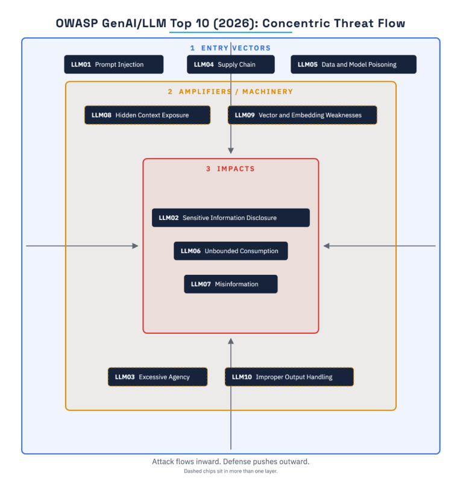
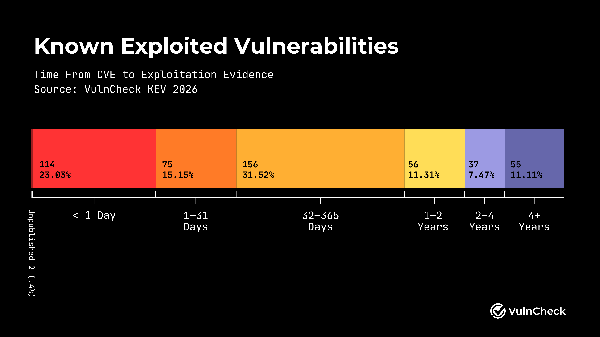

# IA Generativa

En esta sección, se verán los problemas de seguridad comunes a los que se enfrentan las personas que deben integrar herramientas de IA generativa a aplicaciones existenes. También hablaremos del impacto en la seguridad de los sistemas que tienen los procesos de entrenamiento y evaluación de modelos de IA Generativa.

En la sección de _Desarrollo de Software Seguro_, veremos cómo usar herramientas de IA generativa para seguridad defensiva (pentesting y encontrar vulnerabilidades)

En la sección de _Malware y Actores de Amenaza_, veremos cómo usan IA generativa los actores de amenaza hoy en día.

## Modelo de amenaza

Consideraremos como un sistema de IA generativa una _caja negra_ no determinista que recibe texto no estructurado y retorna texto, imágenes, video o audios.

El sistema puede estar conectado una o más de las siguientes herramientas:

* Entorno para ejecutar código.
* Acceso de lectura/escritura a una base de datos o una API (ver [Model Context Protocol](https://modelcontextprotocol.io/docs/2026-07-28/getting-started/intro))
* Almacenamiento persistente del historial de conversaciones (_memoria_)
* Ejecución automática de procesos periódicos (_crontabs_)
* Descripciones de cómo ejecutar tareas recurrentes (_skills_)
* Un _arnés_ (harness) que estructura las instrucciones (_prompts_) del usuario y sus salidas, además de otorgar acceso a las herramientas anteriores.

El mayor riesgo de seguridad del uso de modelos de IA generativa conectados a una o más de estas herramientas se origina del potencial de ejecutar de forma automática y sin validación humana acciones no reversibles en sistemas reales, tales como _leer o divulgar datos sensibles_, _ejecutar acciones destructivas_, _abusar del uso de infraestructura digital pública_, entre otras.

## Casos de Uso riesgosos (sin validación)

* **Como una interfaz de usuario oficial**: Algunos proveedores de servicio entregan _chatbots_ a sus usuarios que son capaces de ejecutar las mismas tareas que el usuario ejecutaría en una aplicación web, pero manteniendo una conversación de chat. [Algo así hizo Meta](https://krebsonsecurity.com/2026/06/hackers-used-metas-ai-support-bot-to-seize-instagram-accounts/) en Junio para prestar soporte a las cuentas de Instagram sin requerir de humanos. No le fue muy bien que digamos.
* **Como interfaz para automatizar otros procesos**: En el caso de sistemas no automatizables fácilmente (interactuar dinámicamente con un sitio web, pedir una hora a un _call center_ o chat), la IA Generativa puede interactuar con ellos directamente. Si cada interacción fuera validada por un humano antes de ejecutarse, se perdería el valor que provee su uso. 

> [!COMMENT]
> No es como que la IA vaya a vulnerar un sistema para cumplir con una instrucción entregada, ¿cierto? [...¿cierto?](https://www.bbc.com/news/articles/cn0nww2qlp7o)

* **Como generadora o modificadora de contenido (en especial código)**: Desde texto en español hasta código fuente. La IA Generativa puede crear y extender funcionalidades a partir de _prompts_, instrucciones o incluso descripciones de muy alto nivel, tanto en un proyecto existente como uno nuevo desde cero. A esto se le suele llamar _vibecoding_ y, dependiendo del modelo, puede o no hacerse cargo de detalles pequeños pero importantes.

> [!COMMENT]
> Esto no es un problema de seguridad pero no puedo no comentarlo: Mientras menos específico algún tipo de _vibecoding_, más iguales son (al menos visualmente) los productos generados (al menos según la percepción de quienes participan en [este hilo de reddit](https://www.reddit.com/r/saasbuild/comments/1uf2dzp/every_aibuilt_site_looks_identical_i_figured_out/))

> [!COMMENT]
> ¡Y sobre otro tipo de contenido! Desde al menos el 2022, han habido casos de asistentes virtuales [dando malos consejos](https://www.bbc.com/travel/article/20240222-air-canada-chatbot-misinformation-what-travellers-should-know) o escribiendo a clientes sobre promociones que no existen. El acuerdo general es que es responsabilidad completa de **quien disponibiliza este tipo de servicios lo que se promete o recomienda en una conversación**.

> [!TIP]
> Si tienes un modelo de IA generativa a mano, intenta pedirle que te haga un código que sabes que, en un caso de uso real, requeriría algunas validaciones adicionales a la sola ejecución de la tarea (por ejemplo, algo relacionado con permisos). ¿El modelo de IA generativa toma esas medidas de seguridad sin que se le ordene explícitamente? 

## Vulnerabilidades destacadas

Desde hace unos años, OWASP mantiene una lista de vulnerabilidades típicas en IA Generativa, denominada OWASP GenAI/LLM Top 10. [La versión del 2026](https://genai.owasp.org/resource/owasp-genai-llm-top-10-2026/) describe las siguientes vulnerabilidades, las que veremos que mapean con muchos de los casos de uso ya mencionados:

El modelo define 3 capas de defensa: Sobre los vectores de entrada, sobre la maquinaria que procesa los _prompts_ y sobre los impactos directos que puede generar la vulneración de estos sistemas.

* **Prompt injection**, o la capacidad de un usuario malicioso de mezclar en alguna entrada (_prompt_, contenido obtenido automáticamente, salida de una herramienta, imagen, video o sonido; razonamiento intermedio o memoria persistente) procesada por el modelo de IA generativa hace que ejecute instrucciones que no debería ejecutar según la intención del equipo de desarrollo.
* **Sensitive information disclosure**, o la capacidad de un modelo de IA Generativa de entregar información que no debía entregar (según las reglas del negocio o el modelo de amenaza) a un usuario, tanto si es pedida explícitamente como si no.
* **Excessive Agency**, o cuando un modelo de IA Generativa hace más de lo que se le solicita que haga, ya sea porque el prompt del proveedor lo incentiva a ello o por predisposición y uso de herramientas a su alcance.
* **Supply Chain**: Vulnerabilidades que afectan las respuestas de modelos de IA Generativa por modificaciones maliciosas a componentes de la cadena de suministro de ellos, tales como datos de entrenamiento, los mismos modelos, adaptadores, código de conversión de datos o plataformas de despliegue. Esto puede generar fallas de seguridad, salidas sesgadas o fallas de sistemas.
* **Data and model poisoning**: Alterar los resultados de un modelo a partir del envenenamiento de los datos de entrenamiento o del mismo modelo, facilitando el comportamiento dañino o sesgado.
* **Consumo no limitado**: Cuando un atacante fuerza a un modelo de IA Generativa a consumir de forma no limitada un recurso (sus propios créditos para tokens o la cantidad de consultas de una API externa, por ejemplo), generando un impacto financiero en la institución que maneja el modelo.
* **Desinformación**: El contenido generado por una IA casi siempre suena realista, pero no es necesariamente real. Sin embargo, la información es comunicada de forma creíble lo que lleva a personas a actuar equivocadamente basado en ella.
* **Exposición de contexto escondido**: En algunos sistemas, el contexto entregado por sus desarrolladores a un modelo de IA generativa es considerado un dato confidencial. Si el atacante logra armar un _prompt_ que revele esta información, puede encontrarse con llaves de API o accesos privados a sistemas sensibles.
* **Debilidades de vectores y _embeddings_**: Asociadas al proceso de codificación y decodificación de textos, imágenes, código y audio desde y hacia representaciones numéricas, abusando de la geometría del espacio de _embeddings_ para cambiar el resultado de las salidas del modelo de IA generativa.
* **Manejo de salidas impropio**: Similar a una inyección de tipo _XSS_, es cuando las salidas generadas por un modelo de IA generativa, lo que puede afectar a otros componentes que reciben esta información y no están preparados para manejar datos equivocados.

## Mayores amenazas

A continuación, se describe una lista para nada exhaustiva de los desafíos que está generando la masificación de herramientas de IA generativa en los procesos de uso, facilitación y desarrollo de software y hardware.

* **"Mejor" phishing**: Lo veremos con más detalle en la unidad de atacantes. Pero considerando lo fácil que se le hace a la IA generar contenido de solo un _prompt_, crear modificaciones de sitios originales bien escritas y con contenido creíble baja la vara para iniciarse en este mundo. Es cosa de ver los [últimos](https://csirt.gob.cl/alertas/acf26-01208/) [phishing](https://csirt.gob.cl/alertas/acf26-01206/) [publicados](https://csirt.gob.cl/alertas/acf26-01207/) en el sitio del CSIRT Nacional para notarlo.

> [!COMMENT]
> Comparen los _phishing_ anteriores con **[esto](https://csirt.gob.cl/alertas/8fph-00010-001-csirt-advierte-sobre-phishing-bancario-que-pide-a-usuarios-entregar-clave-de-digipass/)**. ¡Mis ojos! 😭

* **Ataques automatizados**: Modelos de IA generativa orientados a [encontrar vulnerabilidades](https://www.anthropic.com/research/glasswing-initial-update) (como Mythos de Anthropic) han bajado la vara de dificultad en el proceso de encontrar vulnerabilidades. Esto puede ser bueno para los fabricantes (si cuentan con los recursos para usar estas herramientas, [los fabricantes se las quieren facilitar](https://www.anthropic.com/research/glasswing-initial-update) [o les notifican luego de hacer pruebas](https://red.anthropic.com/2026/cvd/) [y los países que las fabrican no bloquean su exportación](https://edition.cnn.com/2026/06/13/business/anthropic-mythos-model-national-security)), pero también malo si las condiciones anteriores no se cummplen, [como le pasó al Gobierno de Mexico hace unos meses](https://gambit.security/ai-assisted-breach-of-mexicos-government-infrastructure).
* **Ataques automatizados y aumento de _Prompt Kiddies_**: Similar al caso de _phishing_ la vara para vulnerar un sitio baja tanto que cada vez más personas con menos conocimientos pueden generar impactos tremendos en las propiedades de seguridad de sistemas importantes para la ciudadanía. Antes del caso de Mexico,[ Anthropic reveló en noviembre de 2025 que ya habían detectado a un actor de amenaza automatizando las operaciones de detectar vulnerabilidades, explotarlas y conseguir accesos con mayores privilegios.](https://www.anthropic.com/news/disrupting-AI-espionage)
* **Facilidad para encontrar vulnerabilidades en código antes que los desarrolladores**: Algunas personas consideran que [solo el rumor de una vulnerabilidad en un sistema](https://anil.recoil.org/notes/rumour-is-the-exploit) (ya sea por un PR pendiente de subir o por comentarios en un foro) podría motivar a atacantes a buscar la vulnerabilidad por su cuenta, automáticamente y (muchas veces) con altas tasas de éxito.

  Según [VulnCheck](https://www.vulncheck.com/blog/state-of-exploitation-1h-2026), hoy el 23% de las vulnerabilidades son explotadas en menos de 1 día desde que se encuentran.

  
* **Denegaciones de servicio (voluntarias y no tanto)**: Dada la cantidad de instituciones haciendo _scraping_ de la internet para crear sus propios modelos de IA generativa, muchos servidores que partieron como hospedaje de sitios hobby terminaron con una gran cantidad de visitantes no humanos, provocando su baja por un aumento en el costo de mantención o una desconfiguración.
* **Copia, fraude y no aprendizaje**: Dejando de lado la dificultad de demostrar que un contenido fue creado completamente por una persona y no republicado a partir del "razonamiento" de una Inteligencia Artificial, recientes estudios (como este de la [U. de Chile](https://uchile.cl/noticias/245270/estudio-chatgpt-puede-aumentar-la-ilusion-de-aprendizaje-en-universitarios)) muestran que la IA es buena generando la **ilusión de aprender**, al menos en universitarios. Este estudio se correlaciona con [otro](https://dl.acm.org/doi/10.1145/3632620.3671116), comentado en un video de [Jetbrains](https://www.youtube.com/watch?v=DkhhE97Swmo), que llega a una conclusión similar: el estudiantado cree que aprende más y mejor con el uso de la IA generativa, pero esto no siempre es así (al menos comparado con quien desarrolla las tareas de forma "tradicional").
* **Ataques "involuntarios"**: Durante este año, se han descubierto al menos tres ataques potenciados por IA Generativa:
  * [Ataque de HuggingFace](https://metr.org/hugging-face-incident-report-aug-2026.pdf) (OpenAI)
  * [Ataque de colusión en foro](https://collusion.wiki)
  * [Ataque del Gobierno de Australia](https://www.bbc.com/news/articles/c6vgy0333dppo) (OpenAI)

## Mitigaciones

Gran parte de los problemas anteriores parecieran ser inherentes a los grandes modelos de lenguaje, y si bien con el tiempo se han desarrollado cada vez mejores _guardrails_ para atrapar programáticamente intentos de explotación en prompts, la mejor mitigación para alguien que se siempre va a ser **incluir a la persona responsable de tomar acciones críticas o no reversibles en la aprobación o validación de aquellos comportamientos ejecutados por un modelo de IA generativa como parte de su funcionamiento "automático"**.

Como la decisión final suele depender del nivel de riesgo involucrado y de la cantidad de riesgo tolerado por la organización que usa la herramienta, el uso (o no uso) automático dependerá de factores económicos (qué tanto ahorro automatizando vs. qué tanto pierdo por mis errores), legales (¿existe una multa o penalización por equivocarme?), éticos (¿la persona que desarrolla el sistema encuentra que está bien automatizar el proceso sin un camino humano?) y sociales (¿la sociedad espera que los sistemas se equivoquen más que antes? ¿nos gusta más ser atendidos por personas? ¿es algo que está dispuesto a aceptar por tener sistemas desarrollados antes?)

> [!COMMENT]
> Según una encuesta de agosto de 2026, [un 80 por ciento de la ciudadanía en Chile cree que debiese existir una ley que oblige a las empresas a contar con atención humana](https://www.elmostrador.cl/noticias/pais/2026/08/26/clima-social-icsoh-udp-69-de-los-chilenos-usa-ia-para-resolver-dudas-sobre-salud-y-tratamientos/).

Una [cuenta en Twitter](https://x.com/bumblebike/status/832394003492564993) dice que encontró esta diapositiva de una presentación de 1979 en la empresa IBM.

Este sería entonces el resumen de buenas prácticas (por ahora) para trabajar con herramientas de IA generativa: 

* **Decisiones mediadas por humanos**: **La ejecución de una acción o la toma de una decisión crítica deben ser mediadas por humanos.**
* **No soy un robot**: Para evitar el _scraping_ no deseado, se recomienda usar captchas o proytos _Proof-of-work_ como [Anubis](https://xeiaso.net/blog/2025/anubis/) y herramientas de [Cloudflare](https://blog.cloudflare.com/declaring-your-aindependence-block-ai-bots-scrapers-and-crawlers-with-a-single-click/). Otros incluso "[envenenan](https://chronicles.mad-scientist.club/tales/the-cost-of-poison/)" la IA generativa entregándole contenido que suena realista y muy fácil de generar.
* **Pruebas de humanidad**: Si es necesario que la plataforma solo pueda ser usada por humanos (o agentes en representación de humanos ya ingresados), se recomienda integrarse con algún otro sistema que cuente con un gran número de ciudadanos y una autenticación usando una aplicación o sitio web. De esta forma, como vimos en la sección _autenticación federada_, evita caer en el problema de demostrar humanidad para la creación de nuevas cuentas.
* **Sandboxing y chequeo continuo de permismos**: Como vimos en los ejemplos _collusion_ y _hugging_face_, si bien una IA con el tiempo y dinero suficientes muy probablemente escapará de un sandbox mal diseñado, lo anterior no quita mérito a la idea de aplicar en esto los principio de seguridad de seguridad por capas, mínimos mecanismos comunes y autenticación mediada.
* **Marcas de agua en contenido generado por IA**: La Unión Europea publicó un [código de transparencia](https://digital-strategy.ec.europa.eu/en/policies/eu-icons-labelling-ai-generated-content) que existe a los proveedores de plataformas de IA generativa tomar medidas para evitar el mal uso de esta herramienta.. [OpenAI](https://openai.com/index/eu-text-provenance/) y [Anthropic](https://www.anthropic.com/news/claude-text-watermark) se están preparando para este requisito. No deja de ser controversial la medida, dado que para cada mecanismo de detección de uso de IA, debe de existir un contramecanismo que dificulte su identificación como tal.

## Contenido recomendado

* [Demo local de _prompt injection_](https://codingatmyjob.github.io/articles/prompt-injection-demo)
* [Otra demo local de _prompt injection_](https://www.llm-sec.dev/labs/prompt-injection)