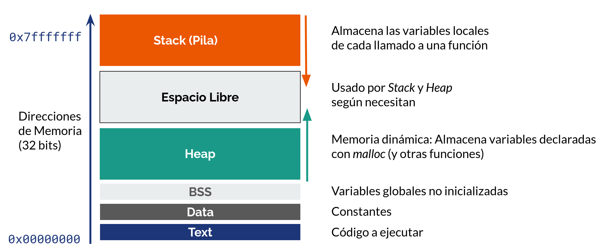
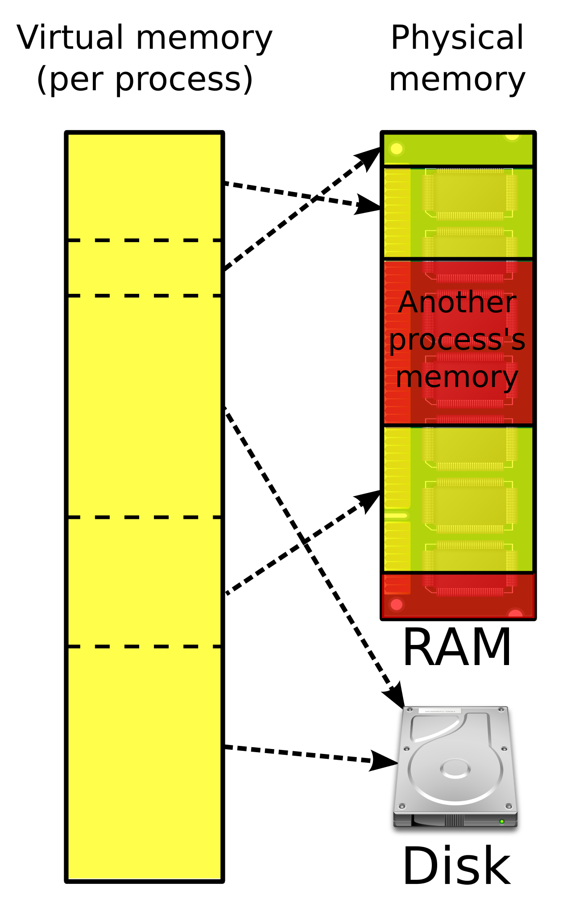
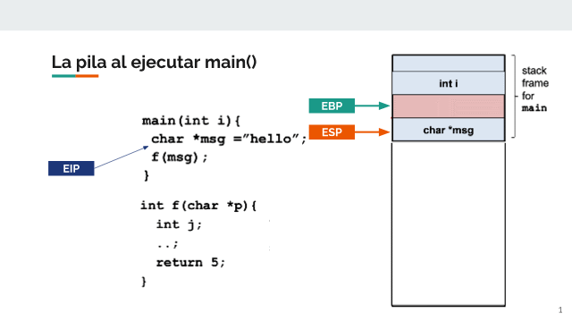
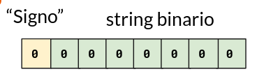
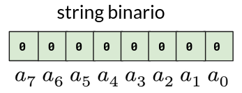
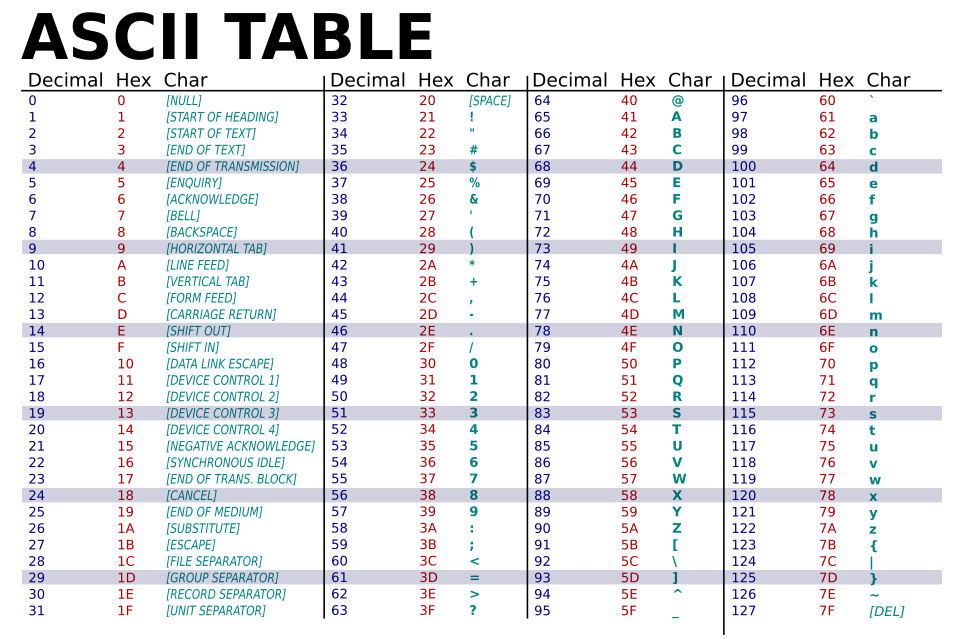
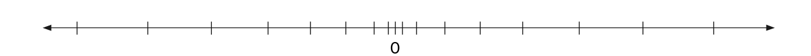

# Ataques de Secuestro de Control de Flujo

En el caso ideal, un programa debiese ejecutar sus instrucciones en un orden determinado por quien lo programa.

Estas instrucciones tienen que estar almacenadas en algún lado, ¿no? En la práctica, son datos (_datos-instrucciones_), pero interpretados de forma tal que hacen que otros datos (_datos datos_, generalmente definidos por quien opera el programa) sean procesados y transformados en un producto de salida.

Sin embargo, existen situaciones en las que, debido a decisiones de diseño de los lenguajes de programación usados o de la arquitectura de los computadores en los que corre la aplicación, un atacante puede sobreescribir con los datos de entrada (_datos-datos_) parte de los datos de instrucciones del programa original (_datos-instrucciones_). Si el o la atacante escribe _datos-instrucciones_, estos pueden terminar siendo ejecutados por el computador, **secuestrándose el flujo del programa**.

## ASM (x86):

¿Cuál es el formato más conocido para almacenar _datos-instrucciones_? Probablemente, es el _código fuente_. El código fuente es la forma que tenemos las y los programadores (y hoy, incluso algunas máquinas), de dar instrucciones a sistemas. 

Los procesadores, sin embargo, no leen el código fuente tal cual como las y los programadores lo escribimos. Leen una representación equivalente pero en un formato más adecuado para ellos, llamado _código de máquina_ (o _machine code_ en inglés). El código de máquina varía según arquitectura, pero en la práctica es una representación binaria de instrucciones de control de flujo, aritméticas, lógicas y punteros a espacios de memoria específicos (donde se guardan los datos que se procesan).

Quien pasa el _código fuente_ a _código de máquina_, al menos en lenguajes compilados, es el _compilador_. En otros tipos de lenguajes, existe un _intérprete_ que toma el código fuente (o una versión optimizada del mismo) y genera en tiempo real código de máquina para que el procesador lo ejecute. En esta unidad, nos enfocaremos más en el primer caso (lenguajes compilados).

Existe una representación un poco más amigable con la humanidad del código de máquina, denominada _Código Ensamblador_ o _ASM_. Su estructura básica es `INST` [`OP1` [`OP2`]...], donde `INST` es una instrucción, y `OPN` son los operandos de la instrucción. Esta representación también dependerá de la arquitectura del procesador.

> [!TIP]
> Si quieres ver cómo se representa código C en ASM, puedes usar [Compiler Explorer](https://godbolt.org/).

> [!TIP]
> Para este curso, una referencia útil de ASM para la arquitectura de procesadores x86 es el [Apunte de la Universidad de Virginia](https://www.cs.virginia.edu/~evans/cs216/guides/x86.html). El caso de x86-64 es muy parecido, pero con registros del doble de tamaño (8 bytes) y nombres un poco distintos (algunos parten con `R` en vez de `E`).

## Explicación general del manejo de memoria en x86

La memoria en x86 se maneja de la siguiente manera:



* **Pila o _Stack_**. Acá se almacenan las variables locales, luego de cada llamado de una función. Opera, como su nombre dice, como una _pila_: los datos ingresados últimos son los primeros en recuperarse. Para agregar/remover datos, se usan las instrucciónes ASM `push` y `pop`, respectivamente. Sus límites en el _marco_ o _frame_ (contexto específico dentro de una función. Cada vez que se llama a una nueva función, se crea un nuevo _frame_, y cuando ésta retorna, se libera) son definidos por los registros _ebp_ y _esp_ (_rbp_ y _rsp_ en x86-64). Como se ve en la imagen, en x86, el _stack_ crece _hacia abajo_: cada elemento ingresado se le asigna una dirección de memoria menor que el anterior.

> [!TIP]
> Los sistemas operativos actuales no usan _exactamente_ las direcciones de memoria que reportan los programas. Existe una capa intermedia que recibe direcciones y las modifica por otras específicas en la memoria real (RAM o disco). Esto simplifica en la práctica el uso de memoria de las aplicaciones, que pueden asumir como que la memoria es contigua y solo de ellos/as. La siguiente imagen del usuario [Ehamberg](https://commons.wikimedia.org/w/index.php?title=User:Ehamberg) de Wikipedia muestra esto de mejor forma:
> 

* **Heap**: Memoria dinámica, debe ser reservada y liberada manualmente en lenguajes de programación de bajo nivel que no cuentan con otros mecanismos de administración de memoria.
* **BSS o _block starting symbol**: Almacena variables declaradas estáticamente pero sin un valor asignado. 
* **Data**: Constantes.
* **Text**: Código a ejecutar en formato de máquina. Un registro especial llamado `eip` apunta a la posición específica de código de máquina en la que va el computador en cada momento.
> [!COMMENT]
> ¡El código es un dato!


Volvamos a hablar de los _frames_ (también conocidos como _activation records_): En un _frame_ se guardan los argumentos de una función llamada, variables locales que se van declarando en su ejecución, los valores de los registros antes de llamar a la función (para que cuando retornemos continuemos donde mismo estábamos) y otros valores de tipo _administrativo_ (como medidas de protección contra ataques o un puntero a la dirección de memoria en la que estaba `eip` en ese momento, antes de entrar a la función).

Este gif muestra la evolución de la pila durante la ejecución de un código de ejemplo:



## Almacenamiento de datos en memoria

[En esta tabla de Wikipedia](https://en.wikipedia.org/wiki/C_data_types#Main_types) se muestran los distintos tipos de datos en memoria en C, su tamaño mínimo según especificación y sus especificadores de formatos (algo que veremos con más detalle en la sección de _string formatting_).

A continuación, describimos brevemente cómo se guardan distintos tipos de datos en C y en una arquitectura de procesador x86 (los valores indicados son el tamaño mínimo para cada estructura, según la especificación):

### Enteros

Los datos de tipo `int` o enteros se guardan generalmente en 4 bytes consecutivos. Existen los tipos `short` `long` y `long long` que usan 2, 4 y 8 bytes  respectivamente, y los tipos `unsigned int`, `unsigned short`, `unsigned long`, `unsigned long long` que almacenan solo números positivos, duplicando el rango en cada caso.

La representación de estos datos (excepto cuando el tipo es `unsigned`) es usando el _último bit_ (o _bit más significativo_) de la estructura como bit de signo. 



Si el bit más significativo es 0, el número es positivo y su valor se calcula interpretando todos sus otros bit como la codificación de un número en base 2:

```katex
a_{N-1} = 0 \to w = \sum^{N-2}_{i=0}{a_i2^i}
```

Si el bit más significativo es 1, el número es negativo y se interpreta de la siguiente forma:

```katex
a_{N-1} = 1 \to w = -a_{N-1}2^{N-1} \sum^{N-2}_{i=0}{a_i2^i}
```

En el caso de los datos tipo `unsigned`, se interpretan todos los bit como parte de la codificación binaria del número.


```katex
u = \sum^{N-1}_{i=0}{a_i2^i}
  ```

### Caracteres

Los datos de tipo `char` o caracteres se guardan en un solo byte. Cada byte corresponde a un caracter de la Tabla ASCII:




### Booleanos

Los datos de tipo `bool` (`verdadero`, `falso`) se guardan en 1 bit. Es posible que por eficiencia, en estructuras de datos los bool queden separados de otros tipos de datos en la estructura por más de un bit.

### Números de coma flotante (Float)

Los datos de tipo `float` o números de coma flotante usan 4 bytes de tamaño. Existen los tipos `double` y `long double` que usan 8 y 16 bytes de tamaño. En todos los casos se representan usando el estándar [IEEE 754](https://www.h-schmidt.net/FloatConverter/IEEE754.html), el cual codifica el número en una notación similar a la científica, con 23 bits para la fracción, 8 bits para el exponente y 1 bit para el signo. La siguiente imagen del usuario de Wikipedia [Fresheneesz](https://en.wikipedia.org/wiki/User:Fresheneesz) muestra la distribución:


Los datos anteriores (en el caso de 32 bits) se usan para calcular el número con esta fórmula: 

  ``` katex
  (-1)^{b_{31}}  \times 2^{(b_{30}b_{29} \dots b_{23})_2 - 127}  \times (1.b_{22}b_{21} \dots b_0)_2 
  ```

**No es posible representar cualquier número decimal con floats**. Al final, son una representación discreta de un conjunto continuo (los reales). Cuando un número no es representable exactamente, se almacena como el número más cercano. Esto puede provocar errores que, a medida se ejecutan más operaciones, pueden componerse y generar comportamientos no esperados.

Como se ve en la imagen de más abajo, a medida los números son más grandes, es más difícil representarlos exactamente con un _float_.



> [!TIP]
> Revisa la fórmula que calcula números de coma flotante para determinar por qué ocurre lo mencionado en el párrafo anterior.

### Arreglos

Si se quiere almacenar más de un dato de un mismo tipo de forma consecutiva, se usan _arreglos_, los cuales al ser declarados deben tener un tamaño específico. Luego, la variable que define el arreglo actúa como _puntero_ a esa dirección de memoria, lo que nos permite acceder a otros elementos del arreglo usando _aritmética de punteros_:

```c
int numeros[] = {2, 4, 8, 16};
int numElem = 2
printf("%d", *(numeros + numElem));
// lo anterior se puede representar también como numeros[numElem]. El tipo del puntero es el que determina cuántos bytes "avanza" el puntero.
```

Para representar cadenas de texto, se usan _arreglos_ de `char`, los cuales se consideran terminados por convención al encontrar un byte nulo (`0x00` en hexadecimal). **Si el byte nulo no está definido al final del arreglo, las funciones inseguras de C siguen "recorriendo" la memoria hasta encontrar un byte nulo**.

