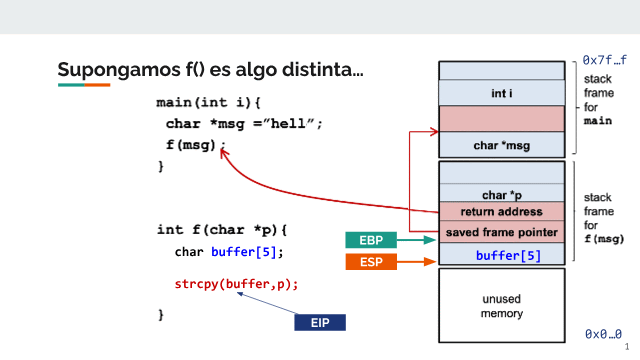
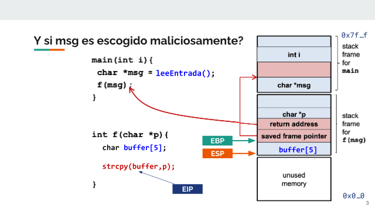
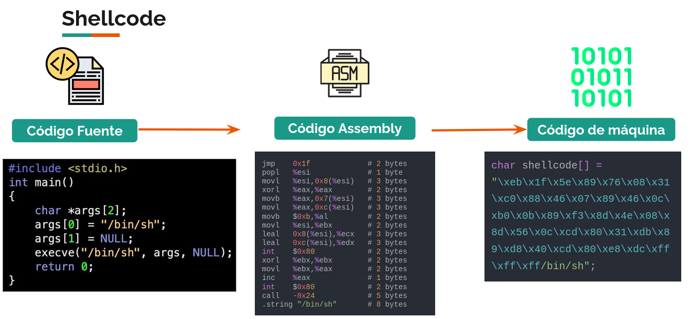
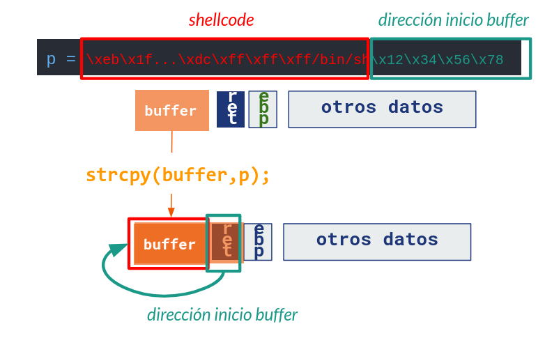
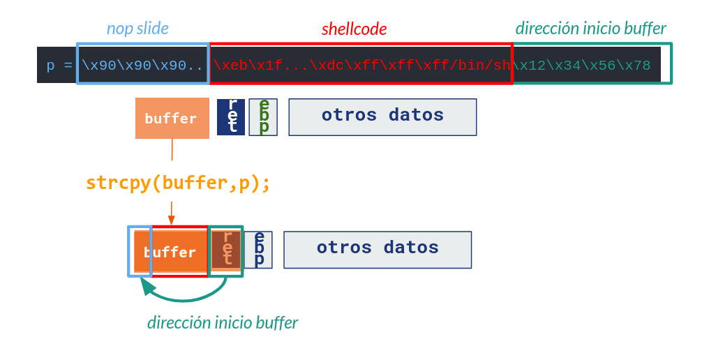
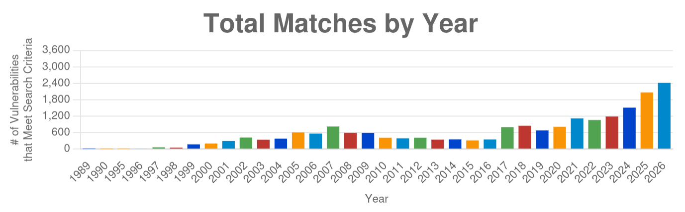
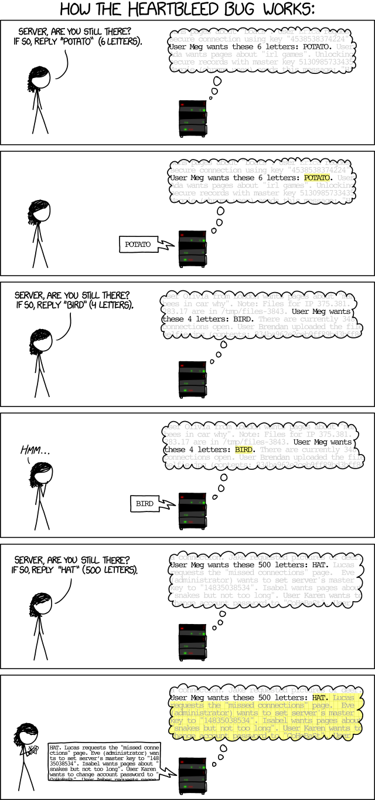
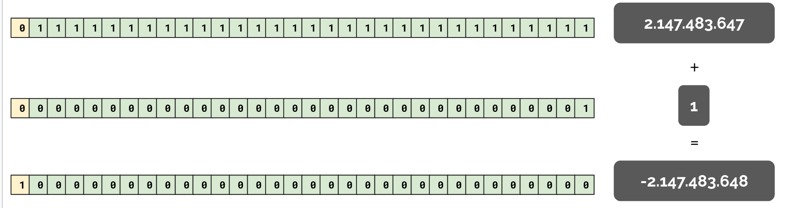
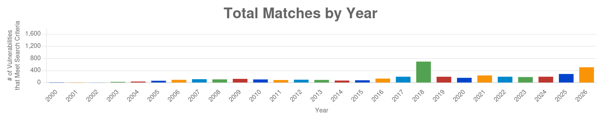



# Desbordamiento de Buffer

Los lenguajes de programación de bajo nivel más antiguos esperan que varias comprobaciones de consistencia y seguridad sean hechas por las personas que desarrollan sistemas con ellos. Asímismo, definen muchas funciones que asumen que esas convenciones se cumplen en todo momento.

Revisitemos el ejemplo de la sección anterior, con una función `f()` algo distinta:



La función `strcpy` permite copiar arreglos de caracteres. Para realizar esta tarea, recibe dos argumentos: un buffer de destino y un puntero al arreglo de origen. **La función asume que el arreglo de destino tiene el espacio suficiente para recibir la cadena de texto de origen**.

¿Qué pasa cuando el tamaño de la entrada depende de quien usa el programa?



Si el texto es más largo que el espacio del buffer reservado, parte de la entrada **sobreescribirá otras variables en la pila**.

Si sobreescribimos la dirección de retorno, cuando la función termine de ejecutarse no podremos volver al frame anterior, lo que generará un error de tipo _segmentation fault_. El código intentará interpretar parte de la entrada como una dirección de memoria que (a no ser que intencionalmente lo preparemos) muy probablemente estará fuera del código ejecutable del programa.

Pero... ¿y si fuéramos atacantes y apuntáramos a una dirección de memoria con código ejecutable de nuestra conveniencia?

A este tipo de vulnerabilidades se les conoce como de **desbordamiento de buffer** o _buffer overflow_.

> [!TIP]
> Si la pila creciera para el otro lado (_"de abajo hacia arriba"_) ¿se podría evitar este problema?

## Toma de control sobre el flujo de la aplicación

Supongamos primero que conocemos una función específica dentro del programa que queremos ejecutar, a pesar de no tener los privilegios para hacerlo:

```c
#include <stdio.h>
#include <string.h>

void vulnerable() {
    char buffer[512];
    printf("Introduce tu mensaje:\n");
    gets(buffer); // No creo que genere problemas...
    printf("Mensaje recibido: %s\n", buffer);
}

void secreto() {
    printf("¡Lograste redirigir la ejecución!\n");
int main() {
    vulnerable();
    return 0;
}

```

Si logramos obtener la dirección de memoria de la función `secreto`, podríamos sobreescribir la pila a través de la entrada `buffer`. Específicamente, podríamos cambiar la dirección de retorno de `vulnerable` para saltar directamente a `secreto` (función que nunca es llamada pero está en el código).

Lo anterior puede servir para saltar medidas de seguridad en aplicaciones, solo adivinando (o calculando) direcciones de memoria de las funciones que nos interesan. En la práctica, quien ejecuta el código puede hacer que éste tome caminos no planificados por quien lo desarrolló. De acá viene el nombre de _secuestro de control de flujo_.

Veremos casos particulares de este tema (_ROP_, _Return-to-LibC_) en la sección _Return Oriented Programming_.

## Shellcode y ejecución de código arbitrario desde el Stack

¿Y si queremos ejecutar código arbitrario?

Si el buffer es lo suficientemente grande, podemos aprovecharlo para almacenar en él _código arbitrario_.

Recordando la definición de _código de máquina_, podríamos crear un código fuente que haga algo que nosotros queremos hacer en un programa (por ejemplo, ejecutar un comando en el sistema operativo), compilarlo para la arquitectura objetivo y extraer su _código de máquina_ como un conjunto de bytes. Luego, ingresar ese conjunto de bytes como entrada del programa vulnerable.



Existen repositorios con shellcodes ya compilados, como los presentes en la ya mencionada página [_Exploit DB_](https://www.exploit-db.com/shellcodes).

## _Stack Smashing_: Inyectando código en el buffer

Ya tenemos todos los componentes para armar nuestro ataque de _stack smashing_:

1. Una vulnerabilidad que nos permita escribir más allá de los límites esperados de la memoria en el _stack_.
1. Un mecanismo para predecir la dirección de memoria aproximada del dato de entrada en el _stack_.
1. Código de máquina (_shellcode_) que quepa en el stack y que permita al programa ejecutar un comando arbitrario que nos convenga.

Nuestro shellcode (variable de entrada) debería quedar más o menos así:



En los casos en los que no podemos determinar exactamente la dirección de entrada, podemos usar _NOP Slides_: cualquier código de máquina que no ejecute operaciones y permita aumentar el tamaño de las posibles direcciones de memoria en las que podemos caer de forma segura.



El paper de referencia por excelencia para esta técnica es [Smashing the Stack for Fun and Profit](http://www-inst.eecs.berkeley.edu/~cs161/fa08/papers/stack_smashing.pdf), del grupo _hacker_ `Aleph One`. Apareció por primera vez en la reconocida revista digital de la cultura hacker [Phrack](https://phrack.org/issues/72/1). Recomendamos mucho que lo lean.


## Heap buffer Overflow

Si bien la explicación hasta esta sección ha sido sobre _buffer overflows_ en el _stack_, la misma lógica aplica a debilidades en el manejo de memoria de tipo _heap_ (pero con técnicas distintas)

> [!IMPORTANT]
> 👷**Pendiente**: Completar con una descripción más completa de _Heap Buffer Overflow_ para futuras versiones del curso.

## ¿Qué tan comunes son estas vulnerabilidades?

Según el [repositorio de vulnerabilidades de NIST (NVD)](https://nvd.nist.gov/vuln/search#/nvd/home?keyword=buffer%20overflow&resultType=statistics), la cantidad de vulnerabilidades de tipo _Buffer Overflow_ (tanto en _stack_ como en el _heap_) es cada vez mayor.




Algunos ejemplos famosos:

* **Morris Worm (1988)**. Lo veremos en mayor detalle en la sección _malware_, pero corresponde al primer gusano informático registrado, el cual se aprovechaba de una vulnerabilidad de tipo _Buffer Overflow_ para explotar sistemas y posteriormente replicarse. Puedes leer más información acerca de cómo funcionaba en [este artículo del FBI estadounidense](https://www.fbi.gov/news/stories/morris-worm-30-years-since-first-major-attack-on-internet-110218).
* **Twilight Hack (2018)**: [Vulnerabilidad](https://wiibrew.org/wiki/Twilight_Hack) en un videojuego (_The Legend Of Zelda: Twilight Princess_) de la consola de Nintendo _Wii_. Muy popular debido a la cantidad de usuarios de la consola en posesión de este juego y a que permitía _desbloquear por software_ la consola, instalando una aplicación (_The Homebrew Channel_) para ejecutar programas desarrollados no oficialmente (_Homebrew_). La vulnerabilidad se aprovechaba de un _Buffer Overflow_ en el código que usaba el nombre del caballo del protagonista del juego para correr código arbitrario y tomar control de la ejecución de código en el dispositivo.
* **GHOST (2015)**: [Vulnerabilidad](https://access.redhat.com/articles/1332213) en `glibc` de tipo _Buffer Overflow_ que permite ejecutar código arbitrario a través de una consulta DNS realizada por la función `gethostbyname()`.
* **Fusée Gelée (2018)**: [Vulnerabilidad](https://github.com/erdzan12/switch-fusee) de hardware en dispositivos de la línea NVIDIA Tegra (especialmente, la consola de videojuegos _Nintendo Switch_, basada en hardware de Nvidia), que permite correr código arbitrario en el modo _recovery_ de estos dispositivos a través del aprovechamiento de un _Buffer Overflow_. El problema es a nivel de la ROM (_Read Only Memory_) de los dispositivos, por lo que no es parchable. Fue popular porque permite instalar aplicaciones no oficiales en versiones antiguas de consola de videojuegos.
* **NGINX (2026)**: En mayo de 2026, se encontró una [vulnerabilidad](https://nvd.nist.gov/vuln/detail/CVE-2026-9256) de tipo Buffer Overflow en las versiones del servidor web NGINX comerciales y de código abierto.

### Variantes

* **Buffer Overrun**: Leer más allá del tamaño de un buffer, exponiendo el contenido de la memoria del sistema (y en algunos casos, datos de otros usuarios). [XKCD](https://xkcd.com/1354/) tiene un comic (el 1354) explicando un caso particular de esta vulnerabilidad: _HeartBleed_:
  

* **Funciones Virtuales**:  En algunos lenguajes de programación (C++), existen _funciones virtuales_, las cuales se consultan en tiempo de ejecución en una _VTable_. Si un atacante puede sobreescribir un objeto para cambiar los punteros a una _VTable falsa_, puede controlar la ejecución de código desde el momento en que se llama a la función virtual en el objeto sobreescrito. [Este paper](https://people.eecs.berkeley.edu/~dawnsong/papers/VTint-%20Protecting%20Virtual%20Function%20Tables'%20Integrity_feb%202015.pdf) explica en detalle este mecanismo y propone una estrategia de protección.
* **Structured Exception Handlers**: En C/C++ de Windows, existen estructuras que permiten manejar situaciones excepcionales de fallas en código de forma controlada. [Estas estructuras se llaman _Structured Exception Handlers_](https://learn.microsoft.com/en-us/cpp/cpp/structured-exception-handling-c-cpp?view=msvc-170). Si esta estructura está muy cerca de datos sobreescribibles, se puede usar un _Buffer Overflow_ para luego forzar una excepción y llamar a código arbitrario.


## Bonus: Integer Overflow

Recordemos la definición de los enteros en C. ¿Qué pasa si un número supera sus límites mínimos o máximos luego de una operación aritmética?

Como el tamaño de un número con respecto a su uso de memoria es fijo, si el valor final de una operación aritmética sobrepasa los límites superiores, ocurre un _integer overflow_, mientras que si se obtiene sobrepasando los límites inferiores, ocurre un _integer underflow_.

La siguiente imagen muestra un _integer overflow_:



> [!TIP]
> Explica por qué este código podría genera una vulnerabilidad:
> 
> ```c
> void func( char *buf1, *buf2, unsigned int len1, len2) {
>   char temp[256];
>   if (len1 + len2 > 256) {return -1}
>   memcpy(temp, buf1, len1);
>   memcpy(temp+len1, buf2, len2);
>   hace_algo(temp);
> }
> ```

Estas vulnerabilidades tienen impactos críticos en el software, como se ve en este gráfico de NVD [con información obtenida hasta agosto de 2026.](https://nvd.nist.gov/vuln/search#/nvd/home?keyword=integer%20overflow&resultType=statistics)



Un caso curioso es 2018, el cual pudo haber ocurrido debido a un aumento de problemas en el desarrollo de _contratos inteligentes_ en _blockchains_ populares como _Ethereum_.(el 5% de las vulnerabilidades de ese año tenían que ver con la creación de tokens dentro de algunas _blockchain_).

Por otro lado, en menos de 8 meses se pasó de 289 vulnerabilidades durante todo el 2025 a 510 al 16 de agosto de 2026, lo que muestra que el alcance de este tipo de problemas sigue siendo relevante al día de hoy.