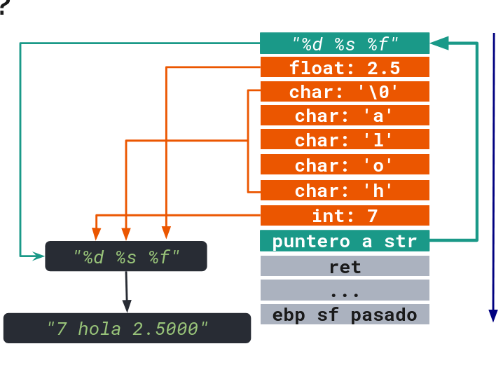
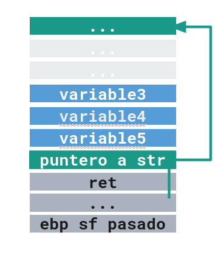
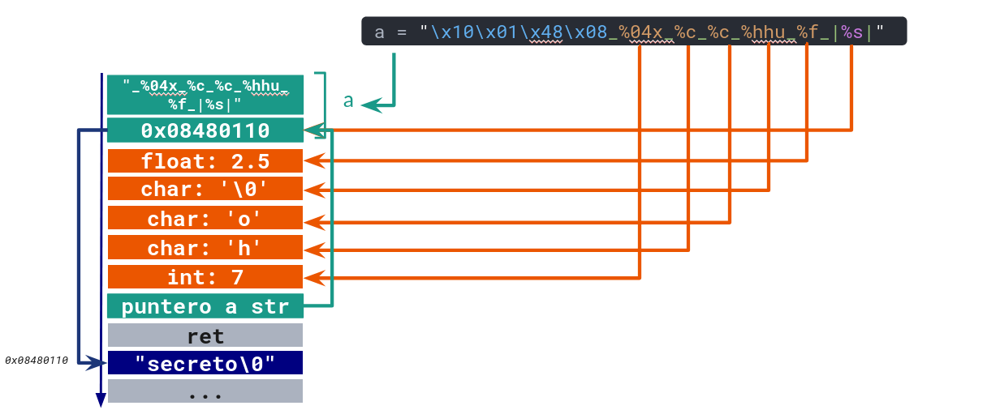
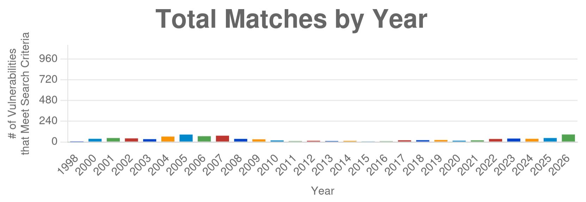
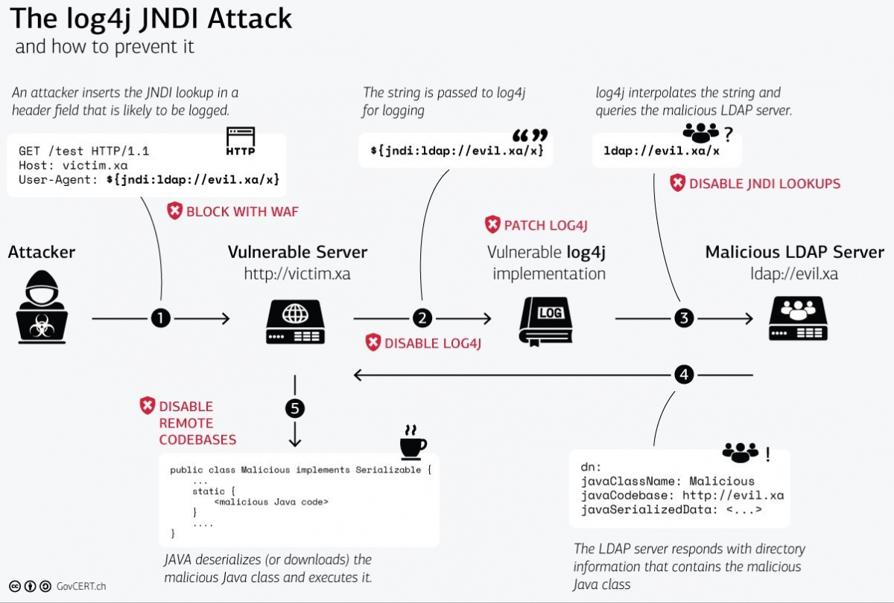

# Formateo de Cadenas de Texto

Una de las funciones más usadas en C/C++ es `printf` (y similares), que permite formatear una cadena de texto con valores específicos, indicando con directrices cómo deben interpretarse estos valores (el tipo de dato y si debe ser dereferenciado o no).

En la página [cplusplus.com](https://cplusplus.com/reference/cstdio/printf/#compatibility) se muestran los parámetros que puede tomar `printf`. Por ejemplo:

```c
#include <stdio.h>
void main() {
   int n = 7;
   char* str = "hola";
   float f = 2.5;
   printf("%d %s %f", n, str, f);
}

```

Lo anterior retorna `7 hola 2.5000`.

La imagen siguiente muestra cómo se ve la pila al momento de ejecutar printf. Cada elemento en la pila tiene el tamaño que le corresponde por su tipo. En el caso del elemento "%d %s %f", su tamaño es igual a la cantidad de caracteres que representa. No se mostraron por separado solo por espacio.



La función `printf` **añade tanto el _format string_ como los argumentos 2..n al _stack_**. Luego, para cada caracter del primer argumento, si este parte con `%`, se copia el siguiente elemento del stack con el formato definido en el caracter del _format string_ después del `%`.

## Vulnerabilidades de cadenas de texto formateadas

Supongamos ahora que definimos una función sin un primer argumento fijo:

```c
#include <stdio.h>
void f(char* a) {
   printf(a);
}
```

y que el argumento `a` tendrá de valor `%08x.%08x.%08x`:



En este caso, **leeremos 8 bytes en hexadecimal de cada elemento que esté adelante de la posición del _stack_**, ya que **`printf` no se asegura de haber sido esta función la que ingresó al _stack_ los elementos que serán usados para el formateo de la cadena de texto**.

Esto se evita **no usando printf** si no hay un format string definido por quien desarrolla el programa (o programando en `printf` como primer argumento la cadena de texto `"%s"`, en este caso).

[Este paper](https://cs155.stanford.edu/papers/formatstring-1.2.pdf) de los grupos _hacker_ `scut` y `team teso` explican con detalle cómo aprovecharse de `printf` mal usados para exfiltrar información útil para facilitar otros ataques o para contar con datos sensibles de la aplicación.

## Extracción de información

Supongamos ahora que ingresamos como valor esta cadena de texto: `\x10\x01\x48\x08_%04x_%c_%c_%hhu_%f_|%s|`.

Si el stack es el de la imagen, y se ejecuta el programa `printf(a)`, con a el valor ya mostrado, el programa devolverá la siguiente salida: `??H?_0007_h_o_0_2.5_|SECRETO|`



> [!TIP]
> Intenta seguir cómo interpreta `printf` el stack de la imagen de arriba

## Ejecución de código

Unsando una directriz especial, `%n`, podemos escribir valores arbitrarios en direcciones de memoria específicas, permitiéndonos esto controlar el flujo de la aplicación.

La directriz %n **escribe en el puntero correspondiente el stack (que debería ser un int con signo) la cantidad de bytes impresos hasta este momento**.

Si controlamos la cantidad de caracteres escritos por printf hasta antes de la interpretación del `%n` y el valor del puntero que usará `%n` para escribir su valor, podemos escribir el valor que queramos en el stack (por ejemplo, modificar la dirección de memoria de retorno para que apunte a un _shellcode_).

Se puede ver un ejemplo detallado de esta situación en el paper de _Format String_ ya mencionado, sección **3.4**.

> [!IMPORTANT]
> 👷 **Pendiente**: Describir detalladamente el ejemplo del paper.


## ¿Qué tan comunes son estas vulnerabilidades?

Las vulnerabilidades de tipo _format string_, si bien no son mayoritarias, siguen siendo comunes al día de hoy. [Según NVD](https://nvd.nist.gov/vuln/search#/nvd/home?keyword=format%20string&resultType=records), a la fecha (agosto 2026) el número de vulnerabilidades de este tipo el 2026 ya es casi el doble con respecto al 2025:



A continuación nombramos algunos casos conocidos de estas vulnerabilidades:

* **Fortinet (2018)**: Esta [vulnerabilidad](https://nvd.nist.gov/vuln/detail/CVE-2018-1352) permitiría a un atacante ejecutar código no autorizado a partir de un nombre de usuario SSH con estructura de _format string_.
* **Motorola (2019)**: Un usuario malicioso podía ingresar un valor con un _format string_ para indisponibilizar la interfaz administrativa de un router. [PoC](https://github.com/TeamSeri0us/pocs/blob/master/iot/morouter/morouter_fmtVuln.md).
* **iOS (2021)**: Según lo indicado por el medio de noticias de tecnología [_The Register_](https://www.theregister.com/security/2021/06/21/its-2021-and-a-printf-format-string-in-a-wireless-networks-name-can-break-iphone-wi-fi/702955), un punto de acceso WiFi con un nombre con estructura de _Format String_ podía hacer caer el módulo de conexión inalámbrica de los iPhone con sistema operativo vulnerable.
* **F5 (2023)**: La [vulnerabilidad](https://nvd.nist.gov/vuln/detail/CVE-2023-22374) permite, a través de un endpoint de control de dispositivos F5, ejecutar código arbitrario ingresando _Format Strings_ como parámetros.

## Variaciones

A continuación se listarán algunas vulnerabilidades similares a los _Format Strings_ de C ya vistos, pero en otros contextos.

* **Log4shell**: A fines de 2021, se encontró una vulnerabilidad en una librería de _logs_ para java muy utilizada, la cual permitía a un atacante ingresar datos con un formato de string usado por esta librería de logging, los cuales podrían terminar siendo usados por la librería al momento de guardar registros de acciones o consultas, realizando consultas a servidores arbitrarios, facilitando ataques de denegación de servicios o incluso, en algunos casos, ejecutando código controlado por el atacante.

[El Instituto Nacional de Ciberseguridad de España (INCIBE) publicó un artículo sobre esto.](https://www.incibe.es/incibe-cert/blog/log4shell-analisis-vulnerabilidades-log4j) y el Equipo de Respuesta a Incidentes de Ciberseguridad Suizo ([CERT.ch](https://cert.ch)) desarrolló este gráfico explicativo:




* **String formatting en lenguajes interpetados**: [Desde el 2006](https://peps.python.org/pep-3101/#security-considerations), Python permite crear cadenas de texto especiales que tienen directrices de formateo, las cuales pueden acceder a datos en objetos y otros parámetros. Si se recibe una cadena de texto no confiable con esta estructura, se podrían generar situaciones de exfiltración de información.

  Algunas mitigaciones propuestas son el uso de [_f-strings_](https://peps.python.org/pep-0498/), que hacen más difícil (pero no imposible) el aprovechamiento de una vulnerabilidad de este estilo, ya que son un tipo definido solo en contexto del código fuente, y no puede ser "entregado directamente" como parte de una entrada.

  El 2024, el lenguaje define la existencia de [_t-strings_](https://peps.python.org/pep-0750/), que permiten contar con código especial para procesar el contenido de los _templates_ de forma segura. Sin embargo, **esto dependerá de las medidas que tome quien desarrolla el sistema para sanitizar las entradas o arrojar error en caso de entradas inválidas**.

> [!TIP]
> Piensa en una forma en la que se podría (debido a un mal diseño o programación) abusar del formateo de una cadena de texto que es un f-string.

