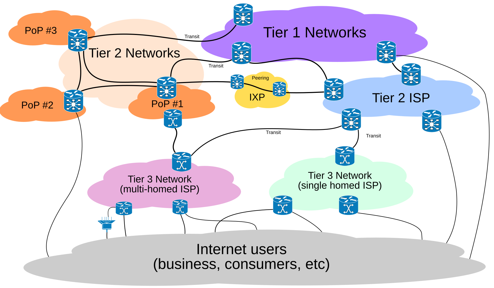
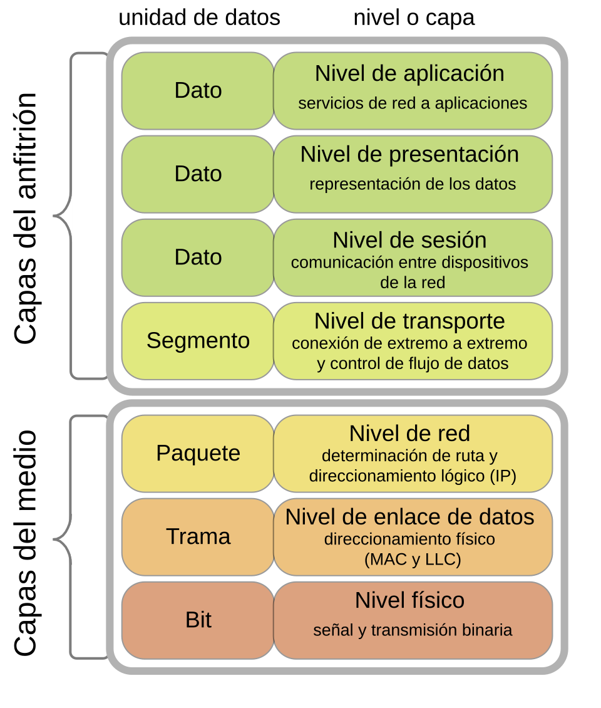
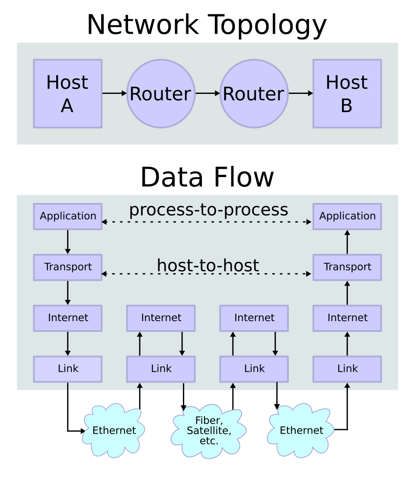
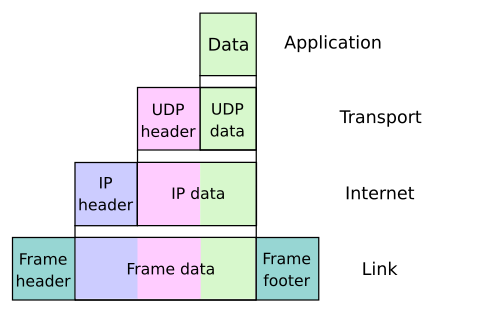
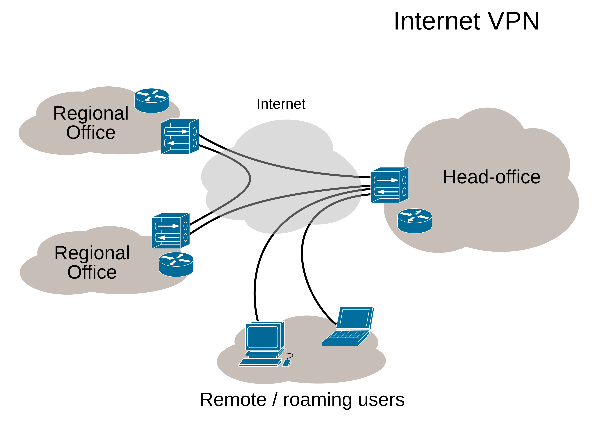

# Seguridad de Redes

Esta sección del curso se basará en decisiones de diseño, debilidades y vulnerabilidades de los protocolos de red más comunes: TCP e IPv4, con algunas menciones a ataques en mecanismos de conexión habituales para computadores personales, servidores y móviles (WiFi/Ethernet).

**No definiremos muchos de los conceptos de Internet, porque asumimos que los vieron o los están viendo en el curso de Redes. Sí enlazaremos RFCs a algunas definiciones, pero si no lo hacemos, casi seguramente pueden buscar y encontrarán alguna definición**.

> [!IMPORTANT]
> 👷 **Pendiente**: Agregar redes móviles, bluetooth, radiofrecuencia y otros protocolos inalámbricos (como Zigbee).

## Internet

Como probablemente están viendo en el curso de Redes, Internet es un sistema global que interconecta redes de computadores entre sí, permitiendo la comunicación entre dispositivos conectados a ella.  

Una representación gráfica de cómo funciona la Internet, conectando muchas redes entre sí, se puede observar en la figura de [Ludovic.ferre](https://commons.wikimedia.org/wiki/User:Ludovic.ferre) de Wikimedia Commons: 

En esta figura, se observan las siguientes categorías de participantes:

- **Usuarios de Internet (consumidores, negocios, etc)**: Puntos de inicio y de fin de las comunicaciones en Internet. Usan la infraestructura compuesta por las otras nubes de colores.
- **Redes de nivel 3**: Son las redes que administran los ISP (Proveedor de Servicios de Internet) que venden el servicio de Internet a personas y empresas. Pueden ser _single homed_ (estar conectados a una sola red de nivel superior) o _multi homed_ (estar conectados a dos o más redes de nivel superior)
- **Redes de nivel 2 y nivel 1**: Son redes que se conectan a otros ISP o redes de nivel 3 o 2. A mayor nivel, más alejadas están de los consumidores finales y más interconectadas están con otras redes.
- **Puntos de Presencia (PoP)**: Ubicaciones físicas en las que las redes o ISPs poseen infraestructura usada para conectarse entre sí y con otras redes. 
- **Internet Exchange Points (IXPs)**: Son puntos que conectan dos o más redes de nivel 2 o nivel 1, administrados por entidades descentralizadas y generando rutas de conexión más rápidas, directas o resilientes.

> [!COMMENT]
> Gran parte de la infraestructura de Internet depende de muchos _cables submarinos_, los que conectan una multitud de países y zonas geográficas. Puedes ver los cables existentes en la actualidad [en esta página web](https://www.submarinecablemap.com/).

## Modelos OSI (Open Systems Interconnection) y de Internet

La organización internacional de estandarización (_ISO_) creó un modelo conceptual de protocolos estándares que permiten que sistemas distintos, conectados por medios distintos, puedan comunicarse entre sí. Este modelo se llama _Modelo OSI_.

El siguiente diagrama muestra las 7 capas del modelo OSI.

Pero para nuestro caso de interés (Suite de protocolos de Internet, según el [RFC1122](https://www.rfc-editor.org/info/rfc1122/)) usaremos este diagrama de los usuarios de Wikipedia [Cburnett](https://en.wikipedia.org/wiki/User:Cburnett) y [Kbrose](https://en.wikipedia.org/wiki/User:Kbrose) que define 4 capas:

De abajo hacia arriba, las capas son:

* **Capa de enlace**: El formato usado para transmitir información a través del medio elegido. En esta capa viven los protocolos [MAC](https://www.rfc-editor.org/rfc/rfc826) (direcciones de tarjetas físicas) y ARP (¿Cómo conozco la dirección MAC a partir de una IP de la capa superior?). ¿Cómo se representan los bytes? ¿Cuándo considero que algo es un uno o un cero? ¿Hay algún mecanismo de corrección de errores frente a interferencia o a ataques?

  > [!TIP]
  > ¿Qué podría llegar a hacer en cada medio para modificar los mensajes enviados? ¿Tengo alguna forma de detectar en esta capa esas modificaciones?

* **Capa de Internet**: El mecanismo que define qué camino tomará un paquete desde un punto a otro. Acá viven IPv4 e IPv6.
  > [!COMMENT]
  > También [IPv8](https://datatracker.ietf.org/doc/draft-thain-ipv8/) 🙄, la razón por la que IETF tuvo que poner ese mensaje explicando que **cualquiera puede enviar un draft a IETF y eso no significa apoyo de nadie**. Por algún motivo, algunas personas se lo tomaron en serio y crearon [una wiki](https://ipv8.wiki/start/overview/) y [una página en muchos idiomas](http://ipv8.es/) intentando explicar con IA generativa un protocolo creado con IA generativa (no sé por qué enlacé eso, no lo lean, por favor.)

* **Capa de transporte**: Capa que permite definir canales de comunicación específica entre aplicaciones. A veces integra mecanismos de control de flujo, control de congestión y estados de inicio y término de conexión (pero no es obligatorio que lo haga). En esta capa están definidos los protocolos  TCP, UDP y QUIC.

* **Capa de aplicación**: Capa que define servicios específicos y cómo se comunican entre ellos. Comparado con la capa del modelo OSI, esta capa incluye sesión, presentación y aplicación.

Los datos viajan encapsulados en cada capa por una cabecera que ayuda a la capa correspondiente a hacer su trabajo. Esto se observa en el siguiente diagrama (creado colaborativamente por Kbrose y Cburnett)

Si bien no está en la suite de protocolos de Internet (o "Modelo de Internet"), creemos importante mencionar esta capa:

* **Capa física**: El medio por el que se transmiten los bits (cable de cobre, fibra óptica, espacio electromagnético, [¿luces?](https://web.archive.org/web/20161117211027/https://www.irjet.net/archives/V3/i4/IRJET-V3I4274.pdf))
  > [!TIP]
  > ¿Hay medios más seguros o menos seguros? ¿Qué ventajas/desventajas tiene cada medio desde el punto de vista de ciberseguridad? ¿Quiénes pueden recibir la información en un medio específico?

## Sistemas Autónomos

Un sistema autónomo representa una de las muchas redes que integran Internet. Es identificado a través de un número asignado por su RIR (Regional Internet Registers, LACNIC es el de Latinoamérica), que a su vez recibe los bloques de números de IANA (Internet Assigned Numbers Authority). Un sistema autónomo posee asignado uno o más prefijos de IP bajo el control de uno o más operadores de red, pero representando una entidad o dominio administrativo específico.

> [!COMMENT]
> La Red de Conectividad Segura del Estado tiene el [ASN 17147](https://ipinfo.io/AS17147). Algunos ISP tienen uno o más sistemas autónomos asignados. Esta es la información que se usa para geolocalizar las IP en algunos sistemas.

Los sistemas autónomos se comunican internamente con su propia infraestructura de seguridad y de ruteo, y se conectan entre ellos a través de [IXPs](https://www.pch.net/ixp/dir). En Chile tenemos a [PIT Chile](https://www.pitchile.cl/wp/), [Patagonia IX](https://patagoniaix.cl/) y [NAP Chile](https://www.nap.cl/f_proveedores.html). Los IXP se conectan a otros IXP y permiten las comunicaciones entre distintas redes.

Los sistemas saben dónde mandar los paquetes usando el protocolo BGP.

## VPNs

Una VPN o red privada virtual es una conexión entre dispositivos que les permite enrutar tráfico como si estuvieran en la misma red interna, usando _túneles cifrados y autenticados_ para ello.

Hay dos tipos de VPNs que se usan principalmente:

* **VPN _Site to Site_**: Pensada para conectar indefinidamente dos redes institucionales, permitiendo a todas las personas dentro de ellas con los privilegios necesarios para hacerlo enrutar mensajes entre ambas. Esta imagen de Ludovic.frere en Wikipedia muestra visualmente cómo funciona una VPN:

  

  Tanto otras oficinas como dispositivos de usuario pueden conectarse a la red interna de la oficina principal, sin necesidad de que existan cables físicos que conecten ambas redes.

* **VPN de usuario**: Suele usar un cliente de escritorio que permite conectarla, desconectarla y/o cambiar los puntos de salida (países, por ejemplo(.))

### Qué no es una VPN

Una VPN **no hace automáticamente que todo el tráfico de red que genero sea anónimo**, solo cambia en quién confío que no lo revelará:
 * **Sin VPN**, es el ISP el que sabe dónde (A qué IPs) y cuándo te conectas. 
 * **Con VPN**, si se configura el ruteo completo a través de su infraestructura, el ISP verá solo que estás conectado continuamente al proveedor de VPN. Sin embargo, **el proveedor de VPN sabrá en todo momento a qué te estás conectando**.

## Otras referencias interesantes

* **[Internet Society Chile](https://www.isoc.cl/)**: Capítulo nacional de la [Internet Society](https://www.internetsociety.org/), ONG cuyo propósito es promover una Internet segura y abierta.