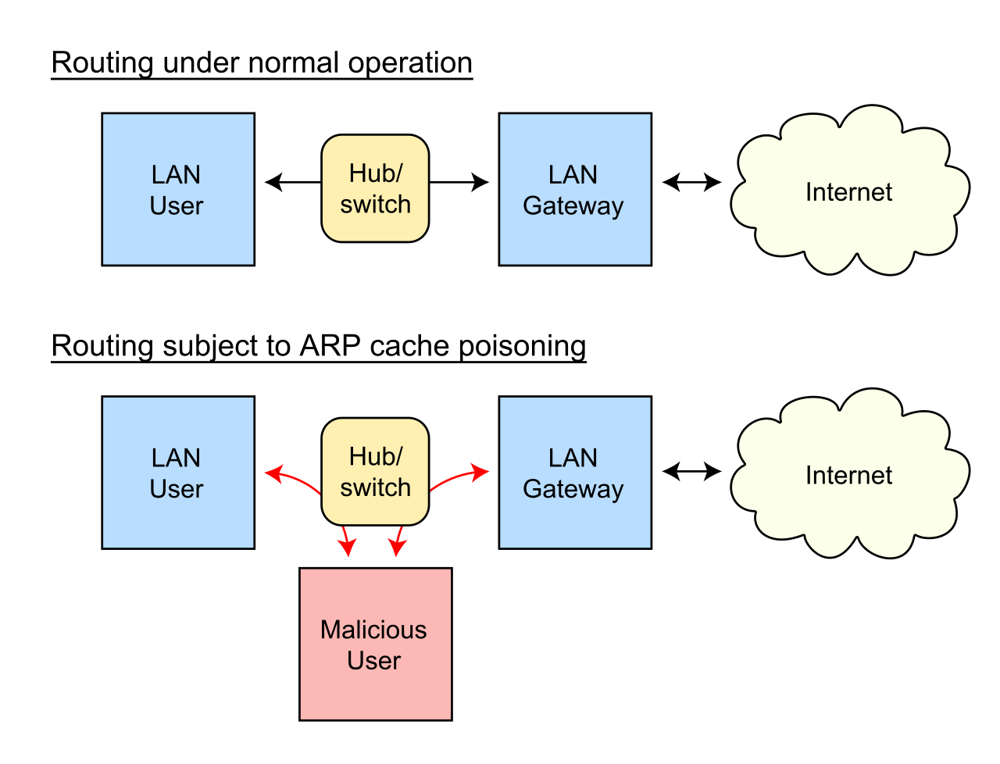
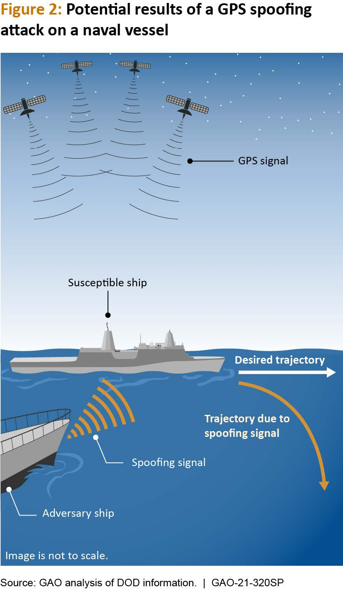

# Vulnerabilidades, debilidades y mitigaciones en las capas del modelo de Internet 

Los protocolos de Internet fueron creados en un mundo en el que el modelo de amenazas era muy distinto al actual. Pueden leer la introducción del capítulo de **Seguridad de Sistemas Operativos** para leer una reflexión sobre esto, ya que casi los mismos motivos que explican las deficiencias en mecanismos de seguridad de esos sistemas las explican en los estándares de red (protocolos exigentes en procesamiento, menor riesgo debido a que las actividades en Internet no eran particularmente lucrativas, menor penetración en la población, etc.)

En esta sección hablaremos de los puntos débiles más conocidos de distintos protocolos de las capas del Modelo de Internet, así como también de algunas medidas de seguridad que se han tomado históricamente para reducir el impacto de estas decisiones de diseño sin tener que modificar estructuralmente los equipos que sostienen Internet en el mundo.

## Capa de enlace

### Vulnerabilidades y debilidades

* **ARP Spoofing**: ARP solo requiere que los dispositivos anuncien información para que el switch correspondiente la almacene en su tabla interna y la replique frente a nuevas preguntas. La siguiente imagen del usuario de Wikipedia [0x55534C](https://commons.wikimedia.org/w/index.php?title=User:0x55534C&action=edit&redlink=1) muestra que un nodo malicioso diga que su MAC apunta a cierta IP para que otros nodos que deseen conectarse a él empiecen  a enviar paquetes a su dirección física, generando las condiciones necesarias para un ataque de tipo _Person in the Middle_.

    

    En un ataque _Person in the middle_, el atacante es capaz de recibir todos los mensajes que el emisor envía al receptor y modificarlos, leerlos y/o demorarlos. En este caso específico, si las capas superiores del protocolo usado no cuentan con mecanismos de autentificación cifrado o comprobación integridad, el atacante podrá leer y modificar el contenido del mensaje a su voluntad.

* **Modificación y clonación de MAC**: Si bien inicialmente la idea de la dirección MAC era que no fuese cambiable, este comportamiento puede ser modificado por sistemas operativos y drivers. El impacto de este cambio es similar al del ARP _spoofing_: Algunos paquetes dirigidos al usuario clonado podrían llegar, en algunas circunstancias, al usuario malicioso, así como también se le podría asignar de forma temporal o permanente la IP del usuario suplantado.
* **Vigilancia y monitoreo a través de la MAC**: Si la MAC de un dispositivo es estática, el punto al cual se conecta (y en realidad, cualquier dispositivo que pueda recibir mensajes de la tabla ARP de la red) sabrá que es el mismo en cada conexión. Peor aún, si más de un administrador/a de sistemas comparte la lista de conexiones de un dispositivo específico, se podrá usar la MAC como una herramienta de tracking de personas entre distintas redes no relacionadas.

### Medidas de seguridad

* **Tabla estática de ARP**: Para servicios críticos, definir en una tabla estática el mapeo MAC -> IP, evitando su reasignación y teniendo en consideración que si se cambia la dirección física del dispositivo, 
* **Modificación en sistema operativo de comportamiento frente a mensajes ARP**: En algunos OSes, se puede configurar que no se consideren los broadcast de actualizaciones de ARP si no fueron solicitados.
* **Software de detección y prevención**: Existe software que monitorea la red y que avisa si un dispositivo intenta ejecutar alguno de estos ataques.
* **Aleatorización de MAC**: Algunos dispositivos móviles aleatorizan la MAC de conexión (iOS desde 2014) para evitar monitoreo de administradores de red. 
* **Bloqueo por MAC**: Algunos dispositivos de red permiten limitar las conexiones desde direcciones MAC específicas en puertos de red (o redes inalámbricas) específicas, intentando limitar los casos de suplantación de MAC o tablas ARP.

## Capa de Internet

### Vulnerabilidades y debilidades

* **[ICMP para reconocer hosts](https://www.rfc-editor.org/rfc/rfc792)**: ICMP es el protocolo que opera cuando uno ejecuta el comando `ping`, pero también sirve para el envío de otros mensajes informativos al equipo que está intentando conectarse, como en los casos en los que el host no es alcanzable o la conexión fue rechazada por el receptor. Estos paquetes pueden ser usados para reconocer las rutas que toman los paquetes enviados (con el comando `traceroute`) o para reconocer dispositivos conectados a la red alcanzables desde el equipo en que se encuentra el atacante (a través de herramientas como _Nmap_).
* **IP Spoofing**: Al igual que como se puede cambiar la MAC de un dispositivo específico (por falta de autenticación), también se puede cambiar la IP de origen de un paquete enviado por cualquier dispositivo, sea el legítimo usuario de la IP o no. Esto habilita la posibilidad de ataques de tipo _Person in the Middle_ y también de ataques de tipo _Denial of Service_ a través de _Ataques de amplificación_.
  
  Con respecto al segundo grupo de ataques, el plan del atacante es buscar algún servicio web (de capa de aplicación) que a partir de una consulta pequeña, se devuelva una respuesta grande. Esto permite enviar paquetes con la consulta con una IP de origen modificada, los cuales llegarán a la víctima. Esto facilita amplificar pocas consultas pequeñas en muchas más grandes, corriéndose el riesgo de botar el servicio.
* **Reconocimiento de conexiones por IP**: Un/a administrador(a) de sistemas y todos los ISP en el camino hasta el sitio de conexión de destino podrán saber exactamente a qué te conectas y en qué momento. 

### Mitigaciones

* **IPSec**: Un protocolo estandarizado que agrega una capa de autentificación y cifrado al protocolo IP. Se suele usar para establecer VPNs de tipo _Site to Site_. De esta forma, nadie más aparte del servidor de destino conocerá el contenido de las comunicaciones emitidas hacia él, sin importar si el protocolo de capa de aplicación está cifrado/autenticado o no.
* **Firewalls (Capa de Red)**: Los _firewalls_ son dispositivos de red que procesan todas las conexiones entrantes y salientes, pudiendo aplicar medidas de bloqueo si las consultas son sospechosas o infringen alguna regla específica. En este caso, los _firewall_ sirven para detener el paso de ciertos mensajes desde o hacia ciertas IP. 
* **Segmentación de redes**: Separar al menos la red administrativa de la red usuaria es necesario para dificultar el escalamiento de privilegios de potenciales atacantes.

## Capa de Transporte

### Vulnerabilidades y debilidades

* **Hijack de sesiones TCP**: El protocolo TCP usa un valor de número de secuencia para asegurar que los mensajes llegan en cierto orden. Si este número vive en un dominio pequeño, un atacante podría intentar adivinarlo para mandar mensajes a la víctima de forma de interferir otra conexión legítima mantenida por ella.
* **Conexiones a C2**: Habilitar en una red conexiones TCP o UDP arbitrarias de entrada y salida puede dar paso a que un atacante intente conectarse a un C2 controlado por él/ella 

### Mitigaciones
* **Firewalls (Capa de transporte)**: Así como en capa de Internet se bloquean IPs específicas en el firewall, en la capa de transporte se esperan bloquear puertos específicos. También se puede bloquear el paso de paquetes con IP o puerto de origen no reconocido por la institución, limitando el impacto de los spoofing.
* **NATs**: Los NATs son un _mal necesario_ aplicado en los tiempos en que las IPv4 empezaron a escasear. Permiten que muchos dispositivos se conecten a Internet con una sola IP de salida, multiplexando los paquetes de llegada según una tabla mantenida que asocia puerto de origen con la IP interna y su puerto en un dispositivo dentro de la NAT. El punto positivo en seguridad de los NAT es que disminuyen involuntariamente la superficie de ataque de las máquinas interna.

## Capa de Aplicación

Veremos esto en términos generales en la sección de unas semanas más: **Seguridad de Aplicaciones**.

Ahora hablaremos de protocolos específicos usados por otras capas:

### Vulnerabilidades y debilidades

* **Broadcast Malicioso BGP**: Siguiendo con la interminable lista de hijackings, en este caso si un participante de la red BGP indica que la ruta para recibir paquetes es distinta a la original, puede terminar botando la página original, redirigiendo la mayoría de las consultas al atacante.
* **DHCP Poisoning**: DHCP es el servicio que permite a un usuario conseguir una IP atuomáticamente en una red real. En configuraciones por defecto, nada impide que una persona pida más de una vez una IP con el objetivo de acabarlas y suspender el servicio.
* **Detección de comportamiento malicioso en comunicaciones cifradas**: En los casos de uso de aplicaciones cifradas, no tenemos forma directa de conocer el contenido de esas comunicaciones. ¿Cómo podemos saber si ese contenido es del usuario real o de un atacante con persistencia?

### Mitigaciones

* **Firewalls (_Deep Packet Inspection_)**: Existen firewalls que pueden leer el contenido de los mensajes cifrados que hacen pasar, aprovechándose de técnicas como la de _Person in the Middle_. Si bien esto podría ayudar a encontrar más información, también significa un riesgo gigante a la privacidad de sus usuarios.
* **Firewalls (Bloqueo de puertos por defecto)**: Sumando a las recomendaciones hasta ahora, un firewall de un sistema crítico debería bloquear **todo por defecto**, y desbloquearlo según el uso.

## Extra: Capa física (porque igual es importante)

No es parte del modelo de Internet, pero puede afectar la seguridad de las otras capas si estas no se preocupan de lo importante al momento de proteger comunicaciones.

### Vulnerabilidades y debilidades

* **Escucha de paquetes WiFi**: Como los paquetes WiFi usan ondas electromagnéticas para desplazarse, cualquier sensor que sea capaz de capturar estas ondas podrá interceptar el contenido en la capa más externa de las comunicaciones entre un router inalámbrico y un dispositivo.

  Este tipo de información puede permitir a un atacante saber en qué momentos el usuario está despierto o usando un dispositivo en particular. También, si el protocolo que cifra el canal de comunicación es inseguro, esto permitiría a los atacantes ver parte del contenido de los mensajes (Esto ha pasado con los protocolos de seguridad [WEP y WPA1](https://www.kali.org/tools/aircrack-ng/)).

  > [!COMMENT]
  > Pero si usamos plataformas a través de un canal cifrado, no es mucho lo que debemos preocuparnos desde el punto de vista de confidencialidad, integridad y disponibilidad (por eso, ¡viva TLS!).

* **Escucha de paquetes Ethernet (en redes con switches simples)**: Al igual que en el caso de WiFi, si el switch que usamos para conectarnos a Internet redistribuye todos los paquetes por todos los puertos, eso puede provocar que, con la tarjeta de red y/o driver adecuado, un usuario malicioso pueda interceptar todas las comunicaciones de un canal específico.
* **Spoofing de antenas**: Aplica para redes móviles de celular, WiFi e incluso GPS. Si una fuente de datos distinta a la original emite una señal con la misma estructura que no es posible autenticar, cualquier sensor que tome esa señal podrá confundirse y actuar erráticamente (como en la imagen de más abajo)

    

### Mitigaciones

* **Cifrado en capa de aplicación**: Si el mensaje viaja cifrado en la capa de aplicación, nadie que no cuente con las llaves podrá leerlo. Si las llaves se generan con protocolos de acuerdo de llave, no es necesario revelar datos sensibles de la misma para establecer la generación de una llave común.
* **Validación de integridad**: No basta con que el contenido esté cifrado. En muchos casos, también debe existir alguna forma de validar que el contenido del mensaje no ha sido modificado. La fórmula que usan aplicaciones como Email, DNS y TLS es una infraestructura de llave pública (contenido de Criptografía) o un certificado previamente confirmado (ya sea al primer uso o uno configurado a mano). 
* **Uso de dispositivos de red físicos más "inteligentes"**: Es ineficiente que un switch o hub de red envíe los paquetes de un dispositivo específico a todos los puertos. Lo que debería hacer es enviarlo solo al puerto que lo podrá leer.

## Conclusiones

Si bien la disponibilidad de sistemas en Internet es generalmente buena, la mayoría de los protocolos de Internet vistos en esta sección tenían tres problemas fundamentalmente complejos de resolver: Confidencialidad, autentificación e integridad. En este sentido, preocuparse de ellos en capas superiores, si bien es menos eficiente, es lo único que nos queda.