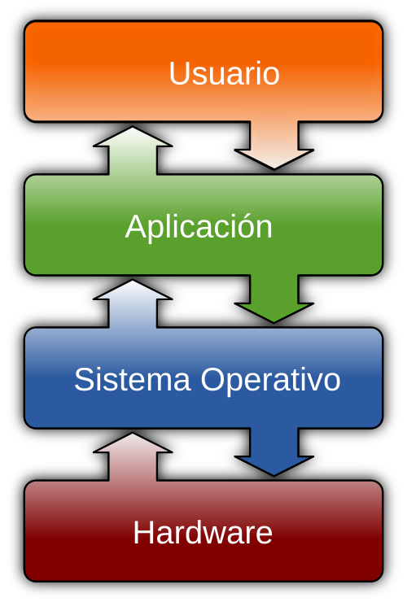

# Seguiridad de Sistemas Operativos

En este módulo, hablaremos de lo que es un sistema operativo, el programa más importante que se ejecuta en todo momento al usar un computador personal, y los mecanismos que usa cada fabricante para mantenerlos seguros frente a modelos de amenaza cada vez más específicos.

Pero antes, hablaremos un poco más de **modelos de amenaza**.

## Breve historia de los computadores 

_(o, ¿en qué momento empezamos a intentar volver seguros los computadores?)_

Si bien las raíces de las ciencias de la computación como las conocemos hoy se desarrollaron hace casi 200 años (excluyendo a propósito de esta definición a las calculadoras analógicas, a los mecanismos para medir el tiempo, la navegación espacial y los algoritmos matemáticos usados por civilizaciones antiguas desde hace miles de años), los primeros computadores digitales de propósito general (les llamaremos computadores en esta sección solo por simplicidad) que se aprovecharon por completo del desarrollo de estas ciencias empezaron a aparecer hace menos de 100.

> [!COMMENT]
> ¿Por qué descartamos las calculadoras, ábacos y otras herramientas mecánicas que no son de uso general (o casi general) para este análisis? Puede que sea solo porque es más aburrido modelar sus interacciones o no nos aportan tanto a los objetivos más importantes del cursp.

>[!COMMENT]
> De todos modos, siempre se le puede asignar a un sistema (digital o físico, computador o no) un modelo de amenazas si nos esforzamos en hacerlo. Si la persona que me facilita la calculadora (digital o mecánica) quiere que siempre que sume 2 + 2 la máquina me entregue 3, muy probablemente podrá encontrar alguna forma de hacerlo (tal vez es más fácil en el mundo digital). Parte de aprender modelamiento de amenazas también es importante saber en qué ocasiones vale la pena hacerlo y con qué nivel de rigor.

Pensemos en algunas diferencias históricas de los computadores de antaño y su contexto de uso con respecto al de hoy:

* **Superficie de exposición limitada**: Los primeros computadores estaban pensados **para uso individual** (una persona a la vez) **y local**, con su usuario físicamente presente al momento de ingresar las entradas y recibir sus salidas. Sumándole a eso el hecho de que fueran **pocos, caros y difíciles de usar**, podemos notar que el contexto para modelar sus amenazas es **completamente distinto al que tenemos hoy**; miles de millones de máquinas de uso concurrente y casi siempre accesibles desde cualquier parte del mundo. 

* **Fuentes generalmente confiables**: Cualquier programa ejecutado en un computador de las características mencionadas al inicio del párrafo anterior provenía muy probablemente de una fuente confiable (de un colega, compañero de estudio o trabajador externo con algún nivel de reputación en el pequeño mundo de programadores), debido a la dificultad asociada a la distribución de los programas. Esto hace muy poco probable que un programa a ejecutar vaya a ser diseñado de forma **intencionadamente maliciosa**.

> [!COMMENT]
> Esto no quiere decir que en los programas de antaño no se pudiesen cometer errores involuntarios que pudiesen terminar _fríendo_ sus circuitos, por lo que probablemente existían mecanismos de seguridad físicos o mecánicos para evitar lo anterior. Desde el punto de vista de riesgos tradicional, echar a perder un computador por un programa mal programado suena como un riesgo sumamente caro que no valía la pena correr. Acá de nuevo el modelo de riesgos se escapa un poco de lo que queremos discutir en el curso.

* **Modelos de amenaza en comunicaciones**: Antes de la masificación de los computadores como medio para realizar cálculos complejos, las comunicaciones remotas y privadas por canales inseguros se mantenían protegidas por _códigos secretos_ (símbolos, gestos, sonidos, imágenes). En el módulo de **🔑 Criptografía** veremos algunos algoritmos usados en este contexto en la antiguedad, y mostraremos por qué los computadores terminaron "rompiéndolos" solo por existir, haciendo más fácil aplicar estrategias de ensayo y error o encontrar patrones numéricos que revelen algo (o toda) la información de una comunicación cifrada.

  Cuando el computador empezó a involucrarse más en los modelos adversariales de comunicaciones, probablemente fue más porque era un medio práctico para cifrar y descifrar mensajes (o romper códigos de cifrado) de forma más rápida y/o automática que antes de su existencia, preservando (o atentando contra) la confidencialidad en un canal de comunicación interceptable, que por ser un dispositivo que quisiéramos proteger (o atacar) directamente como un fin en si mismo (separando el computador del algoritmo que ejecuta). Esto derivó en una especie de _carrera armamentista_ durante la Segunda Guerra Mundial, desarrollándose códigos secretos cada vez más complejos, dependientes de máquinas lo suficientemente potentes como para cifrarlos, descifrarlos, o incluso atacarlos.

> [!COMMENT]
> En otras palabras, ignorando el impacto que tiene en la humanidad el poco tiempo disponible y la dificultad de concentración frente a tareas tediosas, nada nos impide, contando solo con un lápiz y un papel, intentar "hablar" RSA/TLS (o cualquier otro algoritmo criptográfico) sin necesidad de computadores (como cuando seguimos en la mente un programa de computador, pero con ayuda de memoria externa física). Ejecutándose sin errores, algoritmo seguiría siendo seguro (asumiendo que el diseño es seguro, la implementación es correcta y no se conocen ataques sobre ambas). Los computadores solo nos aseguran que esa "conversación cifrada" se ejecute de forma rápida y sin errores de tipeo (algo que seguramente no pasaría si una persona tiene que ejecutarlo manualmente).

> [!TIP]
> ¿El computador atacado es un fin en sí mismo para el adversario en algún caso? ¿O lo son los datos/los servicios proveídos/el dinero que puedo sacar de ingresar a él o indisponibilizarlo?

> [!COMMENT]
> Desde un punto de vista de utilidad humana, el valor original del computador es del mismo tipo que el valor de cualquier otra máquina automática: vuelve más barato, rápido o fácil ejecutar una tarea repetitiva y relativamente predecible de forma confiable.

## Computadores en su contexto histórico

> [!INFO]
> Si quieres una línea de tiempo bastante completa de la historia de los computadores, puedes ver esta del [Computer History Museum de EEUU](https://www.computerhistory.org/timeline/1933/).

La forma de proveer servicios de computación se ha mantenido en una mutación constante desde el inicio de su masificación, y en cada etapa han habido distintos recursos que proteger:

* **Monoproceso, monousuario, sin almacenamiento**: Computadores como el [Colossus](https://www.tnmoc.org/colossus), cuyo objetivo era romper códigos criptográficos durante la guerra, ocupaban espacios enormes en centros de investigación y podían ser usados solo por una persona a la vez, la que corría solo un programa a la vez, el cual era ingresado al momento de iniciar el cómputo. Además, el estado del computador al encenderlo es el mismo cada vez, ya que no existía persistencia. Esto vuelve menos atractivo a un adversario la máquina como para extraer información sensible de a quien quiere atacar. Además, en estos casos los programas y sus datos debían ser ingresados manualmente con botones o con tarjetas perforadas cada vez que se querían ejecutar.

  Posterior a la creación de los primeros computadores digitales y electrónicos de propósito general, aparece la necesidad de poder contar con algo _sobre_ el programa que se está ejecutando, que pueda ayudar a realizar _debugging_. Cada _Mainframe_ tenía generalmente su propio sistema operativo, que podía o no ser compatible con otros incluso del mismo fabricante.

* **Programas almacenados y almacenamiento secundario**: ¿Y si pudiéramos dejar el programa en algo revisable directamente por el mismo computador? ¿O guardar información en algún lado y que el computador la refiera en el futuro? Con la creación de dispositivos de almacenamiento de datos como el _tambor magnético_, el computador deja de ser solo el medio para ejecutar una función (en el sentido matemático, un algoritmo con entradas y salidas) y empieza a almacenar información que puede usar en el futuro de forma automática. ENIAC, [el primer computador digital y electrónico de uso general](https://web.archive.org/web/20110814181522/http://ftp.arl.mil/~mike/comphist/eniac-story.html), en algún momento soportó el uso de memoria externa para ejecutar programas, aunque partió con una interfaz de tipo _patch panel_ necesaria para "programar" (a través del uso de cables con clavijas y plugs). 

> [!COMMENT]
>  Una característica importante que vuelve atractivos a los computadores desde un punto de vista adversarial es el almacenamiento de información. Ahora el interés adversarial no se limita a monitorear las comunicaciones que pasan a través de él, sino que también puede ser el obtener acceso a los datos almacenados (entradas y salidas de programas, o los mismos programas almacenados).

* **Sistemas de tiempo compartido (multiusuario y/o multiproceso)**: La invención de los transistores permitió en los años 50 y 60 hacer computadores mucho más pequeños y más eficientes que los que hasta ese momento estaban basados en tubos de vacío. Esto aumentó considerablemente las capacidades de los computadores, permitiendo la ejecución de más de una tarea a la vez. Si antes las tareas de cómputo eran "apiladas" y ejecutadas una después de otra, ahora era posible ejecutarlas _en paralelo_. Estas tareas podían ser todas ejecutadas por la misma persona, o por personas distintas, lo que requirió crear abstracciones nuevas sobre la ejecución de programas de computadores, que permitan ejecución secuencial sin intervención humana o ejecución paralela de forma resiliente.

> [!COMMENT]
> Si hay dos programas ejecutándose al mismo tiempo, usando la misma memoria y con acceso a las mismas fuentes de datos, ¿qué evita que un programa afecte la memoria o las rutinas del otro?

  En este tiempo el desarrollo de sistemas operativos más sofisticados y estandarizados empieza a tener más sentido, con el objetivo no solo de entregar más facilidades a quienes usan los sistemas, sino también de evitar problemas con la ejecución multiusuario y multiproceso. El primer sistema operativo de tiempo compartido y de propósito general fue [CTSS](https://multicians.org/thvv/compatible-time-sharing-system.pdf), y otros sistemas operativos como Atlas Supervisor del supercomputador [Atlas](https://web.archive.org/web/20120728105352/http://www.computer50.org/kgill/atlas/atlas.html), que contenían funcionalidades modernas para ese entonces pero comunes hoy, como memoria virtual.

  Otro concepto interesante de esta época es la masificación de los _terminales de computador_ físicos (por eso los programas llamados _terminal_ de hoy se llaman en verdad _terminal emulator_). Actuaban como _cajas tontas_ con un sistema de salida (pantalla o impresora) y uno de entrada (teclado) para interactuar con un _mainframe_ tradicional o de tiempo compartido.

  Los sistemas operativos más influyentes de esta categoría son Multics (de los laboratorios Bell, General Electric y el MIT) y Unix (solo de los laboratorios Bell). Sobre Unix, el tatarabuelo de Android, Linux, iOS y macOS, si bien no partió como un sistema operativo de tiempo compartido, terminó desarrollándose como tal. [Dennis Ritchie cuenta en este paper la historia del desarrollo de Unix](https://www.nokia.com/bell-labs/about/dennis-m-ritchie/hist.pdf).

* **Sistemas operativos portables y Computadores personales**: Con el tiempo y el desarrollo de computadores cada vez más potentes y pequeños, los sistemas operativos empezaron a funcionar en cada vez más fabricantes y modelos de computadores, volviéndose _portables_ a partir de la estandarización de las arquitecturas de procesadores. Unix específicamente terminó volviéndose portable y definiendo varios conceptos que hoy son comunes, como los sistemas de archivos jerárquicos o el uso de texto plano para algunos tipos de datos.

En los años 70 aparecieron los _microcomputadores_ y en los 80 los _computadores personales_ de tamaños similares a lo que esperaríamos hoy para un computador en una casa. Este tipo de computadores trabaja con un modelo de amenazas distinto al anterior: Lo usan personas específicas con archivos propios. Los sistemas operativos empezaron a hacerse cargo de algunas de las restricciones que uno esperaría de compartir un dispositivo así: Cuentas de usuario, permisos administrativos para ver o modificar configuraciones y accesos de lectura o escritura a información.

> [!TIP]
> ¿Qué puede hacer un atacante con acceso físico a un computador usado por muchas personas y con solo una cuenta de usuario?
> ¿O sin credenciales para ejecutar acciones administrativas?

Si bien en los casos en los que el computador está en una casa u oficina quienes lo usan son un conjunto acotado y limitado de personas, esto no siempre es así. Hay casos en los que los computadores son usados incluso por desconocidos. Esto ocurre en menor medida en equipos de la U o biblioteca, y en mayor medida en equipos públicos (_¿recuerdan los cibercafé?_), **en los que la posibilidad de acceso de parte de cualquier persona nos expone a muchos más riesgos**.

* **Masificación de la Internet**: El desarrollo de los _Modem_ a finales de los años 50 ya permitía la comunicación con un computador a través de líneas telefónicas, las cuales facilitarían el acceso a él desde teléfonos locales o incluso en larga distancia usando _carriers_ (que eran como un servicio que transfería una llamada a una red telefónica de otra región o país por un cobro adicional).

**Exponer la entrada o salida de un computador a una línea de comunicación remota significó aumentar la superficie de exposición de los computadores que lo hacían**. Con el desarrollo y masificación de la Internet desde fines de los 90s y hasta el día de hoy, estandarizando una red especial para la comunicación de datos digitales, el modelo de amenaza debe considerar cada vez más casos no deseados (esto lo veremos con mayor profundidad en la sección de **🌐 Seguridad de Redes**).

* **Dispositivos portátiles: notebooks, tablets, teléfonos y _wearables_**: Otro cambio en el modelo de amenazas de los computadores es que muchos de ellos son, al menos desde los años 2000, muy fáciles de transportar y almacenan datos muy sensibles para nosotros (o los van registrando en tiempo real mientras los llevamos con nosotros). Estos dispositivos también están, al menos desde la masificación de las redes móviles de celular en los 2010s, casi siempre conectados a una red de internet y funcionan (como vimos en la sección de **Autenticación**) como una llave adicional a servicios físicos y digitales.

* **Nubes personales y Plataformas como Servicio**: Y no todo lo importante o sensible vive en nuestros computadores solamente. Cada vez es más común llevar respaldos (queramos o no) en sistemas de almacenamiento administrados por proveedores externos, como Nextcloud, Google Drive o Microsoft Onedrive. Estos datos externos actúan sin intención como respaldo, como mecanismo para acceder ubicuamente a la misma información desde distintos dispositivos y como almacenamiento adicional externo para evitar quedarnos sin memoria cuando sacamos muchas fotos.

Con respecto a la nube, ésta aparece como un nuevo _framework_ para ejecutar aplicaciones en servidores. En algunos casos el sistema operativo tradicional como tal desaparece, se abstrae o se minimiza un montón, enfocándose los desarrolladores y desarrolladoras en la generación del código y no de las condiciones necesarias para ejecutarlo (que vienen ya configuradas por el proveedor de plataforma como servicio)

> [!COMMENT]
> ¿Tal vez al curso le falta una sección de seguridad en la nube? 🤔

* **El navegador como sistema operativo**: Computadores como los [_Chromebook_ de Google](https://www.google.com/intl/es-419_ALL/chromebook/index.html) han mostrado en la práctica que se pueden hacer muchas cosas cotidianas solo usando un navegador web, siendo las páginas web y el uso de tecnologías como Javascript y Web Assembly las que nos permiten "ejecutar programas"\ ¿Qué nos limita a tener un computador que simplemente _bootee_ un navegador?

## ¿Y qué tiene que ver todo esto con ciberseguridad?

Lo siento, nos dimos la vuelta larga para llegar a una idea muy corta. Este curso propone que la importancia de proteger los computadores y lo que corre dentro de ellos se fue desarrollando por al menos dos caminos. 

Por un lado, a medida los computadores empezaron a ejecutar tareas cada vez más importantes para el funcionamiento de la sociedad, empezaron a atraer a más y mejores *adversarios* con la intención de que estas tareas se ejecutaran de una forma que les beneficiara a ellos y perjudicara a otros. Ese interés ya es suficiente para cuestionarse las medidas que tomamos para evitar que un sistema crítico sea mal utilizado.

Por otro lado, las fronteras de datos e instrucciones entre computadores de distintas personas se disolvieron históricamente de al menos dos formas. 

* La menos caótica es el uso de los **sistemas de tiempo compartido y multitarea** mencionados más arriba. Si no pienso adversarialmente, probablemente nunca se me ocurra que correr dos listas de instrucciones al mismo tiempo puede provocar, tanto a propósito como por error, que un programa modifique los datos del otro, afectando el cálculo final. A medida confiemos menos en los otros programas que se corren en el mismo sistema, necesitamos tomar medidas (lo mejor es que en la capa que se encarga de la ejecución y asignación de memoria y otros permisos de los programas) para aislar los efectos secundarios de cada uno de ellos lo más posible. La pieza que puede hacer esto es la parte orquestadora de ejecuciones en paralelo, que además da interfaces para usar fácilmente los componentes de los dispositivos. **el sistema operativo**.
* La más caótica fue probablemente la masificación de la Internet (lo veremos con más detalle en la unidad de Redes). La superficie de exposición en el peor caso pasó del universo de los que podían entrar a mi oficina a **literalmente casi todo el mundo**.

> [!COMMENT]
> Y ya vale la pena hablar de una tercera: ¡la ejecución de código hecho por personas que no conocemos sin revisarlo! Lo que hasta hace 10 o 15 años no era necesariamente un vector de entrada de atacantes, sino más bien un esfuerzo comunitario que permitía mantener la esperanza en la bondad de la sociedad, hoy se ha vuelto imposible de manejar debido a **ataques de cadena de suministro**. Veremos esto con mayor detalle en la sección de Desarrollo Seguro y Malware

## Partes de un sistema operativo

Esta imagen, creada por el usuario de Wikipedia [Golftheman](https://commons.wikimedia.org/w/index.php?title=User:Golftheman&action=edit&redlink=1), muestra dónde se ubica el sistema operativo entre el usuario y el _hardware_. 

El sistema operativo es el soporte sobre el cual las _aplicaciones_ o programas del usuario se ejecutan, apoyando en el manejo de memoria, el control de múltiples procesos, el manejo de usuarios y permisos de acceso, la entrega de APIs para uso de hardware de parte de las aplicaciones y otros requisitos de seguridad que se han ido sofisticando durante los años.

---

## Modelos de amenaza para un sistema operativo

Entendiendo que los sistemas operativos pueden variar en características según el tipo de disposito, veremos a continuación en términos generales los distintos modelos de amenaza a los que nos podemos enfrentar.

* **Escritorio y Notebook**: En este caso el dispositivo no es fácil de mover y/o no permanece encendido mientras uno lo mueve. Si bien puede que tenga datos sensibles de un usuario, suelen ser documentos, historial de navegación o accesos personales. Dentro de este modelo de amenaza, se considera razonable para evitar complicaciones en caso de robo del dispositivo mantener el almacenamiento cifrado en reposo (Bitlocker en Windows, LUKS en Linux), y una contraseña robusta para iniciar sesión o el uso de algún factor biométrico. Desde el punto de vista de la seguridad en el uso cotidiano, una herramienta de tipo antivirus o EDR, más buenas prácticas en la ejecución e instalación de programas solo desde fuentes conocidas, es suficiente para evitar la mayor parte de los accesos no autorizados. Es importante recordar que si el dispositivo es usado por más de una persona, el usuario que no tiene accesos administrativos debe asumir que cualquiera que sí los tenga podría llegar a acceder a su información
* **Tablet, teléfono, _wearable_**: Al contrario del caso anterior, los dispositivos sí permanecen encendidos constantemente mientras siguen a sus usuarios. Además, almacenan muchas veces información de salud (proveniente de _wearables_ o registradas por sus usuarios), fotos, ubicación en tiempo real, medios de pago, agendas de contactos, entre otros. Para un actor de amenaza común dirigido a este tipo de dispositivos, el recurso más valioso en el móvil de una persona podrían ser las aplicaciones de pago (para usarlos en la compra de cosas) o los contactos de mensajería (para intentar pedirles dinero), por lo que las mitigaciones recomendadas a ese tipo de dispositivos son contar con contraseñas robustas y/o autenticación biométrica tanto a nivel de sistema operativo como en las aplicaciones más críticas, no mostrar el contenido de las notificaciones o SMS con pantalla bloqueada y mantener el dispositivo constantemente actualizado.
* **Servidor expuesto a Internet**: La exposición a Internet de algunos servicios en un servidor dirigido a acceso público es imposible de evitar. Asimismo, si los servicios del servidor son de uso interno (intranet o una IP específica), no tiene sentido que los servicios sean accesibles desde otros lados distintos al objetivo. Un actor de amenaza común buscará vulnerabilidades típicas en los servicios expuestos. En el caso de software _distribuible_, los atacantes pueden automatizar la búsqueda de vulnerabilidades conocidas, por lo que se recomienda mantener los servicios actualizados a sus últimas versiones. Para software desarrollado a medida, se recomienda mantener sus dependencias actualizadas y aplicar metodologías de desarrollo seguro (Esto lo veremos en la unidad del mismo nombre). Para ambos casos, se recomienda configurar herramientas de seguridad perimetral como WAFs y reglas de firewall (esto lo veremos con más detalle en **🌐 Seguridad de Redes**).
* **Dispositivos _embeeded_**: Corresponden a dispositivos de baja potencia, pero con capacidad de conexión a Internet u otras redes. En estas categorías se encuentran los router residenciales, las cámaras IP y otros dispositivos _Internet of Things_, como televisores, aires acondicionados, refrigeradores, lavadoras, luces, impresoras, sistemas de control industrial, etc. Suelen actualizarse muy poco o casi nada, y no suelen usar protocolos de comunicación seguros debido a la poca potencia con la que cuentan. Un actor de amenaza puede dirigirse a atacar los dispositivos más antiguos y vulnerables tanto para usarlos como _zombies_ en ataques de denegación de servicio, o a dispositivos como cámaras y micrófonos e intentar extorsionar a las víctimas con filtrar su contenido (ambas cosas las veremos con más detalle en la sección **😈 Malware**).

---

En las próximas secciones, no nos referiremos tanto a los modelos de amenaza, sino que hablaremos de las medidas de seguridad implementadas en las versiones más modernas de sistemas operativos populares.

