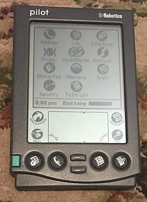
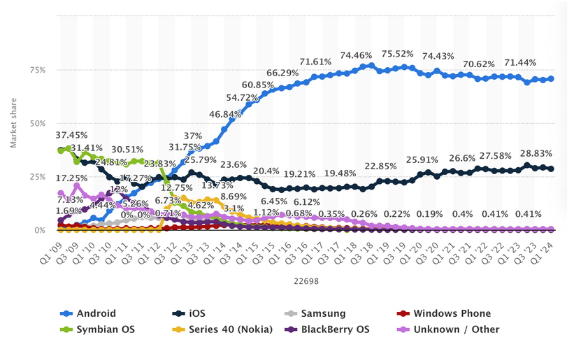
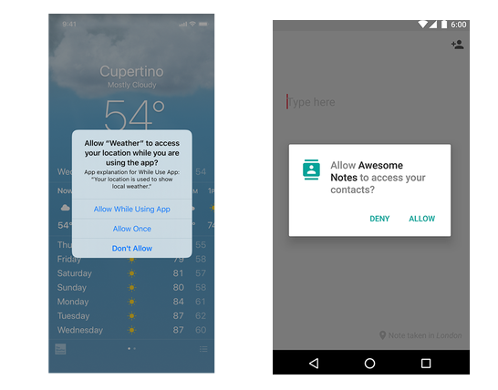
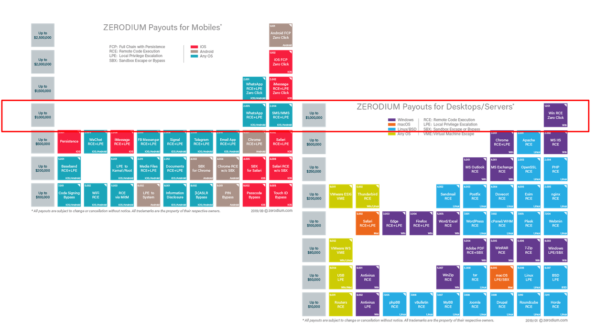
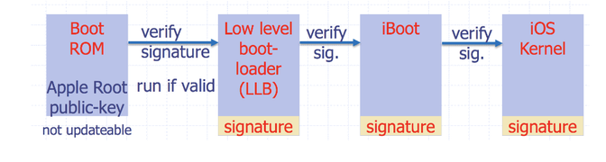
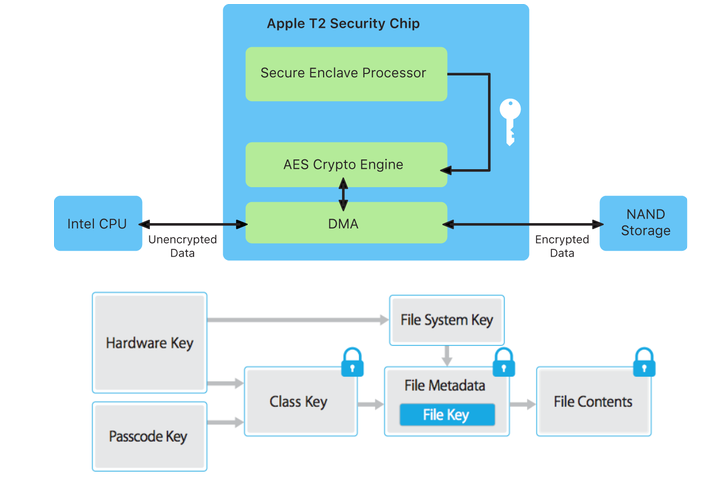
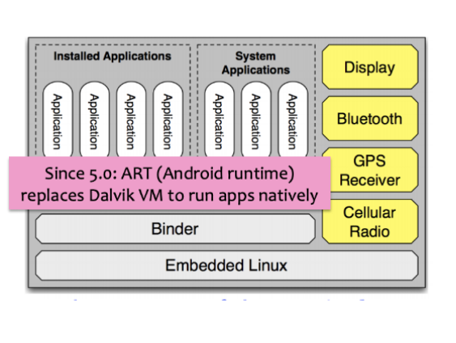
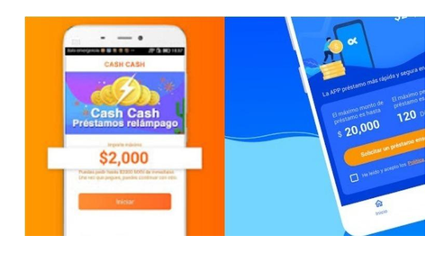

# Sistemas Operativos Móviles: Android e iOS

Los sistemas operativos de dispositivos móviles están optimizados para su funcionamiento en dispositivos pequeños y portátiles. Esto se traduce en:
* Poseen menos requerimientos de hardware (procesador, memoria y especialmente energía)
* Sus interfaces están adaptadas para la operación con teclados pequeños o pantallas táctiles.

## Históricamente

* En el año 1984 apareció el primer PDA (_asistentes digitales personales_) llamado Psion Organiser, con apariencia similar a la de una calculadora y funcionalidades de programación, agenda, sistema de archivos, calculadora y organización, pero no contaba con un sistema operativo propiamente tal.
* En los años 90, los sistemas operativos de teléfonos móviles eran generalmente de tipo _embedded_. No eran actualizables y no existía posibilidad de instalar aplicaciones. Sin embargo, los PDA sí contaban con opciones de _upgrade de software_. Algunos ejemplos:
 * [Apple Newton de 1993](https://appleinsider.com/articles/18/08/02/newton-launched-august-2-1993-setting-the-stage-for-what-would-become-the-ipad-and-iphone). Como pueden ver en el artículo, no le fue muy bien, pero contaba con software externo y reconocimiento de escritura.
 * [Palm Pilot 1000 y 5000 de 1996]() Dispositivo de la empresa _Palm_ con pantalla táctil y _stylus_. Tenían memoria RAM y ROM intercambiable y se sincronizaban con los datos del computador a través de una conexión _Serial_. La siguiente imagen del usuario [80sCompaqPC](https://commons.wikimedia.org/w/index.php?title=User:80sCompaqPC&action=edit&redlink=1) muestra visualmente cómo es un Pilot.
  
* En los 2000 se masificaron en entornos empresariales dispositivos con red móvil que además tenían funcionalidades de PDA. Algunas marcas eran BlackBerry, Windows CE y Nokia S30/S40/Symbian.
  * El caso de aplicaciones más conocidas a mediados de la década fue el de las aplicaciones _J2ME_ o _Java Platform Micro Edition_. Eran relativamente portables.
* Desde 2007 con el lanzamiento del iPhone e iPod Touch, los sistemas operativos de teléfonos móviles se han estandarizado bastante.
  * Android fue comprado por Google, manteniendo su desarrollo _open core_.
  * Durante unos pocos años, Microsoft intentó potenciar su sistema operativo móvil (Windows Phone) con Nokia. No le fue muy bien.

Este gráfico de [Statista](https://www.statista.com/statistics/272698/global-market-share-held-by-mobile-operating-systems-since-2009) (ahora tras _paywall_) muestra la importancia de de Symbian OS y Series 40 (de Nokia) hasta el 2012, momento en que Android despegó en popularidad. Por su parte, iOS se ha mantenido estable en participación de mercado.

A continuación veremos algunas consideraciones de seguridad relacionadas con los sistemas operativos de teléfonos móviles modernos.

## Sistema de permisos

* Tanto en [Android](https://developer.android.com/guide/topics/permissions/overview) como [iOS](https://developer.apple.com/design/human-interface-guidelines/ios/app-architecture/requesting-permission/), las API para acceder a recursos internos están divididas en categorías.

El objetivo de lo anterior es evitar que aplicaciones accedan a recursos a los que no deberían acceder para su funcionamiento normal.

Uno de los casos más comunes de mal uso de permisos es el de las [aplicaciones de préstamos abusivos](https://www.biobiochile.cl/noticias/economia/consumidor/2026/06/12/cmf-denuncia-a-12-aplicaciones-de-prestamos-por-tecnicas-extorsionadoras-y-posibles-cobros-usureros.shtml). Estas aplicaciones se difunden en canales de publicidad y piden un montón de permisos (cámara, ubicación, lista de contactos, entre otros). Luego, usan esta información para extorsionar a las víctimas indicando que conocen a su familia o que cuentan con datos comprometedores de ellos.

## Algunos modelos de amenaza móviles

A continuación enumeramos algunas variables que pueden determinar los posibles modelos de amenaza de dispositivos móviles:

### Amenaza Física
* **Estado del dispositivo**: Apagado, encendido antes del primer desbloqueo, encendido después del primer desbloqueo pero bloqueado, desbloqueado.
* **Tipo de adversario**: Con control total por tiempo indefinido, con control por tiempo limitado, con control del canal de comunicación, con control de una aplicación en el dispositivo.
* **Amenazas de código ejecutado**: Uso de permisos de forma distinta a la anunciada, explotación de bugs en el OS para escalar privilegios(Rooting), reemplazo de aplicaciones por defecto para mensajería y llamadas, lectura de contenido de pantalla con permisos de accesibilidad, inyección de eventos e _intents_ en el sistema.
* **Amenazas de red**: Las mismas que cualquier otro dispositivo conectado (las veremos en **🌐 Seguridad de Redes**): MITM, Packet Sniffing, Tracking con IP o MACs.

Considerando lo importante de la información en estos dispositivos, sus vulnerabilidades tipo 0-day suelen ser súper bien pagadas. El sitio Zerodium mostraba esto en el 2019:

> [!TIP]
> ¿Quién compra vulnerabilidades? 🤔

## Métodos de acceso

* Suele usar al menos de dos tipos: Algo que sabes y algo que eres.
* Los mecanismos biométricos son cada vez más comunes, y bien implementados combinan comodidad con confiabilidad.

Con respecto a "Algo que sabes", algunos sist. operativos móviles bloquean ciertos códigos fáciles de adivinar: * [¿Cuáles son los códigos fáciles según iOS?](https://www.zdnet.com/article/this-raspberry-pi-powered-lego-robot-brute-force-attacked-an-iphone-to-find-out-what-pin-codes-are-blacklisted/)

### Algunas vulnerabilidades

* [Cómo obtener un patrón de desbloqueo desde las marcas en la pantalla](https://www.usenix.org/legacy/events/woot10/tech/full_papers/Aviv.pdf)
* [Problemas de implementación en el _screenlock_ de iOS (2015)](https://www.mdsec.co.uk/2015/03/apple-ios-hardware-assisted-screenlock-bruteforce/)
* [Problemas en el reconocimiento de huella en Galaxy Note 10 y S10 (2019)](https://news.samsung.com/global/statement-on-fingerprint-recognition-issue)
* [Problemas de reconocimiento facial en FaceID](https://www.digitaltrends.com/mobile/apple-faceid-tricked-by-glasses-with-tape/
)

> [!COMMENT]
> Si tienes un iPhone y presionas 5 veces el botón de bloqueo mientras está apagado, requerirá obligatoriamente el PIN para ser desbloqueado, dificultando un desbloqueo forzoso con tu cara/huella.

## Mecanismos de seguridad en hardware

Los dispositivos móviles fueron los que masificaron el uso de "chips seguros" que separaban la información sensible (claves, datos biométricos, llaves privadas) del resto de la información, almacenándola en un chip especial (_TPM_)

* Desde el _iPhone 6_, Apple incluye un _Secure Enclave_ en sus dispositivos.
    * Almacena datos encriptados, como PIN, info de TouchID/FaceID y llaves privadas criptográficas que no se pueden extraer (solo se entrega una API para firmar y validar)
    * OS no puede acceder a la memoria del chip (chip tiene su propio OS)
    * El comportamiento del chip solo puede ser modificado por Apple (a no ser que se encuentre una vulnerabilidad en él)

* En el caso de los Android, cada fabricante tiene sus versiones de chip seguro: Google Pixel usa chips _Titan_ y Samsung usa _Secure Element._

Similar al _Secure Boot_ de Escritorio, los móviles usan una cadena de confianza para determinar si el sistema operativo fue modificado.

[Así](https://support.apple.com/guide/security/secure-enclave-overview-sec59b0b31ff/web) funciona el proceso de cifrado de datos en el _Secure Enclave_ de Apple:

> [!COMMENT]
> Si Apple firma un firmware malicioso, ¿tenemos como protegernos?

Se le ha solicitado históricamente a Apple desarrollar _backdoors_ para sus dispositivos con objetivos de recuperar evidencia en investigaciones policiales. [Apple se ha rehusado a colaborar.](https://time.com/4262480/tim-cook-apple-fbi-2/). En el caso del 2016, el FBI mostró que [no necesita apoyo de las empresas fabricantes para romper la seguridad en dispositivos](https://www.bbc.com/news/world-us-canada-35914195).

## Sandboxing

Las aplicaciones corren en _sandboxes_ o entornos casi completamente aislados (a no ser que se les den permisos para interactuar entre sí o con el sistema de archivos general). Esto disminuye el potencial impacto de una aplicación vulnerable o fraudulenta, _siempre y cuando los permisos otorgados sean los adecuados_.

## App Stores

Las _App Stores_ son una forma fácil y rápida de acceder a "aplicaciones oficiales" y generalmente seguras. Ellas permiten conocer antes de instalar la aplicación los permisos que ella requerirá, las condiciones de privacidad de los servicios y si la aplicación posee pagos internos o no.

* En Android, originalmente se podían instalar aplicaciones desde cualquier fuente fácilmente (a esto se le llama _sideloading_). [Desde marzo de 2026](https://www.androidauthority.com/google-android-sideloading-unverified-apps-new-rules-3650343/) es necesario esperar 24 horas para instalar una aplicación que no esté en la _app store_ si no se es un desarrollador verificado.
* En iOS, hasta hace poco solo podían instalarse aplicaciones desde la _App Store_ oficial. La Unión Europea obliga a fabricantes de dispositivos a proveer alternativas a sus _App Store_ en sus países integrantes. Apple cumple con esta normativa, pero **solo en los países que lo exigen**.

### ¿Estoy seguro/a si solo uso App Store?

Lamentablemente, no porque una aplicación esté en una _App Store_ (Oficial o no) significa que es segura. Han habido muchos casos de malware distribuido a través de _App Stores_ Oficiales (en general Android): 

* **[Juegos de Google Play (2018)](https://twitter.com/LukasStefanko/status/1064507886896844800/photo/1)**: 
* **[Xamalicious (2023)](https://www.mcafee.com/blogs/other-blogs/mcafee-labs/stealth-backdoor-android-xamalicious-actively-infecting-devices/)**: Campaña detectada por McAffee en la que aplicaciones implementadas con Xamarin (Framework de código abierto para hacer apps de Android e iOS) transforman dispositivos móviles en _zombies_ de un _Command and Control_.
* **Aplicaciones de préstamos abusivos**: Mencionadas más arriba, suelen ser reportadas por reguladores nacionales ([CMF](https://www.cmfchile.cl/portal/prensa/615/w3-article-93290.html)) pero no siempre son dadas de baja rápidamente.

### Malware en móvil

Algunos ejemplos de malware en Android:

* **[DroidDream (2011)](https://www.f-secure.com/v-descs/trojan-android-droiddream-d)** Malware en Android 2.2 que recolectaba datos locales y los enviaba a un servidor remoto, además de descargar archivos y aplicaciones.
* **[Zitmo (2011)](https://securelist.com/zeus-in-the-mobile-facts-and-theories/36424/)** Versión móvil del malware _Zeus_ (_Zeus in the Mobile_). A partir de una campaña en dispositivos de escritorio, se incentiva al usuario a instalar un "certificado" en un dispositivo móvil, el que en realidad es una aplicación.
* **[Vault 7 (2013-2016)](https://wikileaks.org/ciav7p1/)**: Herramientas usadas por la CIA para acceder a equipos móviles.
* **[KingRoot (hasta Android 5)](https://xdaforums.com/t/kingroot-malware-adware-root.3563090/)**: Es un mecanismo de _root_ de dispositivos móviles que aparentemente incluía _adware_ adicional al proceso de root.

En iOS, el malware autoinstalable es muy poco común. [En _The Apple Wiki_](https://theapplewiki.com/wiki/Malware_for_iOS) hay algunos ejemplos de herramientas maliciosas disponibles para la plataforma, la mayoría usadas por gobiernos o actores de amenaza para acceder al contenido de sus usuarios.

En ambos casos, si el actor de amenaza del que uno quiere defenderse es un _APT_ o un gobierno de forma dirigida, es muy difícil protegerse, dado que este tipo de actores podría contar con vulnerabilidades de tipo _0-day_ para acceder a la información en el dispositivo. Un ejemplo de proveedor de este tipo de herramientas es [Cellebrite](https://cellebrite.com/en/products/cellebrite-inseyets/ufed/).

## Rooting y Jailbreaking

Consiste en aprovecharse de alguna vulnerabilidad en el sistema operativo para conseguir permisos mayores a los que el fabricante esperaba.

El paso a paso de casi todos los métodos de _root_ es el siguiente:

* Se ejecuta un exploit que permite escalar privilegios a superusuario o se desactiva una funcionalidad de seguridad crítica (como revisión de firmas en código ejecutado)
* Se instala una aplicación que intermedia las solicitudes de _root_ de otras aplicaciones
* (A veces,) se desarrolla un mecanismo de persistencia para que el _root_ perdure entre actualizaciones.

Para rootear Androids se puede usar una guía como [esta](https://github.com/awesome-android-root/awesome-android-root).

Algunas personas _rootean_ sus dispositivos para conseguir control completo sobre ellos, otras para instalar aplicaciones _piratas_. En ambos casos, se está habilitando una opción para que las aplicaciones se salten varios de los controles de los que hemos hablado en esta sección.

La recomendación general es **no rootear dispositivos que tienen datos sensibles**. Si el dispositivo es una tablet vieja que quiero usar como _dashboard_ con una visualización del tiempo para la semana, da un poco lo mismo rootear o no, pero si el dispositivo tiene instaladas aplicaciones bancarias o de MFA, lo mejor es evitarlo.

Generalmente los teléfonos más modernos no son fácilmente _rooteables_ (o requieren desactivar un montón de medidas de seguridad para serlo), lo que es un pro desde el punto de vista de seguridad.

## Mitigaciones

Para disminuir el impacto de ser afectado por una situación que ponga en riesgo los datos o la privacidad de sus usuarios:

* **Usar dispositivos sin vulnerabilidades conocidas**: Lamentablemente, los dispositivos más antiguos (más de 4 años) suelen ser afectados por vulnerabilidades que los fabricantes ya no parchan o que son imparchables por software, lo que los vuelve fácilmente desbloqueables por algunos tipos de actores de amenaza.
* **Usar sistemas operativos actualizados y oficiales**: Para el caso de las vulnerabilidad
* **Usar sistemas operativos seguros** Los Google Pixel ([y futuramente algunos Lenovo](https://motorolanews.com/motorola-three-new-b2b-solutions-at-mwc-2026/)) pueden usar el sistema operativo *[Graphene OS](https://grapheneos.org/)*, que no depende de Google y posee valores por defecto mucho más seguros que un Android tradicional. Además, este sistema operativo tiene otras configuraciones orientadas a evitar acceso no autorizado de información, como el uso de _Duress PINs_ que si son ingresados al desbloquear, el equipo se formatea inmediatamente. [Esto ha sido consdierado como ilegal en algunos países del norte de nuestro continente, conocidos por malas prácticas de revisión fronteriza](https://cybernews.com/privacy/atlanta-man-border-search-prosecuted-grapheneos/)
* **Evitar el _rooteo_ del dispositivo móvil primario**: Rootear un dispositivo puede ser útil para tomar control sobre él, pero el atacante también podrá acceder a más datos y más fácilmente que si el dispositivo no estuviese en ese estado. 

## Otras referencias:
* [Podcast sobre vulnerabilidades 0-Day](https://securitycryptographywhatever.com/2024/06/24/mdowd/)