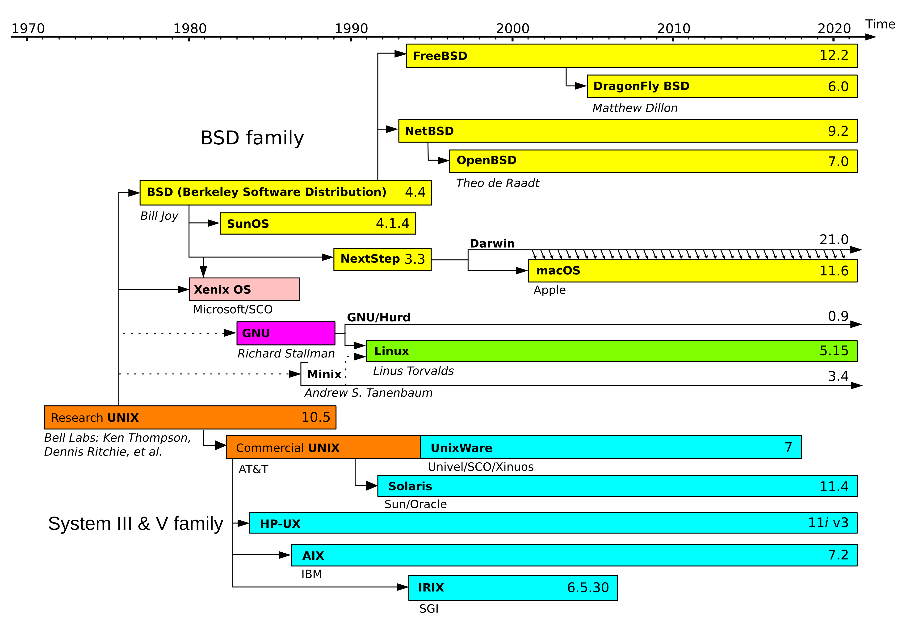

# Sistemas Operativos basados en Linux (y otros sistemas de la familia Unix)

Linux partió el 1991 como un _kernel_ gratis y de código abierto, creado por el programador finés Linus Torvalds, inspirado en el Sistema Operativo Unix mencionado en la sección introductoria.

Linux puede significar varias cosas:

* [**Kernel de Linux**](https://www.kernel.org/): El Kernel de un sistema operativo es el componente que se comunica directamente con el hardware en el que corre el mismo. En el caso de Linux, este kernel es desarrollado como código abierto y compartido por muchos _sistemas operativos_.
* **Distros de Linux**: Conjunto de kernel, gestores de paquetes, interfaz gráfica, librerías y otras utilidades. Un conjunto de utilidades específico se llama [GNU](https://www.gnu.org) y suele ser usado como parte o por completo en sistemas operativos que también usan el kernel de Linux. Algunas distro conocidas son las basadas en [Debian](https://www.debian.org/index.es.html) ([Ubuntu](https://ubuntu.com/download), [Linux Mint](https://www.linuxmint.com/), [Parrot Security](https://www.parrotsec.org/), [Kali Linux](https://www.kali.org/)), las basadas en [Arch](https://archlinux.org/) ([BlackArch](https://www.blackarch.org/), [Manjaro](https://manjaro.org/), [EndeavourOS](https://endeavouros.com)) y las basadas en Fedora ([RedHat](https://developers.redhat.com/products/rhel/download), [CentOS Stream](https://centos.org/), [Rocky Linux](https://rockylinux.org/), [Alma Linux](https://almalinux.org/), [Bazzite](https://bazzite.gg/))

{}
_I'd just like to interject for a moment. What you're refering to as Linux, is in fact, GNU/Linux, or as I've recently taken to calling it, GNU plus Linux. Linux is not an operating system unto itself, but rather another free component of a fully functioning GNU system made useful by the GNU corelibs, shell utilities and vital system components comprising a full OS as defined by POSIX._

_Many computer users run a modified version of the GNU system every day, without realizing it. Through a peculiar turn of events, the version of GNU which is widely used today is often called Linux, and many of its users are not aware that it is basically the GNU system, developed by the GNU Project._

_There really is a Linux, and these people are using it, but it is just a part of the system they use. Linux is the kernel: the program in the system that allocates the machine's resources to the other programs that you run. The kernel is an essential part of an operating system, but useless by itself; it can only function in the context of a complete operating system. Linux is normally used in combination with the GNU operating system: the whole system is basically GNU with Linux added, or GNU/Linux. All the so-called Linux distributions are really distributions of GNU/Linux!_
{}

> [!COMMENT]
> Debian es una distro muy especial. [Sus versiones tienen los nombres de los personajes de Toy Story](https://people.debian.org/~miriam/toy_story/).

* [**Fundación Linux**](https://www.linuxfoundation.org/): Organización estadounidense sin fines de lucro que apoya financieramente el desarrollo de Linux y otro software libre. Hoy en día apoya proyectos relacionados con computación en la nube, seguridad de software e inteligencia artificial, entre otros.

Esta imagen muestra la genealogía de los sistemas operativos tipo Unix desde la creación de Unix a inicios de los 70 hasta este momento:

Mucho de lo que veremos acá aplica para casi todas las variantes de Unix, pero hablaremos solo de Linux (y específicamente de la distro Ubuntu) por simplicidad.

## Uso de Linux

Según el sitio [StatCounter](https://gs.statcounter.com/os-market-share/), al menos hasta septiembre de 2026, Linux era usado por el 3% de todos los usuarios de sistemas operativos móviles y de escritorio. ¡Es casi la misma cantidad de usuarios de macOS! (descartando los de OS X, que posiblemente son versiones desactualizadas del Sist. Operativo de Apple).

Según [Mordor Intelligence](https://www.mordorintelligence.com/industry-reports/server-operating-system-market), al menos el 44% de los servidores del mundo usan alguna versión de Linux, por lo que para atacantes que intenten vulnerar instituciones que cuentan con servicios expuestos a Internet puede ser muy provechoso aprender de las debilidades más comunes de estos sistemas

## ¿Cómo funciona Linux?

En esta sección hablaremos de algunas características particulares de Linux y similares, relacionadas con posibles debilidades y vulnerabilidades

### Sistema de archivos

El sistema de archivos en Linux es un árbol, en cuya raíz (`/`) viven todos los sistemas de archivos (e incluso dispositivos reales y virtuales). Si queremos acceder a un sistema de archivos particular, debemos _montarlo_ en alguna hoja de este árbol.

El árbol tiene en casi todas las distros una estructura estándar, con carpetas con utilidades más o menos definidas. A esta estructura se le llama [Filesystem Hierarchy Standard](https://specifications.freedesktop.org/fhs/) y se mantiene actualizada hasta el día de hoy. A continuación hablamos de algunas carpetas importantes, pero pueden verlas todas en el link anterior:

* `/bin` posee comandos esenciales para uso de todos los usuarios
* `/boot` posee archivos necesarios para iniciar el sistema
* `/etc` posee los archivos de configuración del host
* `/lib` posee librerías compartidas y módulos de kernel
* `/mnt` es el directorio donde generalmente se montan sistemas de archivos temporalmente (pero no es obligatorio hacerlo acá)
* `/media` posee sistemas de archivos removibles montados en él.
* `/home` es el _hogar_ de todas las carpetas de usuario, excepto del superusuario `root`
* `/root` es la carpeta del superusuario `root`.
* `/tmp` guarda archivos temporales que podrían desaparecer frente a un reinicio.

> [!COMMENT]
> Hay distros de Linux que han intentado cambiar esto, con mejores o peores resultados, como [GoboLinux](https://gobolinux.org/), que se autodefine como un _experimento_ que intenta superar la herencia del sistema de archivos de sistemas de tipo Unix.

### Sistema de usuarios y grupos

Los usuarios en Linux viven en el archivo `/etc/passwd`. Originalmente este archivo guardaba también las contraseñas de los usuarios, pero hoy ese dato no es almacenado (en su lugar se escribe * o `aqxaq` por motivos descubribles si leen [`man passwd`](https://linux.die.net/man/5/passwd), y las contraseñas se guardan con un algoritmo adecuado en el archivo `/etc/shadow` solo accesible por un superusuario).

El archivo `/etc/passwd` hoy sí guarda datos como el _ID del Usuario_, ID del grupo principal, comentarios (como nombre de usuario completo), directorio en que se ubica la carpeta del usuario (generalmente en `/home/nombredeusuario`, pero no es obligatorio), tipo de `shell` que puede usar el usuario 

El superusuario `root` tiene el  UID 0 y eso le permite hacer lo que quiera sin revisión de permisos.

Si bien un usuario en un dispositivo puede servir para agrupar todos los archivos de una persona en particular, Linux los usa también para definir grupos de permisos específicos (Linux hace mucho esto con servicios en segundo plano o _daemons_). Veremos esto con más detalle en la próxima sección. 

> [!COMMENT]
> El comando `man` muestra el _manual_ de las aplicaciones, pero hasta hace unos años [también era el origen de un _easter egg_ muy particular](https://unix.stackexchange.com/questions/405783/why-does-man-print-gimme-gimme-gimme-at-0030).

### Daemon

Tarea en segundo plano que se ejecuta independiente haya un usuario conectado cal servidor. Generalmente parten al partir el sistema según configuraciones internas del sistema operativo y cuentan con sus propios usuarios y/o grupos. Algunos ejemplos de procesos _dameon_ son los servidores web (_Apache, Nginx, Caddy_), servidores SSH, servicios de logs (`syslogd`), entre otros.

> [!COMMENT]
> [Dicen](https://ei.cs.vt.edu/~history/Daemon.html) que los llamaron _demonios_ por el [_Demonio de Maxwell_](https://archive.org/details/lifescientificwo00knotuoft/page/212/mode/2up), dado su parecido en trabajar incansablemente tras bambalinas en tareas específicas.

### Shells de usuario

Programas ejecutados inmediatamente después de iniciar sesión. En general son interfaces de línea de comandos que permiten acceder a las características de un sistema operativo tipo Unix, pero nada impide que uno coloque cualquier programa como shell (incluso uno súper limitado).

Cuando un administrador o administradora de sistemas quiere que un usuario no pueda iniciar sesión, usa la [shell `/sbin/nologin`](https://man7.org/linux/man-pages/man8/nologin.8.html).

### Sistema de Permisos

¿Cómo Linux define a qué archivos puede acceder un usuario?

Con las propiedades `owner user`, `owner group` y los permisos en los sistemas de archivos compatibles (como `EXT2/3/4` y `Btrfs`). Al menos desde Unix v4, son 9 los bit de permiso:

* lectura, escritura y/o ejecución del usuario definido como `owner` del archivo o carpeta
* lectura, escritura y/o ejecución de un usuario en el grupo definido como `owner` del archivo o carpeta
* lectura, escritura y/o ejecución del cualquier otro usuario en el archivo o carpeta

Cada uno de los 3 grupos de 3 permisos anteriores se puede representar como un número octal (3 bits por tipo de permiso da un número de 0 a 7)

En el caso de archivos, cada permiso permite lo siguiente:
 * Lectura permite leer el contenido del archivo.
 * Escritura permite escribir sobre el archivo.
 * Ejecución permite ejecutar el archivo como si fuera un script.

En el caso de carpetas, cada permiso permite lo siguiente:
 * Lectura permite listar el directorio pero no acceder a su contenido.
 * Escritura permite modificar los archivos y directorios dentro de una carpeta.
 * Ejecución permite listar el contenido de los archivos y sus metadatos.

> [!COMMENT]
> ¡Esto no funciona cuando montas un disco NTFS en Linux! 

> [!TIP]
> ¿Qué pasa si un directorio tiene permiso de ejecución pero no de lectura?

Los bit de permiso se pueden cambiar con el comando `https://linux.die.net/man/1/chmod`, y los usuarios/grupos dueños de los archivos se pueden cambiar con `https://linux.die.net/man/1/chown`/`https://linux.die.net/man/1/chgrp`

#### SUID, SGID y Sticky Bit

Hay 3 bit de permisos adicionales con características especiales para archivos:

* `SUID`/`SGID` permite configurar el `user id`/`group id` de cualquiera que ejecute un archivo al `UID`/`GID` del `user owner`/`group owner` del archivo usando una instrucción especial en el código del programa.
* `SGID` en una carpeta provoca que cualquier archivo y directorio nuevo dentro de esa carpeta quede asignado al `GID` de la misma.
* `Sticky` en directorios permite evitar la edición/eliminación/cambio de nombre de archivos de otros usuarios dentro del mismo para todos los usuarios menos el `UID` que es `owner` del directorio.

### Dispositivos

En linux los dispositivos suelen ser mostrados como archivos en el sistema de archivos. Esto permite interactuar con ellos como si lo fueran. 

* Los dispositivos de almacenamiento viven en `/dev/sdX`, siendo X un número del 1 en adelante. Algunos dispositivos de tipo NVMe tienen nombres distintos a este.
* Las particiones a veces viven en `/dev/SDXY` con `X` igual al ID del _block device_ e `Y` igual al número de partición.
* Algunos dispositivos USB viven en rutas como por ejemplo `/dev/bus/usb`. Escribir en estos archivos permite comunicarse con algunos dispositivos en formato _raw_ y leer de ellos, recibir información.
* Los [terminales](https://www.man7.org/linux/man-pages/man4/tty.4.html) viven en `/dev/ttyX`. Específicamente, `/dev/tty0` es el terminal principal.

## Medidas de seguridad en Linux

> [!IMPORTANT]
> 👷 **En construcción**: Si bien esta sección se llama Linux, hablaremos brevemente de las implementaciones en Windows y macOS de algunas tecnologías comunes mientras creamos las secciones correspondientes.

### Secure Boot (también en Windows)

¿Cómo se que el sistema operativo que ejecuto en mi dispositivo no ha sido modificado por un atacante mientras dormía?

Si el dispositivo cuenta con un chip seguro (TPM), es posible establecer una cadena de confianza entre todos los componentes de booteo del sistema operativo. A esta cadena le llamamos [Secure Boot](https://learn.microsoft.com/en-us/windows-hardware/design/device-experiences/oem-secure-boot).

El componente más a la raíz es la UEFI, que es el firmware de la tarjeta madre del dispositivo. El fabricante del dispositivo guarda unas llaves en el mismo, las cuales pueden ser usadas para validar que el sistema no ha sido modificado desde el último booteo.

Cuando uno usa un sistema operativo firmado con alguna de esas llaves raíz almacenadas, éste debería cargar sin problemas. Pero si hubo alguna modificación entre el último uso y ese momento, es posible que haya que introducir una contraseña maestra para acceder.

Veremos esto con más detalle en la unidad de Sistemas Operativos Móviles.

### Tiendas de aplicaciones y sandboxing: Snap y Flatpak 

En los últimos años, algunas Distro de Linux como Ubuntu ofrecen las herramientas [Snap](https://snapcraft.io/) y [Flatpak](https://flatpak.org/), que actúan tanto como tiendas o repositorios configurables de aplicaciones como técnicas de _Sandboxing_ de herramientas del sistema operativo.

El _sandboxing_ aplicado por estas herramientas es bastante similar al de las aplicaciones de Mac o de dispositivos móviles, otorgándole a la herramienta en _sandbox_ un conjunto de permisos minimal para ejecutar sus tareas.

Sin embargo, muchas veces esos permisos no son suficientes para proveer los servicios tradicionales que entregan algunas aplicaciones. Por ejemplo, al usar el Snap de Ubuntu, es casi imposible poder integrarlo con el gestor de contraseñas instalado en el equipo.

Otro problema de los _snap_ y _Flatpak_ es que muchas veces su configuración no es completamente aislada, lo que da falsas garantías de seguridad.

Por último, si bien una tienda de aplicaciones debería dar más seguridad con respecto a qué programas descargar, en algunas de las opciones de Linux ya mencionadas no hay un proceso de reputación que nos permita descartar las aplicaciones más riesgosas.

### SELinux

> [!IMPORTANT]
> 👷 **Pendiente**: Describir SELinux, sus ventajas y desventajas.

### Contenedores

> [!IMPORTANT]
> 👷 **Pendiente**: Describir cómo funcionan los contenedores. Por mientras, un(a) estudiante curiosa/o puede leer [este grupo de posts](https://www.kenmuse.com/blog/building-container-isolation-from-linux-kernel-up/) que explica cómo construir Docker desde cero, usando solo funcionalidades del Kernel del linux (namespaces, cgroups, etc)

### Actualizaciones automáticas (También en Windows y Mac)

Algunos sistemas operativos (seguramente recordarán a Windows) obligan a los usuarios a reiniciar su equipo para poder actualizarse. Otros (como Ubuntu) ofrecen herramientas que permiten actualizar una gran cantidad de funcionalidades sin necesidad de reiniciar los servicios.

Ubuntu específicamente ofrece el servicio [LivePatch](https://ubuntu.com/security/livepatch) del plan _Ubuntu Pro_, que permite actualizar vulnerabilidades de kernel críticas de Linux mientras el sistema operativo se ejecuta.

## Vulnerabilidades destacables

A pesar de todas las medidas mencionadas anteriormente, problemas de configuración o de entendimiento sobre cómo funcionan algunas utilidades de Linux pueden poner a quienes están a cargo de sistemas Linux en situaciones muy vulnerables. Hablaremos de algunos ejemplos a continuación.

* **[Backdoor XZ](https://tukaani.org/xz/#_cve_2024_3094_liblzma_backdoor)**: Uno de los ataques de cadena de suministro (a verse en detalle más adelante) más importantes de la década fue descubierto casi por casualidad. Recomiendo mucho leer la historia de las fuentes originales.
* **[Escalación de privilegios en Snapd](https://discourse.ubuntu.com/t/snapd-local-privilege-escalation-cve-2026-3888/78627)** Como escapar de de un sandbox con mucha paciencia
* **[Escalación de privilegios con Docker](https://www.vesto.me/2026/08/31/any-process-escalate-root.html)** Generalmente los usuarios del wrapper de containerización _Docker_ suelen ser agregados al grupo _docker_ para poder usar los comandos con permisos. Eso facilita a atacantes e IAs determinadas en cumplir con sus cometidos por igual a escalar privilegios, es decir, conseguir permisos de superusuario sin usar contraseñas. La mitigación más directa es usar Docker en modo [_rootless_](https://docs.docker.com/engine/security/rootless/) o la librería [podman](https://podman.io/). El grupo de posts en la sección contenedores igual es una lectura recomendada si quieren saber más.
* **[sudo y sus últimas vulnerabilidades](https://cybersecuritynews.com/poc-exploit-sudo-vulnerability/)**: El comando `sudo` se usa para ejecutar comandos específicos con privilegios de superusuario. Es posible, usando una configuración especial en el archivo `/etc/sudoers`, limitar su uso a otros usuarios para que puedan ejecutar solo algunas acciones como superusuario con él. Este comando se aprovecha de al funcionalidad `SUID` descrita más arriba para conseguir su objetivo. El año 2025 se encontró una falla (CVE-2025-32463) que permitía a un atacante con privilegios locales escalarlos a superusuario. Pueden leer [acá](https://github.com/kh4sh3i/CVE-2025-32463) una prueba de concepto. Como mitigación se recomienda usar `doas`, parte del proyecto primo de Linux `OpenBSD`, que hace lo prácticamente mismo pero con mucho menos código (recordemos el principio de seguridad de **Economía de Mecanismos**).
* **[Ataques de cadena de suministro en gestores de paquetes comunitarios (como AUR)](https://cybernews.com/security/massive-malware-attack-hits-arch-linux-aur/)**: El 2026 el proyecto comunitario AUR de Arch Linux tuvo que suspender la subida de nuevos paquetes por un ataque de cadena de suministro masivo a más de 100 de ellos en el repositorio.
* **[Actualización automática de Crowdstrike de 2024](https://www.abc.net.au/news/2024-07-19/global-it-outage-crowdstrike-microsoft-banks-airlines-australia/104119960)**: En julio de 2024, la herramienta de seguridad _Crowdstrike_ impidió que muchos equipos que la tenían instalada pudieran volver a iniciar por una falla de software. Esto causó un montón de revuelo en el norte del mundo, suspendiéndose operaciones bancarias y vuelos. En Chile, no generó mucho impacto, posiblemente por lo caro de la herramienta.

## Otras referencias

* [OWASP TOP 10 Desktop App Security](https://owasp.org/www-project-desktop-app-security-top-10/): Vulnerabilidades más comunes en aplicaciones de escritorio.
* [Wargame Natas de Overthewire](https://overthewire.org/wargames/natas/): Para introducirse en los CTF y aprender un poco de seguridad en servidores web con Linux.

> [!IMPORTANT]
> 👷 **Pendiente**: Dar ejemplos para cada una de ellas (como en las diapositivas antiguas del curso).